--- 
title: "DfT R Cookbook"
author: "Isi Avbulimen, Hannah Bougdah, Tamsin Forbes, Jack Marks, Tim Taylor"
date: "2021-03-01"
site: bookdown::bookdown_site
output: 
  bookdown::gitbook:
    df_print: kable
    fig_width: 7
    fig_height: 6
documentclass: book
bibliography: [book.bib, packages.bib]
biblio-style: apalike
link-citations: yes
github-repo: departmentfortransport/R-cookbook
description: "Guidance and code examples for R usage for DfT and beyond"

---


# {-}


# Why do we need _another_ book?

`R` is a very flexible programming language, which inevitably means there are lots of ways to achieve the same result. This is true of all programming languages, but is particularly exaggerated in `R` which makes use of ['meta-programming'](http://adv-r.had.co.nz/). 

For example, here is how to calculate a new variable using standard R and filter on a variable:

```r
# Calculate kilometers per litre from miles per gallon
mtcars$kpl <- mtcars$mpg * 0.425144

# Select cars with a horsepower greater than 250 & show only mpg and kpl columns
mtcars[mtcars$hp > 250, c("car", "mpg", "kpl")]
```

<div class="kable-table">

<table>
 <thead>
  <tr>
   <th style="text-align:left;"> car </th>
   <th style="text-align:right;"> mpg </th>
   <th style="text-align:right;"> kpl </th>
  </tr>
 </thead>
<tbody>
  <tr>
   <td style="text-align:left;"> 29 </td>
   <td style="text-align:right;"> 15.8 </td>
   <td style="text-align:right;"> 6.717275 </td>
  </tr>
  <tr>
   <td style="text-align:left;"> 31 </td>
   <td style="text-align:right;"> 15.0 </td>
   <td style="text-align:right;"> 6.377160 </td>
  </tr>
</tbody>
</table>

</div>

Here's the same thing using {tidyverse} style R:

```r
mtcars %>%
  # Calculate kilometers per litre
  dplyr::mutate(
    kpl = mpg * 0.425144
  ) %>%
  # Filter cars with a horsepower greater than 250
  dplyr::filter(
    hp > 250
  ) %>%
  # Take only the car, mpg, and newly created kpl columns
  dplyr::select(car, mpg, kpl)
```

<div class="kable-table">

<table>
 <thead>
  <tr>
   <th style="text-align:left;"> car </th>
   <th style="text-align:right;"> mpg </th>
   <th style="text-align:right;"> kpl </th>
  </tr>
 </thead>
<tbody>
  <tr>
   <td style="text-align:left;"> 29 </td>
   <td style="text-align:right;"> 15.8 </td>
   <td style="text-align:right;"> 6.717275 </td>
  </tr>
  <tr>
   <td style="text-align:left;"> 31 </td>
   <td style="text-align:right;"> 15.0 </td>
   <td style="text-align:right;"> 6.377160 </td>
  </tr>
</tbody>
</table>

</div>

These coding styles are quite different. As people write more code across the Department, it will become increasingly important that code can be handed over to other R users. It is much easier to pick up code written by others if it uses the same coding style you are familiar with. 

This is the main motivation for this book, to establish a way of coding that represents a sensible default for those who are new to R that is readily transferable across DfT. 


## Coding standards

Related to this, the Data Science team maintain a [coding standards document](https://departmentfortransport.github.io/ds-processes/Coding_standards/r.html), that outlines some best practices when writing R code. This is not prescriptive and goes beyond the scope of this document, but might be useful for managing your R projects. 


## Data

The data used in this book is all derived from opensource data. As well as being availble fro the data folder on the github site [here][(https://github.com/departmentfortransport/R-cookbook/tree/master/data) you can also find the larger data sets at the links below.

- [Road Safety Data](https://data.gov.uk/dataset/cb7ae6f0-4be6-4935-9277-47e5ce24a11f/road-safety-data)
- Search and Rescue Helicopter data; SARH0112 record level data download available under **All data** at the bottom of this [webpage](https://www.gov.uk/government/statistical-data-sets/search-and-rescue-helicopter-sarh01).
- Pokemon data, not sure of original source, but borrowed from Matt Dray [here](https://github.com/matt-dray/beginner-r-feat-pkmn/tree/master/data)
- Port data; the port data can be downloaded by clicking on the table named [PORT0499](https://www.gov.uk/government/statistical-data-sets/port-and-domestic-waterborne-freight-statistics-port)


## Work in progress

This book is not static - new chapters can be added and current chapters can be amended. Please let us know if you have suggestions by raising an issue [here](https://github.com/departmentfortransport/R-cookbook/issues).


<!--chapter:end:index.Rmd-->

# The basics {#basics}


## R family

A few of the common R relations are

- R is the programming language, born in 1997, based on S, [honest](https://en.wikipedia.org/wiki/R_(programming_language)).
- RStudio is a useful integrated development environment (IDE) that makes it cleaner to write, run and organise R code.
- Rproj is the file extension for an R project, essentially a working directory marker, shortens file paths, keeps everything relevant to your project together and easy to reference.
- packages are collections of functions written to make specific tasks easier, eg the {stringr} package contains functions to work with strings. Packages are often referred to as libraries in other programming languages.
- .R is the file extension for a basic R script in which anything not commented out with `#` is code that is run.
- .Rmd is the file extension for Rmarkdown an R package useful for producing reports. A .Rmd script is different to a .R script in that the default is text rather than code. Code is placed in code chunks - similar to how a Jupyter Notebook looks.

## DfT R/RStudio - subject to change

Which version of R/RStudio should I use at DfT? A good question. Currently the 'best' version of R we have available on network is linked to RStudio version 11453. This can be accessed via the Citrix app on the Windows 10 devices, or via Citrix desktop. The local version of RStudio on the Windows 10 devices is currently unusable (user testing is ongoing to change this). There is also a 11423 version of RStudio available which uses slightly older versions of packages.


## RStudio IDE

The RStudio integrated development environment has some very useful features which make writing and organising code a lot easier. It's divided into 3 panes; 


### Left (bottom left if you have scripts open)
 
- this is the **Console** it shows you what code has been run and outputs.

### Top right; **Environment**, and other tabs

- **Environment** tab shows what objects have been created in the global environment in the current session. 
- **Connections** tab will show any connections you have set up this session, for example, to an SQL server.

### Bottom right

- **Files** tab shows what directory you are in and the files there. 
- **Plots** tab shows all the plot outputs created this session, you can navigate through them. 
- **Packages** tab shows a list of installed packages, if the box in front of the package name is checked then this package has been loaded this session. 
- **Help** tab can be used to search for help on a topic/package function, it also holds any output from `?function_name` help command that has been run in the console, again you can navigate through help topics using the left and right arrows. 
- **Viewer** tab can be used to view local web content.

For some pictures have a look at DfE's **R Training Course** [getting started with rstudio](https://dfe-analytical-services.github.io/r-training-course/getting-started-with-rstudio.html)

Or Matt Dray's [Beginner R Featuring Pokemon: the RStudio interface](https://matt-dray.github.io/beginner-r-feat-pkmn/#4_the_rstudio_interface)

### Other handy buttons in RStudio IDE

- top left new script icon; blank page with green circle and white cross.
- top right project icon; 3D transparent light blue cube with R. Use this to create and open projects.

### RStudio menu bar a few pointers

- **View** contains **Zoom In** **Zoom Out**
- **Tools** -> **Global Options** contains many useful setting tabs such as **Appearance** where you can change the RStudio theme, and **Code** -> **Display** where you can set a margin vertical guideline (default is 80 characters).

## Projects

Why you should work in an R project, how to set up and project happiness. See this section of [Beginner R Featuring Pokemon](https://matt-dray.github.io/beginner-r-feat-pkmn/#3_project_working) by Matt Dray.

### Folders

When you set up a project it is good practise to include separate folders for different types of files such as

- data; for the data your R code is using
- output; for files creates by your code
- R; all your code files, eg .R, .Rmd
- images

### sessionInfo()

Include a saved file of the sessionInfo() output, this command prints out the versions of all the packages currently loaded. This information is essential when passing on code as packages can be updated and code breaking changes made.


## R memory

R works in RAM, so its memory is only as good as the amount of RAM you have - however this should be sufficient for most tasks. More info in the **Memory** chapter of Advanced R by Hadley Wickham [here](http://adv-r.had.co.nz/memory.html).

## A note on rounding

For rounding numerical values we have the base function `round(x, digits = 0)`. This rounds the value of the first argument to the specified number of decimal places (default 0).


```r
round(c(-1.5, -0.5, 0.5, 1.5, 2.5, 3.5, 4.5))
```

```
## [1] -2  0  0  2  2  4  4
```

For example, note that 1.5 and 2.5 both round to 2, which is probably not what you were expecting, this is generally referred to as 'round half to even'. The `round()` documentation explains all (`?round`)

> Note that for rounding off a 5, the IEC 60559 standard (see also ‘IEEE 754’) 
is expected to be used, *‘go to the even digit’*. Therefore `round(0.5)` is `0` 
and `round(-1.5)` is `-2`. However, this is dependent on OS services and on 
representation error (since e.g. `0.15` is not represented exactly, the
rounding rule applies to the represented number and not to the printed number, 
and so `round(0.15, 1)` could be either `0.1` or `0.2`).

To implement what we consider normal rounding we can use the {janitor} package and the function `round_half_up`


```r
library(janitor)
janitor::round_half_up(c(-1.5, -0.5, 0.5, 1.5, 2.5, 3.5, 4.5))
```

```
## [1] -2 -1  1  2  3  4  5
```

If we do not have access to the package (or do not want to depend on the package) then we can implement^[see [stackoverflow](https://stackoverflow.com/questions/12688717/round-up-from-5/12688836#12688836)


```r
round_half_up_v2 <- function(x, digits = 0) {
  posneg <- sign(x)
  z <- abs(x) * 10 ^ digits
  z <- z + 0.5
  z <- trunc(z)
  z <- z / 10 ^ digits
  z * posneg
}

round_half_up_v2(c(-1.5, -0.5, 0.5, 1.5, 2.5, 3.5, 4.5))
```

```
## [1] -2 -1  1  2  3  4  5
```


## Assignment operators `<-` vs `=`

To assign or to equal? These are not always the same thing. In R to assign a value to a variable it is advised to use `<-` rather than `=`. The latter is generally used for setting parameters inside functions, e.g., `my_string <- stringr::str_match(string = "abc", pattern = "a")`. More on assignment operators [here](https://stat.ethz.ch/R-manual/R-patched/library/base/html/assignOps.html).

## Arithmetic operators

- addition

```r
1 + 2
```

```
## [1] 3
```
 - subtraction

```r
5 - 4
```

```
## [1] 1
```
- multiplication

```r
2 * 2
```

```
## [1] 4
```
- division

```r
3 / 2
```

```
## [1] 1.5
```
- exponent

```r
3 ^ 2
```

```
## [1] 9
```
- modulus (remainder on divsion)

```r
14 %% 6 
```

```
## [1] 2
```
- integer division

```r
50 %/% 8
```

```
## [1] 6
```


## Relational operators

- less than

```r
3.14 < 3.142
```

```
## [1] TRUE
```

- greater than

```r
3.14159 > 3
```

```
## [1] TRUE
```

- less than or equal to

```r
3 <= 3.14
```

```
## [1] TRUE
```

```r
3.14 <= 3.14
```

```
## [1] TRUE
```

- greater than or equal to

```r
3 >= 3.14
```

```
## [1] FALSE
```

```r
3.14 >= 3.14
```

```
## [1] TRUE
```

- equal to

```r
3 == 3.14159
```

```
## [1] FALSE
```

- not equal to

```r
3 != 3.14159
```

```
## [1] TRUE
```


## Logical operators

Logical operations are possible only for numeric, logical or complex types. Note that 0 (or complex version 0 + 0i) is equivalent to `FALSE`, and all other numbers (numeric or complex) are equivalent to `TRUE`. 

- not `!` 

```r
x <- c(TRUE, 0, FALSE, -4)
!x
```

```
## [1] FALSE  TRUE  TRUE FALSE
```

- element-wise and `&`

```r
y <- c(3.14, FALSE, TRUE, 0)
x & y
```

```
## [1]  TRUE FALSE FALSE FALSE
```

- first element and `&&`

```r
x && y
```

```
## [1] TRUE
```

- element-wise or `|`

```r
x | y
```

```
## [1]  TRUE FALSE  TRUE  TRUE
```

- first element or `||`

```r
z <- c(0, FALSE, 8)
y || z
```

```
## [1] TRUE
```


## Vectors

### Types {#vector-types}

There are four main atomic vector types that you are likely to come across
when using R^[technically there are more, see 
https://adv-r.hadley.nz/vectors-chap.html#atomic-vectors]; **logical** (`TRUE` 
or `FALSE`), *double* (`3.142`), *integer* (`2L`) and *character* (`"Awesome"`)


```r
v1 <- TRUE
typeof(v1)
```

```
## [1] "logical"
```

```r
v1 <- FALSE
typeof(v1)
```

```
## [1] "logical"
```

```r
v2 <- 1.5
typeof(v2)
```

```
## [1] "double"
```

```r
v2 <- 1
typeof(v2)
```

```
## [1] "double"
```

```r
# integer values must be followed by an L to be stored as integers
v3 <- 2
typeof(v3)
```

```
## [1] "double"
```

```r
v3 <- 2L
typeof(v3)
```

```
## [1] "integer"
```

```r
v4 <- "Awesome"
typeof(v4)
```

```
## [1] "character"
```

As well as the atomic vector types you will often encounter two other vector
types; **Date** and **factor** . As well as some notes here this book also contains fuller sections on both

- Chapter 5 [Working with dates and times]
- Chapter 6 [Working with factors]

Factor vectors are used to represent categorical data. They are actually integer vectors with two additional attributes, levels and class. At this stage it is not worth worrying too much about what attributes are, but is suffiecient to understand that, for factors, the levels attribute gives the possible categories, and combined with the integer values works much like a lookup table.  The `class` attribute is just "factor".


```r
ratings <- factor(c("good", "bad", "bad", "amazing"))
typeof(ratings)
```

```
## [1] "integer"
```

```r
attributes(ratings)
```

```
## $levels
## [1] "amazing" "bad"     "good"   
## 
## $class
## [1] "factor"
```

Date vectors are just vectors of class double with an additional class attribute set as "Date".  


```r
DfT_birthday <- lubridate::as_date("1919-08-14")

typeof(DfT_birthday)
```

```
## [1] "double"
```

```r
attributes(DfT_birthday)
```

```
## $class
## [1] "Date"
```

If we remove the class using `unclass()` we can reveal the value of the double, which is the number of days since "1970-01-01"^[a special date known as the Unix Epoch], since DfT's birthday is before this date, the double is negative.


```r
unclass(DfT_birthday)
```

```
## [1] -18403
```

### Conversion between atomic vector types

Converting between the atomic vector types is done using the `as.character`, `as.integer`, `as.logical` and `as.double` functions.


```r
value <- 1.5
as.integer(value)
```

```
## [1] 1
```

```r
as.character(value)
```

```
## [1] "1.5"
```

```r
as.logical(value)
```

```
## [1] TRUE
```

Where it is not possible to convert a value you will get a warning message


```r
value <- "z"
as.integer(value)
```

```
## Warning: NAs introduced by coercion
```

```
## [1] NA
```

When combining different vector types, coercion will obey the following hierarchy: character, double, integer, logical.


```r
typeof(c(9.9, 3L, "pop", TRUE))
```

```
## [1] "character"
```

```r
typeof(c(9.9, 3L, TRUE))
```

```
## [1] "double"
```

```r
typeof(c(3L, TRUE))
```

```
## [1] "integer"
```

```r
typeof(TRUE)
```

```
## [1] "logical"
```

<!--chapter:end:01-basics.Rmd-->

# Data Importing/Exporting and interaction with other programmes {#data-import}

This chapter is for code examples of data importing/exporting and interactions with other programmes and databases.

## Libraries


```r
library(tidyverse)
library(fs) #cross-platform file systems operations (based on libuv C library)
library(knitr) #general purpose tool for dynamic report generation in R 
library(kableExtra) #presentation of complex tables with customizable styles
library(DT) #presentation of tables (wrapper of JavaScript library DataTables)
library(DBI) #database connection
library(dbplyr) #database connection
library(haven) #for importing/exporting SPSS, Stata, and SAS files
library(bigrquery) #connecting to GCP BigQuery
```


```r
library(openxlsx) #formatting xlsx outputs
library(xltabr) #MoJ RAP enabler built on openxlsx
```


## Star functions

- `readxl::read_excel`
- `readxl::excel_sheets`
- `purrr::map_dfr`
- `purrr::map_dfc`
- `purrr::map2_dfc`
- `fs::dir_ls`

## Navigating folders

A couple of pointers to navigate from your working directory, which, if you're using R projects (it is highly recommended that you do) will be wherever the `.Rproj` file is located 
### Down

To navigate down folders use `/`. The path given below saves the file **my_df.csv** in the **data** folder, which itself is inside the **monthly_work** folder

```r
readr::write_csv(
  x = my_dataframe
  , path = "monthly_work/data/my_df.csv"
)
```

### Up

To go up a folder use `../`. In particular you may need to do this when running Rmarkdown files. Rmarkdown files use their location as the working directory. If you have created an **R** folder, say, to stash all your scripts in, and a **data** folder to stash your data files in, then you will need to go up, before going down...

The path below goes up one folder, then into the **data** folder, where the **lookup_table.csv** is located.

```r
lookup_table <- readr::read_csv(
  file = "../data/lookup_table.csv"
)
```

## .rds

.rds is R's native file format, any object you create in R can be saved as a .rds file. The functions `readRDS` and `saveRDS` are base R functions.


```r
#not run
saveRDS(
  object = my_model #specify the R object you want to save
  , file = "2019_0418_my_model.rds" #give it a name, don't forget the file extension
)
```


## .csv

We use the functions `read_csv` and `write_csv` from the {readr} package (which is part of the {tidyverse}). These are a little bit *cleverer* than their base counterparts, however, this cleverness can catch you out.

The file **messy_pokemon_data.csv** contains pokemon go captures data which has been deliberately messed up a bit. `read_csv` imputes the column specification from the first 1000 rows, which is fine if your first 1000 rows are representative of the data type. If not then subsequent data that can't be coerced into the imputed data type will be replaced with NA. 

Looking at the column specification below notice that `read_csv` has recognised **time_first_capture** as a time type, but not **date_first_capture** as date type. Given the information that **combat_power** should be numeric we can see that something is also amiss here as `read_csv` has guessed character type for this column.  

```r
pokemon <- readr::read_csv(
  file = "data/messy_pokemon_data.csv"
)
```

```
## 
## ── Column specification ────────────────────────────────────────────────────────────────────────────────────────────────────────
## cols(
##   species = col_character(),
##   combat_power = col_character(),
##   hit_points = col_double(),
##   weight_kg = col_double(),
##   weight_bin = col_character(),
##   height_m = col_double(),
##   height_bin = col_character(),
##   fast_attack = col_character(),
##   charge_attack = col_character(),
##   date_first_capture = col_character(),
##   time_first_capture = col_time(format = "")
## )
```

Let's have a quick look at some data from these columns

```r
pokemon %>% 
  dplyr::select(species, combat_power, date_first_capture, time_first_capture) %>% 
  dplyr::arrange(desc(combat_power)) %>% 
  head()
```

<div class="kable-table">

<table>
 <thead>
  <tr>
   <th style="text-align:left;"> species </th>
   <th style="text-align:left;"> combat_power </th>
   <th style="text-align:left;"> date_first_capture </th>
   <th style="text-align:left;"> time_first_capture </th>
  </tr>
 </thead>
<tbody>
  <tr>
   <td style="text-align:left;"> electabuzz </td>
   <td style="text-align:left;"> P962 </td>
   <td style="text-align:left;"> 29/04/2001 </td>
   <td style="text-align:left;"> 08:20:10 </td>
  </tr>
  <tr>
   <td style="text-align:left;"> pidgey </td>
   <td style="text-align:left;"> P95 </td>
   <td style="text-align:left;"> 27/11/1969 </td>
   <td style="text-align:left;"> 21:59:32 </td>
  </tr>
  <tr>
   <td style="text-align:left;"> drowzee </td>
   <td style="text-align:left;"> P613 </td>
   <td style="text-align:left;"> 18/07/1968 </td>
   <td style="text-align:left;"> 10:36:38 </td>
  </tr>
  <tr>
   <td style="text-align:left;"> bulbasaur </td>
   <td style="text-align:left;"> P577 </td>
   <td style="text-align:left;"> 17 June 1997 </td>
   <td style="text-align:left;"> 09:17:17 </td>
  </tr>
  <tr>
   <td style="text-align:left;"> drowzee </td>
   <td style="text-align:left;"> P542 </td>
   <td style="text-align:left;"> 04/07/1928 </td>
   <td style="text-align:left;"> 21:54:04 </td>
  </tr>
  <tr>
   <td style="text-align:left;"> drowzee </td>
   <td style="text-align:left;"> P518 </td>
   <td style="text-align:left;"> 06/09/1950 </td>
   <td style="text-align:left;"> 17:01:18 </td>
  </tr>
</tbody>
</table>

</div>

The pokemon dataset has less than 1000 rows so `read_csv` has 'seen' the letters mixed in with some of the numbers in the **combat_power** column. It has guessed at character type because everything it has read in the column can be coerced to character type.

What if there are more than 1000 rows? For example, say you have a numeric column, but there are some letters prefixed to the numbers in some of the post-row-1000 rows. These values are still meaningful to you, and with some data wrangling you can extract the actual numbers. Unfortunately `read_csv` has guessed at type double based on the first 1000 rows and since character type cannot be coerced into double, these values will be replaced with `NA`. If you have messy data like this the best thing to do is to force `read_csv` to read in as character type to preserve all values as they appear, you can then sort out the mess yourself.

You can specify the column data type using the `col_types` argument. Below I have used a compact string of abbreviations (c = character, d = double, D = date, t = time) to specify the column types, see the help at `?read_csv` or the {readr} vignette for the full list. You can see I got many parsing failures, which I can access with `problems()`, which is a data frame of the values that `read_csv` was unable to coerce into the type I specified, and so has replaced with NA. 

```r
pokemon <- readr::read_csv(
  file = "data/messy_pokemon_data.csv"
  , col_types = "cdddcdcccDt"
)
```

```
## Warning: 723 parsing failures.
## row                col   expected           actual                          file
##   1 date_first_capture date like  31 May 1977      'data/messy_pokemon_data.csv'
##   2 date_first_capture date like  24 February 1973 'data/messy_pokemon_data.csv'
##   3 date_first_capture date like  21 June 1924     'data/messy_pokemon_data.csv'
##   4 date_first_capture date like  01 August 1925   'data/messy_pokemon_data.csv'
##   5 date_first_capture date like  06 August 1952   'data/messy_pokemon_data.csv'
## ... .................. .......... ................ .............................
## See problems(...) for more details.
```

```r
# c = character, d = double, D = Date, t = time
tibble::glimpse(pokemon)
```

```
## Rows: 696
## Columns: 11
## $ species            <chr> "abra", "abra", "bellsprout", "bellsprout", "bellsprout", "bellsprout", "bellsprout", "bellsprout",…
## $ combat_power       <dbl> 101, 81, 156, 262, 389, 433, 628, 161, 135, 420, 125, NA, 13, 10, 50, 10, 62, 143, 75, 198, 105, 21…
## $ hit_points         <dbl> 20, 16, 32, 44, 50, 59, 68, 33, 29, 51, 26, 60, 15, 10, 28, 10, 31, 50, 38, 55, 46, 53, 291, 52, 74…
## $ weight_kg          <dbl> 17.18, 25.94, 5.85, 5.42, 3.40, 6.67, 3.84, 1.13, 10.09, 7.51, 7.30, 7.04, 1.72, 3.50, 2.52, 2.82, …
## $ weight_bin         <chr> "normal", "extra_large", "extra_large", "extra_large", "normal", "extra_large", "normal", "extra_sm…
## $ height_m           <dbl> 0.85, 1.00, 0.80, 0.82, 0.66, 0.84, 0.78, 0.39, 0.80, 0.74, 0.71, 0.65, 0.24, 0.32, 0.31, 0.29, 0.3…
## $ height_bin         <chr> "normal", "normal", "normal", "normal", "normal", "normal", "normal", "extra_small", "normal", "nor…
## $ fast_attack        <chr> "zen_headbutt", "zen_headbutt", "acid", "acid", "vine_whip", "acid", "vine_whip", "vine_whip", "tac…
## $ charge_attack      <chr> "shadow_ball", "shadow_ball", "sludge_bomb", "sludge_bomb", "wrap", "power_whip", "sludge_bomb", "w…
## $ date_first_capture <date> NA, NA, NA, NA, NA, NA, NA, NA, NA, NA, NA, NA, NA, NA, NA, NA, NA, NA, NA, NA, NA, NA, NA, NA, NA…
## $ time_first_capture <time> 20:59:33, 10:18:40, 08:06:55, 11:18:28, 21:11:42, 13:30:41, 06:53:21, 07:49:18, 02:06:55, 22:27:35…
```

Let's take a look at the problems.

```r
problems(pokemon) %>% 
  head()
```

<div class="kable-table">

<table>
 <thead>
  <tr>
   <th style="text-align:right;"> row </th>
   <th style="text-align:left;"> col </th>
   <th style="text-align:left;"> expected </th>
   <th style="text-align:left;"> actual </th>
   <th style="text-align:left;"> file </th>
  </tr>
 </thead>
<tbody>
  <tr>
   <td style="text-align:right;"> 1 </td>
   <td style="text-align:left;"> date_first_capture </td>
   <td style="text-align:left;"> date like </td>
   <td style="text-align:left;"> 31 May 1977 </td>
   <td style="text-align:left;"> 'data/messy_pokemon_data.csv' </td>
  </tr>
  <tr>
   <td style="text-align:right;"> 2 </td>
   <td style="text-align:left;"> date_first_capture </td>
   <td style="text-align:left;"> date like </td>
   <td style="text-align:left;"> 24 February 1973 </td>
   <td style="text-align:left;"> 'data/messy_pokemon_data.csv' </td>
  </tr>
  <tr>
   <td style="text-align:right;"> 3 </td>
   <td style="text-align:left;"> date_first_capture </td>
   <td style="text-align:left;"> date like </td>
   <td style="text-align:left;"> 21 June 1924 </td>
   <td style="text-align:left;"> 'data/messy_pokemon_data.csv' </td>
  </tr>
  <tr>
   <td style="text-align:right;"> 4 </td>
   <td style="text-align:left;"> date_first_capture </td>
   <td style="text-align:left;"> date like </td>
   <td style="text-align:left;"> 01 August 1925 </td>
   <td style="text-align:left;"> 'data/messy_pokemon_data.csv' </td>
  </tr>
  <tr>
   <td style="text-align:right;"> 5 </td>
   <td style="text-align:left;"> date_first_capture </td>
   <td style="text-align:left;"> date like </td>
   <td style="text-align:left;"> 06 August 1952 </td>
   <td style="text-align:left;"> 'data/messy_pokemon_data.csv' </td>
  </tr>
  <tr>
   <td style="text-align:right;"> 6 </td>
   <td style="text-align:left;"> date_first_capture </td>
   <td style="text-align:left;"> date like </td>
   <td style="text-align:left;"> 17 January 1915 </td>
   <td style="text-align:left;"> 'data/messy_pokemon_data.csv' </td>
  </tr>
</tbody>
</table>

</div>

And since I know that there are problems with **combat_power** let's take a look there.

```r
problems(pokemon) %>% 
  dplyr::filter(col == "combat_power") %>% 
  head()
```

<div class="kable-table">

<table>
 <thead>
  <tr>
   <th style="text-align:right;"> row </th>
   <th style="text-align:left;"> col </th>
   <th style="text-align:left;"> expected </th>
   <th style="text-align:left;"> actual </th>
   <th style="text-align:left;"> file </th>
  </tr>
 </thead>
<tbody>
  <tr>
   <td style="text-align:right;"> 12 </td>
   <td style="text-align:left;"> combat_power </td>
   <td style="text-align:left;"> a double </td>
   <td style="text-align:left;"> P577 </td>
   <td style="text-align:left;"> 'data/messy_pokemon_data.csv' </td>
  </tr>
  <tr>
   <td style="text-align:right;"> 96 </td>
   <td style="text-align:left;"> combat_power </td>
   <td style="text-align:left;"> a double </td>
   <td style="text-align:left;"> P458 </td>
   <td style="text-align:left;"> 'data/messy_pokemon_data.csv' </td>
  </tr>
  <tr>
   <td style="text-align:right;"> 97 </td>
   <td style="text-align:left;"> combat_power </td>
   <td style="text-align:left;"> a double </td>
   <td style="text-align:left;"> P455 </td>
   <td style="text-align:left;"> 'data/messy_pokemon_data.csv' </td>
  </tr>
  <tr>
   <td style="text-align:right;"> 98 </td>
   <td style="text-align:left;"> combat_power </td>
   <td style="text-align:left;"> a double </td>
   <td style="text-align:left;"> P518 </td>
   <td style="text-align:left;"> 'data/messy_pokemon_data.csv' </td>
  </tr>
  <tr>
   <td style="text-align:right;"> 99 </td>
   <td style="text-align:left;"> combat_power </td>
   <td style="text-align:left;"> a double </td>
   <td style="text-align:left;"> P348 </td>
   <td style="text-align:left;"> 'data/messy_pokemon_data.csv' </td>
  </tr>
  <tr>
   <td style="text-align:right;"> 100 </td>
   <td style="text-align:left;"> combat_power </td>
   <td style="text-align:left;"> a double </td>
   <td style="text-align:left;"> P542 </td>
   <td style="text-align:left;"> 'data/messy_pokemon_data.csv' </td>
  </tr>
</tbody>
</table>

</div>

The `problems()` feature in `read_csv` is super useful, it helps you isolate the problem data so you can fix it.

Other arguments within `read_csv` that I will just mention, with their default settings are

- `col_names = TRUE`: the first row on the input is used as the column names.
- `na = c("", "NA")`: the default values to interpret as `NA`.
- `trim_ws = TRUE`: by default trims leading/trailing white space. 
- `skip = 0`: number of lines to skip before reading data.
- `guess_max = min(1000, n_max)`: maximum number of records to use for guessing column type. NB the bigger this is the longer it will take to read in the data.

 


## .xlsx and .xls

Excel workbooks come in many shapes and sizes. You may have one or many worksheets in one or many workbooks, there may only be certain cells that you are interested in. Below are a few examples of how to cope with these variations using functions from {readxl} and {purrr} to iterate over either worksheets and/or workbooks, the aim being to end up with all the data in a single tidy dataframe.

### Single worksheet - single workbook

The simplest combination, you are interested in one rectangular dataset in a particular worksheet in one workbook. Leaving the defaults works fine on this dataset. Note that `readxl::read_excel` detects if the file is `.xlsx` or `.xls` and behaves accordingly.


```r
readxl::read_excel(path = "data/port0499.xlsx") %>% 
  head()
```

<div class="kable-table">

<table>
 <thead>
  <tr>
   <th style="text-align:right;"> year </th>
   <th style="text-align:left;"> polu_majorport </th>
   <th style="text-align:left;"> polu_region </th>
   <th style="text-align:left;"> direction </th>
   <th style="text-align:left;"> cargo_group </th>
   <th style="text-align:right;"> cargo_category </th>
   <th style="text-align:left;"> cargo_description </th>
   <th style="text-align:right;"> tonnage </th>
   <th style="text-align:right;"> units </th>
  </tr>
 </thead>
<tbody>
  <tr>
   <td style="text-align:right;"> 2000 </td>
   <td style="text-align:left;"> Aberdeen </td>
   <td style="text-align:left;"> Africa (excl. Mediterranean) </td>
   <td style="text-align:left;"> Inwards </td>
   <td style="text-align:left;"> Other General Cargo </td>
   <td style="text-align:right;"> 92 </td>
   <td style="text-align:left;"> Iron and steel products </td>
   <td style="text-align:right;"> 1.153177 </td>
   <td style="text-align:right;"> 0 </td>
  </tr>
  <tr>
   <td style="text-align:right;"> 2000 </td>
   <td style="text-align:left;"> Aberdeen </td>
   <td style="text-align:left;"> Africa (excl. Mediterranean) </td>
   <td style="text-align:left;"> Outwards </td>
   <td style="text-align:left;"> Other General Cargo </td>
   <td style="text-align:right;"> 92 </td>
   <td style="text-align:left;"> Iron and steel products </td>
   <td style="text-align:right;"> 2.406102 </td>
   <td style="text-align:right;"> 0 </td>
  </tr>
  <tr>
   <td style="text-align:right;"> 2000 </td>
   <td style="text-align:left;"> Aberdeen </td>
   <td style="text-align:left;"> Africa (excl. Mediterranean) </td>
   <td style="text-align:left;"> Outwards </td>
   <td style="text-align:left;"> Other General Cargo </td>
   <td style="text-align:right;"> 99 </td>
   <td style="text-align:left;"> Other general cargo &amp; containers &lt;20' </td>
   <td style="text-align:right;"> 3.664545 </td>
   <td style="text-align:right;"> 0 </td>
  </tr>
  <tr>
   <td style="text-align:right;"> 2000 </td>
   <td style="text-align:left;"> Aberdeen </td>
   <td style="text-align:left;"> America </td>
   <td style="text-align:left;"> Inwards </td>
   <td style="text-align:left;"> Other General Cargo </td>
   <td style="text-align:right;"> 91 </td>
   <td style="text-align:left;"> Forestry products </td>
   <td style="text-align:right;"> 108.771082 </td>
   <td style="text-align:right;"> 0 </td>
  </tr>
  <tr>
   <td style="text-align:right;"> 2000 </td>
   <td style="text-align:left;"> Aberdeen </td>
   <td style="text-align:left;"> America </td>
   <td style="text-align:left;"> Inwards </td>
   <td style="text-align:left;"> Other General Cargo </td>
   <td style="text-align:right;"> 92 </td>
   <td style="text-align:left;"> Iron and steel products </td>
   <td style="text-align:right;"> 11.045082 </td>
   <td style="text-align:right;"> 0 </td>
  </tr>
  <tr>
   <td style="text-align:right;"> 2000 </td>
   <td style="text-align:left;"> Aberdeen </td>
   <td style="text-align:left;"> America </td>
   <td style="text-align:left;"> Outwards </td>
   <td style="text-align:left;"> Other General Cargo </td>
   <td style="text-align:right;"> 99 </td>
   <td style="text-align:left;"> Other general cargo &amp; containers &lt;20' </td>
   <td style="text-align:right;"> 12.397106 </td>
   <td style="text-align:right;"> 0 </td>
  </tr>
</tbody>
</table>

</div>

Let's set a few of the other arguments, run `?read_excel` in the console to see the full list.

```r
readxl::read_excel(
  path = "data/port0499.xlsx"
  , sheet = 1 #number or name of sheet, default is first sheet
  , col_names = TRUE #default
  , col_types = "text" #a single type will recycle to all columns, specify each using character vector of the same length eg c("numeric", "text", ...)
) %>% 
  head()
```

<div class="kable-table">

<table>
 <thead>
  <tr>
   <th style="text-align:left;"> year </th>
   <th style="text-align:left;"> polu_majorport </th>
   <th style="text-align:left;"> polu_region </th>
   <th style="text-align:left;"> direction </th>
   <th style="text-align:left;"> cargo_group </th>
   <th style="text-align:left;"> cargo_category </th>
   <th style="text-align:left;"> cargo_description </th>
   <th style="text-align:left;"> tonnage </th>
   <th style="text-align:left;"> units </th>
  </tr>
 </thead>
<tbody>
  <tr>
   <td style="text-align:left;"> 2000 </td>
   <td style="text-align:left;"> Aberdeen </td>
   <td style="text-align:left;"> Africa (excl. Mediterranean) </td>
   <td style="text-align:left;"> Inwards </td>
   <td style="text-align:left;"> Other General Cargo </td>
   <td style="text-align:left;"> 92 </td>
   <td style="text-align:left;"> Iron and steel products </td>
   <td style="text-align:left;"> 1.15317721340056 </td>
   <td style="text-align:left;"> 0 </td>
  </tr>
  <tr>
   <td style="text-align:left;"> 2000 </td>
   <td style="text-align:left;"> Aberdeen </td>
   <td style="text-align:left;"> Africa (excl. Mediterranean) </td>
   <td style="text-align:left;"> Outwards </td>
   <td style="text-align:left;"> Other General Cargo </td>
   <td style="text-align:left;"> 92 </td>
   <td style="text-align:left;"> Iron and steel products </td>
   <td style="text-align:left;"> 2.4061025320368699 </td>
   <td style="text-align:left;"> 0 </td>
  </tr>
  <tr>
   <td style="text-align:left;"> 2000 </td>
   <td style="text-align:left;"> Aberdeen </td>
   <td style="text-align:left;"> Africa (excl. Mediterranean) </td>
   <td style="text-align:left;"> Outwards </td>
   <td style="text-align:left;"> Other General Cargo </td>
   <td style="text-align:left;"> 99 </td>
   <td style="text-align:left;"> Other general cargo &amp; containers &lt;20' </td>
   <td style="text-align:left;"> 3.6645448610128639 </td>
   <td style="text-align:left;"> 0 </td>
  </tr>
  <tr>
   <td style="text-align:left;"> 2000 </td>
   <td style="text-align:left;"> Aberdeen </td>
   <td style="text-align:left;"> America </td>
   <td style="text-align:left;"> Inwards </td>
   <td style="text-align:left;"> Other General Cargo </td>
   <td style="text-align:left;"> 91 </td>
   <td style="text-align:left;"> Forestry products </td>
   <td style="text-align:left;"> 108.771081940982 </td>
   <td style="text-align:left;"> 0 </td>
  </tr>
  <tr>
   <td style="text-align:left;"> 2000 </td>
   <td style="text-align:left;"> Aberdeen </td>
   <td style="text-align:left;"> America </td>
   <td style="text-align:left;"> Inwards </td>
   <td style="text-align:left;"> Other General Cargo </td>
   <td style="text-align:left;"> 92 </td>
   <td style="text-align:left;"> Iron and steel products </td>
   <td style="text-align:left;"> 11.045081750930599 </td>
   <td style="text-align:left;"> 0 </td>
  </tr>
  <tr>
   <td style="text-align:left;"> 2000 </td>
   <td style="text-align:left;"> Aberdeen </td>
   <td style="text-align:left;"> America </td>
   <td style="text-align:left;"> Outwards </td>
   <td style="text-align:left;"> Other General Cargo </td>
   <td style="text-align:left;"> 99 </td>
   <td style="text-align:left;"> Other general cargo &amp; containers &lt;20' </td>
   <td style="text-align:left;"> 12.397106259006 </td>
   <td style="text-align:left;"> 0 </td>
  </tr>
</tbody>
</table>

</div>


### Single worksheet - many workbooks

For example, you collect pokemon go capture data from many different players, the data all has the same structure and you want to read it in and row bind into a single dataframe in R. 


<br/>
The code below collects the names of the 3 excel workbooks using `fs::dir_ls`, and, as these are not the only files in that folder, I've specified them using regular expressions (regex). Then we use `purrr::map_dfr` to iterate and rowbind over this list of files, applying the function we supply, that is `readxl::read_excel`. Since we are only reading a single worksheet per workbook we don't need to supply any arguments to `readxl:read_excel`, the defaults will work fine, each workbook path is piped in, in turn. The `.id` argument in `purrr:map_dfr` adds the file path into a new column, which we have named "player" in this instance. The "dfr" in `map_dfr` refers to the output "data-frame-rowbound".


```r
pokemon <- fs::dir_ls(path = "data", regex = "pokemon_player_.\\.xlsx$")  %>% 
  purrr::map_dfr(.f = readxl::read_excel, .id = "player")

tibble::glimpse(pokemon)
```

```
## Rows: 15
## Columns: 10
## $ player        <chr> "data/pokemon_player_a.xlsx", "data/pokemon_player_a.xlsx", "data/pokemon_player_a.xlsx", "data/pokemon_…
## $ species       <chr> "krabby", "geodude", "venonat", "parasect", "eevee", "nidoran_female", "kingler", "magnemite", "koffing"…
## $ combat_power  <dbl> 51, 85, 129, 171, 172, 10, 234, 20, 173, 157, 249, 28, 24, 195, 138
## $ hit_points    <dbl> 15, 23, 38, 32, 37, 11, 33, 20, 26, 49, 50, 10, 13, 35, 30
## $ weight_kg     <dbl> 5.82, 20.88, 20.40, 19.20, 4.18, 6.21, 73.81, 5.28, 0.53, 90.57, 11.96, 0.13, 1.44, 2.50, 3.37
## $ weight_bin    <chr> "normal", "normal", "extra_small", "extra_small", "extra_small", "normal", "normal", "normal", "extra_sm…
## $ height_m      <dbl> 0.36, 0.37, 0.92, 0.87, 0.25, 0.36, 1.52, 0.30, 0.49, 0.94, 0.62, 1.36, 0.29, 0.30, 0.31
## $ height_bin    <chr> "normal", "normal", "normal", "normal", "normal", "normal", "normal", "normal", "normal", "normal", "ext…
## $ fast_attack   <chr> "mud_shot", "rock_throw", "confusion", "bug_bite", "tackle", "bite", "metal_claw", "thunder_shock", "aci…
## $ charge_attack <chr> "vice_grip", "rock_tomb", "poison_fang", "x-scissor", "body_slam", "poison_fang", "vice_grip", "magnet_b…
```


Using `DT::datatable` for ease of viewing we can see that all 5 rows of data from each of the 3 workbooks has been read in, rowbound, and an id column has been added showing the workbook path.

```r
DT::datatable(data = pokemon)
```

```{=html}
<div id="htmlwidget-b17d1c61c5e20b4025c2" style="width:100%;height:auto;" class="datatables html-widget"></div>
<script type="application/json" data-for="htmlwidget-b17d1c61c5e20b4025c2">{"x":{"filter":"none","data":[["1","2","3","4","5","6","7","8","9","10","11","12","13","14","15"],["data/pokemon_player_a.xlsx","data/pokemon_player_a.xlsx","data/pokemon_player_a.xlsx","data/pokemon_player_a.xlsx","data/pokemon_player_a.xlsx","data/pokemon_player_b.xlsx","data/pokemon_player_b.xlsx","data/pokemon_player_b.xlsx","data/pokemon_player_b.xlsx","data/pokemon_player_b.xlsx","data/pokemon_player_c.xlsx","data/pokemon_player_c.xlsx","data/pokemon_player_c.xlsx","data/pokemon_player_c.xlsx","data/pokemon_player_c.xlsx"],["krabby","geodude","venonat","parasect","eevee","nidoran_female","kingler","magnemite","koffing","rhyhorn","drowzee","gastly","pidgey","rattata","rattata"],[51,85,129,171,172,10,234,20,173,157,249,28,24,195,138],[15,23,38,32,37,11,33,20,26,49,50,10,13,35,30],[5.82,20.88,20.4,19.2,4.18,6.21,73.81,5.28,0.53,90.57,11.96,0.13,1.44,2.5,3.37],["normal","normal","extra_small","extra_small","extra_small","normal","normal","normal","extra_small","normal","extra_small","extra_large","normal","extra_small","normal"],[0.36,0.37,0.92,0.87,0.25,0.36,1.52,0.3,0.49,0.94,0.62,1.36,0.29,0.3,0.31],["normal","normal","normal","normal","normal","normal","normal","normal","normal","normal","extra_small","normal","normal","normal","normal"],["mud_shot","rock_throw","confusion","bug_bite","tackle","bite","metal_claw","thunder_shock","acid","rock_smash","confusion","sucker_punch","tackle","quick_attack","tackle"],["vice_grip","rock_tomb","poison_fang","x-scissor","body_slam","poison_fang","vice_grip","magnet_bomb","sludge","horn_attack","psychic","sludge_bomb","twister","body_slam","body_slam"]],"container":"<table class=\"display\">\n  <thead>\n    <tr>\n      <th> <\/th>\n      <th>player<\/th>\n      <th>species<\/th>\n      <th>combat_power<\/th>\n      <th>hit_points<\/th>\n      <th>weight_kg<\/th>\n      <th>weight_bin<\/th>\n      <th>height_m<\/th>\n      <th>height_bin<\/th>\n      <th>fast_attack<\/th>\n      <th>charge_attack<\/th>\n    <\/tr>\n  <\/thead>\n<\/table>","options":{"columnDefs":[{"className":"dt-right","targets":[3,4,5,7]},{"orderable":false,"targets":0}],"order":[],"autoWidth":false,"orderClasses":false}},"evals":[],"jsHooks":[]}</script>
```


Note that the `regex` argument in `fs::dir_ls` is applied to the full file path so if I had tried to specify that the file name starts with "pokemon" by front anchoring it using "^pokemon" this would return no results, since the full name is actually "data/pokemon...". Helpful regex links below.

[regex cheatsheet](https://www.rstudio.com/wp-content/uploads/2016/09/RegExCheatsheet.pdf)

[stringr cheatsheet including regex](http://edrub.in/CheatSheets/cheatSheetStringr.pdf)

### Many worksheets - single workbook

You have a single workbook, but it contains many worksheets of interest, each containing rectangular data with the same structure. For example, you have a workbook containing pokemon go captures data, where each different data collection point has its own sheet. The data structure, column names and data types are consistent. You want to read in and combine these data into a single dataframe.

The code below sets the location of the workbook and puts this in the object `path`. It then collects the names of all the sheets in that workbook using `readxl::excel_sheets`. Next `purrr::set_names` sets these names in a vector so that they can be used in the next step. This vector of names is implicitly assigned to the `.x` argument in `purrr::map_dfr` as it is the first thing passed to it. This means we can refer to it as `.x` in the function we are iterating, in this case `readxl::read_excel`. Finally, an id column is included, made up of the sheet names and named "sheet". The output is a single dataframe with all the sheets row bound together.


```r
path <- "data/multi_tab_messy_pokemon_data.xlsx"
pokemon_collections <- readxl::excel_sheets(path = path) %>% 
  purrr::set_names() %>% 
   purrr::map_dfr(
     ~ readxl::read_excel(path = path, sheet = .x)
     , .id = "sheet"
   )
DT::datatable(data = pokemon_collections)
```

```{=html}
<div id="htmlwidget-552a78bf2d0963d95b12" style="width:100%;height:auto;" class="datatables html-widget"></div>
<script type="application/json" data-for="htmlwidget-552a78bf2d0963d95b12">{"x":{"filter":"none","data":[["1","2","3","4","5","6","7","8","9","10","11","12","13","14"],["collection_point_1","collection_point_1","collection_point_1","collection_point_1","collection_point_1","collection_point_1","collection_point_2","collection_point_2","collection_point_2","collection_point_2","collection_point_2","collection_point_3","collection_point_3","collection_point_3"],["jigglypuff","caterpie","koffing","drowzee","growlithe","pidgey","weedle","venomoth","slowpoke","rattata","rattata","pidgey","poliwhirl","poliwag"],[56,212,440,283,624,199,158,77,206,40,10,274,542,154],[51,53,43,53,66,40,43,13,62,16,10,49,71,32],[5.55,1.84,0.93,37.03,24.43,1.56,2.94,10.72,38.09,4.71,3.09,1.95,24.49,9.99],["normal","extra_small","normal","normal","extra_large","normal","normal","normal","normal","extra_large","normal","normal","normal","normal"],[0.49,0.28,0.53,1.09,0.8,0.3,0.27,1.48,1.13,0.34,0.29,0.32,1.08,0.53],["normal","normal","normal","normal","normal","normal","normal","normal","normal","normal","normal","normal","normal","normal"],["feint_attack","bug_bite","acid","pound","bite","quick_attack","poison_sting","bug_bite","confusion","tackle","quick_attack","quick_attack","bubble","mud_shot"],["play_rough","struggle","sludge_bomb","psychic","body_slam","aerial_ace","struggle","poison_fang","psyshock","body_slam","hyper_fang","twister","bubble_beam","body_slam"]],"container":"<table class=\"display\">\n  <thead>\n    <tr>\n      <th> <\/th>\n      <th>sheet<\/th>\n      <th>species<\/th>\n      <th>combat_power<\/th>\n      <th>hit_points<\/th>\n      <th>weight_kg<\/th>\n      <th>weight_bin<\/th>\n      <th>height_m<\/th>\n      <th>height_bin<\/th>\n      <th>fast_attack<\/th>\n      <th>charge_attack<\/th>\n    <\/tr>\n  <\/thead>\n<\/table>","options":{"columnDefs":[{"className":"dt-right","targets":[3,4,5,7]},{"orderable":false,"targets":0}],"order":[],"autoWidth":false,"orderClasses":false}},"evals":[],"jsHooks":[]}</script>
```

### Many worksheets - many workbooks

Now we can use the above two solutions to combine data from many worksheets spread across many workbooks. As before, the data is rectangular and has the same structure. For example, you receive a workbook every month, containing pokemon go captures data, and each data collection point has its own sheet. 


We create a function to import and combine the sheets from a single workbook, and then iterate this function over all the workbooks using `purrr::map_df`.


```r
#function to combine sheets from a single workbook
read_and_combine_sheets <- function(path){
  readxl::excel_sheets(path = path) %>% 
  purrr::set_names() %>% 
   purrr::map_df(
     ~ readxl::read_excel(path = path, sheet = .x)
     , .id = "sheet"
   )
}
#code to iterate over many workbooks
pokemon_monthly_collections <- fs::dir_ls(
  path = "data", regex = "pokemon_2019\\d{2}\\.xlsx$")  %>% 
  purrr::map_df(
    read_and_combine_sheets
    , .id = "month"
    )
DT::datatable(data = pokemon_monthly_collections)
```

```{=html}
<div id="htmlwidget-6dd49f71ece391cc1d64" style="width:100%;height:auto;" class="datatables html-widget"></div>
<script type="application/json" data-for="htmlwidget-6dd49f71ece391cc1d64">{"x":{"filter":"none","data":[["1","2","3","4","5","6","7","8","9","10","11","12","13","14","15","16","17","18","19","20","21","22","23","24","25","26","27","28","29","30","31","32","33","34","35","36","37","38","39","40","41","42","43","44","45"],["data/pokemon_201901.xlsx","data/pokemon_201901.xlsx","data/pokemon_201901.xlsx","data/pokemon_201901.xlsx","data/pokemon_201901.xlsx","data/pokemon_201901.xlsx","data/pokemon_201901.xlsx","data/pokemon_201901.xlsx","data/pokemon_201901.xlsx","data/pokemon_201901.xlsx","data/pokemon_201901.xlsx","data/pokemon_201901.xlsx","data/pokemon_201901.xlsx","data/pokemon_201901.xlsx","data/pokemon_201901.xlsx","data/pokemon_201902.xlsx","data/pokemon_201902.xlsx","data/pokemon_201902.xlsx","data/pokemon_201902.xlsx","data/pokemon_201902.xlsx","data/pokemon_201902.xlsx","data/pokemon_201902.xlsx","data/pokemon_201902.xlsx","data/pokemon_201902.xlsx","data/pokemon_201902.xlsx","data/pokemon_201902.xlsx","data/pokemon_201902.xlsx","data/pokemon_201902.xlsx","data/pokemon_201902.xlsx","data/pokemon_201902.xlsx","data/pokemon_201903.xlsx","data/pokemon_201903.xlsx","data/pokemon_201903.xlsx","data/pokemon_201903.xlsx","data/pokemon_201903.xlsx","data/pokemon_201903.xlsx","data/pokemon_201903.xlsx","data/pokemon_201903.xlsx","data/pokemon_201903.xlsx","data/pokemon_201903.xlsx","data/pokemon_201903.xlsx","data/pokemon_201903.xlsx","data/pokemon_201903.xlsx","data/pokemon_201903.xlsx","data/pokemon_201903.xlsx"],["collection_point_1","collection_point_1","collection_point_1","collection_point_1","collection_point_1","collection_point_2","collection_point_2","collection_point_2","collection_point_2","collection_point_2","collection_point_3","collection_point_3","collection_point_3","collection_point_3","collection_point_3","collection_point_1","collection_point_1","collection_point_1","collection_point_1","collection_point_1","collection_point_2","collection_point_2","collection_point_2","collection_point_2","collection_point_2","collection_point_3","collection_point_3","collection_point_3","collection_point_3","collection_point_3","cp_1","cp_1","cp_1","cp_1","cp_1","cp_2","cp_2","cp_2","cp_2","cp_2","cp_3","cp_3","cp_3","cp_3","cp_3"],["horsea","geodude","drowzee","eevee","goldeen","eevee","ekans","eevee","drowzee","krabby","abra","abra","bellsprout","bellsprout","bellsprout","magikarp","krabby","drowzee","exeggute","horsea","goldeen","drowzee","bellsprout","jigglypuff","drowzee","eevee","eevee","chansey","bellsprout","drowzee","drowzee","horsea","cubone","magikarp","drowzee","goldeen","dratini","dratini","drowzee","drowzee","bulbasaur","krabby","exeggute","hypno","gastly"],[119,225,213,234,59,44,95,195,44,91,101,81,156,262,389,23,209,245,449,56,122,159,628,349,74,108,572,328,433,128,294,53,489,10,284,400,298,332,73,249,135,76,488,471,236],[21,38,46,46,19,19,24,40,21,17,20,16,32,44,50,10,29,52,67,15,26,40,68,119,28,30,74,291,59,38,54,14,64,10,54,53,42,44,26,50,29,18,67,66,30],[4.62,18.16,25.17,5.33,10.83,9.82,5.2,6.02,41.36,5.4,17.18,25.94,5.85,5.42,3.4,6.98,3.28,38.46,3.5,9.65,20.77,31.68,3.84,3.57,38.48,5.58,7.97,39.74,6.67,20.73,31.05,5.1,5.75,9,19.51,15.93,4.4,4.75,45.34,11.96,10.09,8.05,3.64,93,0.07],["extra_small","normal","normal","normal","extra_small","extra_large","normal","normal","extra_large","normal","normal","extra_large","extra_large","extra_large","normal","extra_small","normal","normal","extra_large","normal","extra_large","normal","normal","extra_small","normal","normal","normal","normal","extra_large","extra_small","normal","extra_small","normal","normal","extra_small","normal","extra_large","extra_large","extra_large","extra_small","extra_large","normal","extra_large","normal","extra_small"],[0.29,0.4,0.85,0.3,0.54,0.34,1.93,0.28,1.09,0.38,0.85,1,0.8,0.82,0.66,0.78,0.34,1.13,0.47,0.43,0.67,1.01,0.78,0.42,1.05,0.29,0.53,1.17,0.84,0.78,0.8,0.35,0.4,0.81,0.8,0.59,2.08,1.99,1.16,0.62,0.8,0.46,0.49,1.76,1.09],["extra_small","normal","normal","normal","normal","normal","normal","normal","normal","normal","normal","normal","normal","normal","normal","normal","normal","normal","normal","normal","normal","normal","normal","normal","normal","normal","normal","normal","normal","normal","normal","normal","normal","normal","normal","normal","normal","normal","normal","extra_small","normal","normal","normal","normal","normal"],["bubble","tackle","pound","tackle","mud_shot","tackle","acid","tackle","confusion","bubble","zen_headbutt","zen_headbutt","acid","acid","vine_whip","splash","mud_shot","confusion","confusion","bubble","peck","pound","vine_whip","pound","pound","tackle","tackle","pound","acid","confusion","confusion","bubble","rock_smash","splash","pound","peck","dragon_breath","dragon_breath","confusion","confusion","tackle","bubble","confusion","confusion","lick"],["bubble_beam","rock_slide","psychic","body_slam","horn_attack","dig","gunk_shot","swift","psyshock","vice_grip","shadow_ball","shadow_ball","sludge_bomb","sludge_bomb","wrap","struggle","water_pulse","psyshock","psychic","bubble_beam","water_pulse","psybeam","sludge_bomb","disarming_voice","psybeam","body_slam","swift","dazzling_gleam","power_whip","psyshock","psybeam","flash_cannon","bulldoze","struggle","psybeam","aqua_tail","aqua_tail","twister","psybeam","psychic","sludge_bomb","water_pulse","psychic","psychic","sludge_bomb"]],"container":"<table class=\"display\">\n  <thead>\n    <tr>\n      <th> <\/th>\n      <th>month<\/th>\n      <th>sheet<\/th>\n      <th>species<\/th>\n      <th>combat_power<\/th>\n      <th>hit_points<\/th>\n      <th>weight_kg<\/th>\n      <th>weight_bin<\/th>\n      <th>height_m<\/th>\n      <th>height_bin<\/th>\n      <th>fast_attack<\/th>\n      <th>charge_attack<\/th>\n    <\/tr>\n  <\/thead>\n<\/table>","options":{"columnDefs":[{"className":"dt-right","targets":[4,5,6,8]},{"orderable":false,"targets":0}],"order":[],"autoWidth":false,"orderClasses":false}},"evals":[],"jsHooks":[]}</script>
```

### Non-rectangular data - single worksheet - single workbook

You have received some kind of data entry form that has been done in excel in a more human readable, rather than machine readable, format. Some of the cells contain instructions and admin data so you only want the data held in specific cells. This is non-rectangular data, that is, the data of interest is dotted all over the place. In this example we have pet forms, and the data of interest is in cells **B2**, **D5** and **E8** only.

Here's an image of what the data looks like.


Let's see what we get if we naively try to read it in.

```r
readxl::read_excel(
  path = "data/pet_form_1.xlsx"
) %>% 
  knitr::kable() %>% 
  kableExtra::kable_styling(full_width = F, position = "left")
```

<table class="table" style="width: auto !important; ">
 <thead>
  <tr>
   <th style="text-align:left;"> Name: </th>
   <th style="text-align:left;"> Tiddles </th>
   <th style="text-align:left;"> ...3 </th>
   <th style="text-align:left;"> ...4 </th>
   <th style="text-align:left;"> ...5 </th>
  </tr>
 </thead>
<tbody>
  <tr>
   <td style="text-align:left;"> NA </td>
   <td style="text-align:left;"> NA </td>
   <td style="text-align:left;"> NA </td>
   <td style="text-align:left;"> NA </td>
   <td style="text-align:left;"> NA </td>
  </tr>
  <tr>
   <td style="text-align:left;"> NA </td>
   <td style="text-align:left;"> NA </td>
   <td style="text-align:left;"> NA </td>
   <td style="text-align:left;"> NA </td>
   <td style="text-align:left;"> NA </td>
  </tr>
  <tr>
   <td style="text-align:left;"> NA </td>
   <td style="text-align:left;"> NA </td>
   <td style="text-align:left;"> Age: </td>
   <td style="text-align:left;"> 2 </td>
   <td style="text-align:left;"> NA </td>
  </tr>
  <tr>
   <td style="text-align:left;"> NA </td>
   <td style="text-align:left;"> NA </td>
   <td style="text-align:left;"> NA </td>
   <td style="text-align:left;"> NA </td>
   <td style="text-align:left;"> NA </td>
  </tr>
  <tr>
   <td style="text-align:left;"> NA </td>
   <td style="text-align:left;"> NA </td>
   <td style="text-align:left;"> NA </td>
   <td style="text-align:left;"> NA </td>
   <td style="text-align:left;"> NA </td>
  </tr>
  <tr>
   <td style="text-align:left;"> NA </td>
   <td style="text-align:left;"> NA </td>
   <td style="text-align:left;"> NA </td>
   <td style="text-align:left;"> Species: </td>
   <td style="text-align:left;"> cat </td>
  </tr>
</tbody>
</table>

It's not what we wanted, let's try again, now using the `range` argument

```r
readxl::read_excel(
  path = "data/pet_form_1.xlsx"
  , col_names = FALSE
  , range = "A2:B2"
) %>% 
 knitr::kable() %>% 
 kableExtra::kable_styling(full_width = F, position = "left")
```

<table class="table" style="width: auto !important; ">
 <thead>
  <tr>
   <th style="text-align:left;"> ...1 </th>
   <th style="text-align:left;"> ...2 </th>
  </tr>
 </thead>
<tbody>
  <tr>
   <td style="text-align:left;"> Name: </td>
   <td style="text-align:left;"> Tiddles </td>
  </tr>
</tbody>
</table>

The `range` argument helps, we have picked up one bit of the data, and its name. The `range` argument uses the {cellranger} package which allows you to refer to ranges in Excel files in Excel style. However, we have 3 disconnected data points, we need to iterate, so it's {purrr} to the rescue once more.

The code below demonstrates explicitly that the `.x` argument in `purrr::map_dfr` takes the vector of things that will be iterated over in the supplied function. In this case we are giving the `range` argument of `readxl::read_excel` three individual cells to iterate over. These will then be rowbound so we end up with a single dataframe comprising a single column, named "cells", containing 3 rows.

```r
pet_details <- purrr::map_dfr(
    .x = c("B2", "D5", "E8")
    , ~ readxl::read_excel(
      path = "data/pet_form_1.xlsx"
      , range = .x
      , col_names = "cells" #assign name 
      , col_types = "text" #have to use text to preserve all data in single column
    ) 
  )

pet_details %>% 
  knitr::kable() %>% 
  kableExtra::kable_styling(full_width = F, position = "left")
```

<table class="table" style="width: auto !important; ">
 <thead>
  <tr>
   <th style="text-align:left;"> cells </th>
  </tr>
 </thead>
<tbody>
  <tr>
   <td style="text-align:left;"> Tiddles </td>
  </tr>
  <tr>
   <td style="text-align:left;"> 2 </td>
  </tr>
  <tr>
   <td style="text-align:left;"> cat </td>
  </tr>
</tbody>
</table>

This is an improvement, we have a dataframe named `pet_details` comprising a single "cells" column, which contains all the relevant data from this worksheet. 

We could now try to reshape it, however, a better idea is to use `map_dfc` since we actually want to column bind these data rather than rowbind them. The read out from `tibble::glimpse` shows that the different variable types have been picked up, which is also helpful. The default naming of the columns gives a clue as to how the function works. 


```r
pet_details <- purrr::map_dfc(
  .x = c("B2", "D5", "E8") #vector of specific cells containing the data
  , ~ readxl::read_excel(
    path = "data/pet_form_1.xlsx"
    , range = .x
    , col_names = FALSE
  ) 
)
```

```
## New names:
## * `` -> ...1
## New names:
## * `` -> ...1
## New names:
## * `` -> ...1
```

```
## New names:
## * ...1 -> ...2
## * ...1 -> ...3
```

```r
tibble::glimpse(pet_details)
```

```
## Rows: 1
## Columns: 3
## $ ...1 <chr> "Tiddles"
## $ ...2 <dbl> 2
## $ ...3 <chr> "cat"
```

<table class="table" style="width: auto !important; ">
 <thead>
  <tr>
   <th style="text-align:left;"> ...1 </th>
   <th style="text-align:right;"> ...2 </th>
   <th style="text-align:left;"> ...3 </th>
  </tr>
 </thead>
<tbody>
  <tr>
   <td style="text-align:left;"> Tiddles </td>
   <td style="text-align:right;"> 2 </td>
   <td style="text-align:left;"> cat </td>
  </tr>
</tbody>
</table>

This is pretty close to what we want, the only sticking point is that we still don't have the correct column names. We could deal with this using `dplyr::rename`, but an even better idea is to use `purrr::map2_dfc`. The `map2` variant allows you to iterate over two arguments simultaneously (into the same function).


```r
pet_details_2 <- purrr::map2_dfc(
  .x = c("B2", "D5", "E8") #vector of specific data cells
  , .y = c("Name", "Age", "Species") #vector of column names
  , ~ readxl::read_excel(
    path = "data/pet_form_1.xlsx"
    , range = .x
    , col_names = .y
  ) 
)

tibble::glimpse(pet_details_2)
```

```
## Rows: 1
## Columns: 3
## $ Name    <chr> "Tiddles"
## $ Age     <dbl> 2
## $ Species <chr> "cat"
```

<table class="table" style="width: auto !important; ">
 <thead>
  <tr>
   <th style="text-align:left;"> Name </th>
   <th style="text-align:right;"> Age </th>
   <th style="text-align:left;"> Species </th>
  </tr>
 </thead>
<tbody>
  <tr>
   <td style="text-align:left;"> Tiddles </td>
   <td style="text-align:right;"> 2 </td>
   <td style="text-align:left;"> cat </td>
  </tr>
</tbody>
</table>

### Non-rectangular data - single worksheet - many workbooks

Having solved for one workbook and worksheet, we can functionalise and iterate to gather the data from every workbook, two of which are shown below.


<br/>
The function `cells_to_rows` below iterates over `read_excel` reading each of the three cells from the worksheet, applying the corresponding column name as it goes. It takes three character or character vector inputs, `path`, `cells`, and `col_names`.


```r
cells_to_rows <- function(path, cells, col_names){
  purrr::map2_dfc(
    .x = cells
    , .y = col_names
    , ~ readxl::read_excel(
      path = path
      , range = .x
      , col_names = .y
    ) 
  )
}
```

Let's test it on the first pet form data, first setting the parameters to use in the function. 

```r
path <- "data/pet_form_1.xlsx"
cells <- c("B2", "D5", "E8")
col_names <- c("Name", "Age", "Species")

pet_form_1 <- cells_to_rows(
  path = path, cells = cells, col_names = col_names
  )
```

<table class="table" style="width: auto !important; ">
 <thead>
  <tr>
   <th style="text-align:left;"> Name </th>
   <th style="text-align:right;"> Age </th>
   <th style="text-align:left;"> Species </th>
  </tr>
 </thead>
<tbody>
  <tr>
   <td style="text-align:left;"> Tiddles </td>
   <td style="text-align:right;"> 2 </td>
   <td style="text-align:left;"> cat </td>
  </tr>
</tbody>
</table>

It works! So now we can iterate this over all the pet form workbooks, specifying the paths using regex as before. Note below we use `.x` in the `path` argument in the `cells_to_rows` function to refer to the vector of paths piped to `purrr::map_dfr` from `fs::dir_ls`. 

```r
cells <- c("B2", "D5", "E8")
col_names <- c("Name", "Age", "Species")

all_pet_forms <- fs::dir_ls(
  path = "data", regex = "pet_form_\\d\\.xlsx$")  %>% 
  purrr::map_dfr(
    ~ cells_to_rows(path = .x, cells = cells, col_names = col_names)
    , .id = "path"
    )
```

<table class="table" style="width: auto !important; ">
 <thead>
  <tr>
   <th style="text-align:left;"> path </th>
   <th style="text-align:left;"> Name </th>
   <th style="text-align:right;"> Age </th>
   <th style="text-align:left;"> Species </th>
  </tr>
 </thead>
<tbody>
  <tr>
   <td style="text-align:left;"> data/pet_form_1.xlsx </td>
   <td style="text-align:left;"> Tiddles </td>
   <td style="text-align:right;"> 2.0 </td>
   <td style="text-align:left;"> cat </td>
  </tr>
  <tr>
   <td style="text-align:left;"> data/pet_form_2.xlsx </td>
   <td style="text-align:left;"> Woof </td>
   <td style="text-align:right;"> 1.0 </td>
   <td style="text-align:left;"> dog </td>
  </tr>
  <tr>
   <td style="text-align:left;"> data/pet_form_3.xlsx </td>
   <td style="text-align:left;"> Hammy </td>
   <td style="text-align:right;"> 0.5 </td>
   <td style="text-align:left;"> hamster </td>
  </tr>
  <tr>
   <td style="text-align:left;"> data/pet_form_4.xlsx </td>
   <td style="text-align:left;"> Toothless </td>
   <td style="text-align:right;"> 3.0 </td>
   <td style="text-align:left;"> dragon </td>
  </tr>
</tbody>
</table>


### Non-rectangular data - many worksheets - single workbook

Now we have more than one worksheet in a single workbook, and the data looks like this, the workbook is from a "pet house" and each worksheet is pet details.


<br/>

To incorporate the worksheets element we rejig the `cells_to_rows` function from above and give it a "sheet" argument, so it can be passed a specific sheet.


```r
sheet_cells_to_rows <- function(path, sheet, cells, col_names){
  purrr::map2_dfc(
    .x = cells
    , .y = col_names
    , ~ readxl::read_excel(
      path = path
      , sheet = sheet
      , range = .x
      , col_names = .y
    ) 
  )
}
```

We now have the function `sheet_cells_to_rows` that can accept a list of worksheet names. As before we use `readxl::excel_sheets` to collect the worksheet names, first setting the other parameters

```r
path <- "data/pet_house_1.xlsx"
cells <- c("B2", "D5", "E8")
col_names <- c("Name", "Age", "Species")

pet_house_1 <- readxl::excel_sheets(path = path) %>% 
  purrr::set_names() %>% 
  purrr::map_dfr(
    ~ sheet_cells_to_rows(path = path
                          , sheet = .x
                          , cells = cells
                          , col_names = col_names)
    , .id = "sheet"
  ) 
```


### Non-rectangular data - many worksheets - many workbooks

Finally we have many workbooks each containing many worksheets, each containing many cells, as before we want to read them in and combine.


<br/>

We could functionalise the code above that reads and combines the cells in many worksheets from a single workbook, but an alternative approach is used below. We create an anonymous function and use that on the fly. This is useful if the function is a one off, and not too complicated. The anonymous function below still depends on the `sheet_cells_to_rows` we created earlier though.


```r
cells <- c("B2", "D5", "E8")
col_names <- c("Name", "Age", "Species")

pet_house_all <- fs::dir_ls(
  path = "data", regex = "pet_house_\\d\\.xlsx$")  %>% 
  purrr::map_dfr(
    function(path){
      readxl::excel_sheets(path = path) %>% 
        purrr::set_names() %>% 
        purrr::map_dfr(
          ~ sheet_cells_to_rows(path = path
                                , sheet = .x
                                , cells = cells
                                , col_names = col_names)
          , .id = "sheet"
        )
    }
    , .id = "path"
  )
```

<table class="table" style="width: auto !important; ">
 <thead>
  <tr>
   <th style="text-align:left;"> path </th>
   <th style="text-align:left;"> sheet </th>
   <th style="text-align:left;"> Name </th>
   <th style="text-align:right;"> Age </th>
   <th style="text-align:left;"> Species </th>
  </tr>
 </thead>
<tbody>
  <tr>
   <td style="text-align:left;"> data/pet_house_1.xlsx </td>
   <td style="text-align:left;"> pet_1 </td>
   <td style="text-align:left;"> Tiddles </td>
   <td style="text-align:right;"> 2.0 </td>
   <td style="text-align:left;"> cat </td>
  </tr>
  <tr>
   <td style="text-align:left;"> data/pet_house_1.xlsx </td>
   <td style="text-align:left;"> pet_2 </td>
   <td style="text-align:left;"> Leafy </td>
   <td style="text-align:right;"> 0.8 </td>
   <td style="text-align:left;"> shield bug </td>
  </tr>
  <tr>
   <td style="text-align:left;"> data/pet_house_2.xlsx </td>
   <td style="text-align:left;"> pet_1 </td>
   <td style="text-align:left;"> Tuuli </td>
   <td style="text-align:right;"> 8.0 </td>
   <td style="text-align:left;"> tiger </td>
  </tr>
  <tr>
   <td style="text-align:left;"> data/pet_house_2.xlsx </td>
   <td style="text-align:left;"> pet_2 </td>
   <td style="text-align:left;"> Sophie </td>
   <td style="text-align:right;"> 4.0 </td>
   <td style="text-align:left;"> cheetah </td>
  </tr>
  <tr>
   <td style="text-align:left;"> data/pet_house_2.xlsx </td>
   <td style="text-align:left;"> pet_3 </td>
   <td style="text-align:left;"> Pearl </td>
   <td style="text-align:right;"> 3.0 </td>
   <td style="text-align:left;"> Chilean rose tarantula </td>
  </tr>
</tbody>
</table>


## Exporting to .xlsx

We recommend {openxlsx} and {xltabr} for writing and formatting tables to MS Excel. The latter is a wrapper built on {openxlsx} developed by MoJ and is specifically aimed at making it easier to produce publication ready tables. {xltabr} has one known drawback in that it applies the formatting cell by cell, so if your tables are massive (~100,000 rows) it will take too long, in this instance you should resort to {openxlsx}.

[openxlsx manual](https://cran.r-project.org/web/packages/openxlsx/openxlsx.pdf)

[xltabr manual](https://cran.r-project.org/web/packages/xltabr/xltabr.pdf)

So you can see an example of the formatting available, here is a link to DfT's Search and Rescue Helicopter (SARH) statistics tables that are produced in R using {xltabr}.

[SARH tables](https://www.gov.uk/government/statistical-data-sets/search-and-rescue-helicopter-sarh01)


## .sav

Use {haven} to import SPSS, Stata and SAS files.

## SQL

Below are links to DfT Coffee and Coding materials on the subject of connecting R to SQL

[20181114_Connecting_R_to_SQL](https://github.com/departmentfortransport/coffee-and-coding/tree/master/20181114_Connecting_R_to_SQL)

[20190130_SQL_and_Excel_to_R](https://github.com/departmentfortransport/coffee-and-coding/tree/master/20190130_SQL_and_Excel_to_R)


## GCP

### BigQuery

Link below to DfT Coffee and Coding materials on how to use {bigrquery} to interact with GCP's BigQuery

[20190403_bigrquery](https://github.com/departmentfortransport/coffee-and-coding/tree/master/20190403_bigrquery)


## Copy data to clipboard

Normally when you have a table in a data frame in R, if you want to get this into a spreadsheet you will need to use functions like `writexl::write_xlsx` or the base `write.csv` to do so. Wouldn’t it be easier to simply copy the entire data frame to the clipboard, so that you can paste it in the spreadsheet yourself? Well try this:

`write.table(df, "clipboard", sep="\t", col.names=TRUE)`

**df** = data frame you want to copy
**col.names** = if you want the column headers leave as TRUE. Just the data, change to FALSE

If you get warnings about “too big for clipboard”, you can even specify what size of clipboard you want to copy to, such as:

`write.table(df, "clipboard-16384", sep="\t", col.names=TRUE)`

This tells the write.table to copy df to a clipboard with size 2^14.

<!--chapter:end:02-data-import.Rmd-->

# Table/Data Frame manipulation {#tables}


This chapter provides an overview of code examples for table or data frame manipulation (a tidyverse data frame is referred to as a tibble).

One of the main things you will have to do in any R project or RAP project will be manipulating the data that you are using in order to get it into the format you require.

One of the main packages used to manipulate data is the {dplyr} package which we recommend and use throughout this book. The {dplyr} package (and others e.g. {tidyr}) are all part of the tidyverse. The tidyverse is a group of packages developed by Hadley Wickham and others and are all designed to work with each other. See https://www.tidyverse.org/ for more info.

**Tidyverse packages and functions can be combined and layered using the pipe operator `%>%`.**

{dplyr} is built to work with **tidy data**. To find out more about tidy data please look at the following link https://r4ds.had.co.nz/tidy-data.html but the general principles are:

1. Each variables must have its own column
2. Each observation must have its own row
3. Each value must have its own cell


## Pivot and reshape tables

There will be two examples for pivoting tables provided:

* The {tidyr} package uses the gather/spread functions and is often used to create tidy data
* The {reshape2} package is also a useful package to pivot tables and has added functionality such as providing totals of columns etc.


We want to have the day of the week variable running along the top so each day of the week is its own column.

<table>
<caption>(\#tab:unnamed-chunk-111)Number of road accidents by accident severity and weekday</caption>
 <thead>
  <tr>
   <th style="text-align:right;"> Accident_Severity </th>
   <th style="text-align:right;"> Day_of_Week </th>
   <th style="text-align:right;"> n </th>
  </tr>
 </thead>
<tbody>
  <tr>
   <td style="text-align:right;"> 1 </td>
   <td style="text-align:right;"> 1 </td>
   <td style="text-align:right;"> 300 </td>
  </tr>
  <tr>
   <td style="text-align:right;"> 1 </td>
   <td style="text-align:right;"> 2 </td>
   <td style="text-align:right;"> 205 </td>
  </tr>
  <tr>
   <td style="text-align:right;"> 1 </td>
   <td style="text-align:right;"> 3 </td>
   <td style="text-align:right;"> 187 </td>
  </tr>
  <tr>
   <td style="text-align:right;"> 1 </td>
   <td style="text-align:right;"> 4 </td>
   <td style="text-align:right;"> 233 </td>
  </tr>
  <tr>
   <td style="text-align:right;"> 1 </td>
   <td style="text-align:right;"> 5 </td>
   <td style="text-align:right;"> 220 </td>
  </tr>
  <tr>
   <td style="text-align:right;"> 1 </td>
   <td style="text-align:right;"> 6 </td>
   <td style="text-align:right;"> 250 </td>
  </tr>
</tbody>
</table>


**{tidyr} package**

Using the {tidyr} package, gather and spread functions can be used  to pivot the table views:

- **gather** makes wide data longer i.e. variables running along the top can be "gathered" into rows running down.

- **spread** makes long data wider i.e. one variable can be spread and run along the top with each value being a variable.

**Note: Hadley Wickham is bringing out new versions of these packages called pivot_longer and pivot_wider which are not yet available on DfT laptops.**


```r
# Pivot table using tidyr package
library(tidyr)
road_accidents_weekdays <- road_accidents_small %>%
  tidyr::spread(Day_of_Week, n)
```

With the spread function above you need to first specify the variable you want to spread, in this case `Day_of_Week`, and then the variable that will be used to populate the columns (`n`).

<table>
<caption>(\#tab:unnamed-chunk-113)Number of road accidents by accident severity and weekday, tidyr::spread</caption>
 <thead>
  <tr>
   <th style="text-align:right;"> Accident_Severity </th>
   <th style="text-align:right;"> 1 </th>
   <th style="text-align:right;"> 2 </th>
   <th style="text-align:right;"> 3 </th>
   <th style="text-align:right;"> 4 </th>
   <th style="text-align:right;"> 5 </th>
   <th style="text-align:right;"> 6 </th>
   <th style="text-align:right;"> 7 </th>
  </tr>
 </thead>
<tbody>
  <tr>
   <td style="text-align:right;"> 1 </td>
   <td style="text-align:right;"> 300 </td>
   <td style="text-align:right;"> 205 </td>
   <td style="text-align:right;"> 187 </td>
   <td style="text-align:right;"> 233 </td>
   <td style="text-align:right;"> 220 </td>
   <td style="text-align:right;"> 250 </td>
   <td style="text-align:right;"> 281 </td>
  </tr>
  <tr>
   <td style="text-align:right;"> 2 </td>
   <td style="text-align:right;"> 3009 </td>
   <td style="text-align:right;"> 2948 </td>
   <td style="text-align:right;"> 3230 </td>
   <td style="text-align:right;"> 3227 </td>
   <td style="text-align:right;"> 3246 </td>
   <td style="text-align:right;"> 3649 </td>
   <td style="text-align:right;"> 3225 </td>
  </tr>
  <tr>
   <td style="text-align:right;"> 3 </td>
   <td style="text-align:right;"> 11668 </td>
   <td style="text-align:right;"> 14783 </td>
   <td style="text-align:right;"> 16065 </td>
   <td style="text-align:right;"> 15859 </td>
   <td style="text-align:right;"> 16331 </td>
   <td style="text-align:right;"> 17346 </td>
   <td style="text-align:right;"> 13720 </td>
  </tr>
</tbody>
</table>


The opposite can also be done using the gather function: 


```r
# Pivot table using tidyr package
library(tidyr)
road_accidents_gather <- road_accidents_weekdays %>%
  tidyr::gather(`1`, `2`, `3`, `4`, `5`, `6`, `7`, key = "weekday", value = "n")
```

To use gather, specify which columns you want to be gathered into one column (in this case the individual weekday columns). The `key` is the name of the gathered column, and the `value` is the name of the values.

<table>
<caption>(\#tab:unnamed-chunk-115)Number of road accidents by accident severity and weekday, tidyr::gather</caption>
 <thead>
  <tr>
   <th style="text-align:right;"> Accident_Severity </th>
   <th style="text-align:left;"> weekday </th>
   <th style="text-align:right;"> n </th>
  </tr>
 </thead>
<tbody>
  <tr>
   <td style="text-align:right;"> 1 </td>
   <td style="text-align:left;"> 1 </td>
   <td style="text-align:right;"> 300 </td>
  </tr>
  <tr>
   <td style="text-align:right;"> 2 </td>
   <td style="text-align:left;"> 1 </td>
   <td style="text-align:right;"> 3009 </td>
  </tr>
  <tr>
   <td style="text-align:right;"> 3 </td>
   <td style="text-align:left;"> 1 </td>
   <td style="text-align:right;"> 11668 </td>
  </tr>
  <tr>
   <td style="text-align:right;"> 1 </td>
   <td style="text-align:left;"> 2 </td>
   <td style="text-align:right;"> 205 </td>
  </tr>
  <tr>
   <td style="text-align:right;"> 2 </td>
   <td style="text-align:left;"> 2 </td>
   <td style="text-align:right;"> 2948 </td>
  </tr>
  <tr>
   <td style="text-align:right;"> 3 </td>
   <td style="text-align:left;"> 2 </td>
   <td style="text-align:right;"> 14783 </td>
  </tr>
</tbody>
</table>

**{reshape2} package**

Again, this has two functions which can be used to pivot tables:

- **melt** makes wide data longer 

- **dcast** makes long data wider


```r
# Pivot table using reshape2 package
library(reshape2)
road_accidents_weekdays2 <- 
  reshape2::dcast(road_accidents_small, Accident_Severity ~ 
                    Day_of_Week, value.var = "n")
```

With the `dcast` function above, after stating the name of the data frame, you need to specify the variable(s) you want in long format (multiple variables seperated by "+"), in this case Accident_Severity, and then the wide format variable(s) are put after the tilda (again multiple seperated by "+"). The `value.var` argument specifies which column will be used to populate the new columns, in this case it is n.

<table>
<caption>(\#tab:unnamed-chunk-117)Number of road accidents by accident severity and weekday, reshape2::dcast</caption>
 <thead>
  <tr>
   <th style="text-align:right;"> Accident_Severity </th>
   <th style="text-align:right;"> 1 </th>
   <th style="text-align:right;"> 2 </th>
   <th style="text-align:right;"> 3 </th>
   <th style="text-align:right;"> 4 </th>
   <th style="text-align:right;"> 5 </th>
   <th style="text-align:right;"> 6 </th>
   <th style="text-align:right;"> 7 </th>
  </tr>
 </thead>
<tbody>
  <tr>
   <td style="text-align:right;"> 1 </td>
   <td style="text-align:right;"> 300 </td>
   <td style="text-align:right;"> 205 </td>
   <td style="text-align:right;"> 187 </td>
   <td style="text-align:right;"> 233 </td>
   <td style="text-align:right;"> 220 </td>
   <td style="text-align:right;"> 250 </td>
   <td style="text-align:right;"> 281 </td>
  </tr>
  <tr>
   <td style="text-align:right;"> 2 </td>
   <td style="text-align:right;"> 3009 </td>
   <td style="text-align:right;"> 2948 </td>
   <td style="text-align:right;"> 3230 </td>
   <td style="text-align:right;"> 3227 </td>
   <td style="text-align:right;"> 3246 </td>
   <td style="text-align:right;"> 3649 </td>
   <td style="text-align:right;"> 3225 </td>
  </tr>
  <tr>
   <td style="text-align:right;"> 3 </td>
   <td style="text-align:right;"> 11668 </td>
   <td style="text-align:right;"> 14783 </td>
   <td style="text-align:right;"> 16065 </td>
   <td style="text-align:right;"> 15859 </td>
   <td style="text-align:right;"> 16331 </td>
   <td style="text-align:right;"> 17346 </td>
   <td style="text-align:right;"> 13720 </td>
  </tr>
</tbody>
</table>

If you want to create sums and totals of the tables this can also be done using {reshape2}. For example, taking the original table, we want to pivot it and sum each severity to get the total number of accidents per day.


```r
# Pivot table using reshape2 package
library(reshape2)
road_accidents_weekdays3 <- 
reshape2::dcast(road_accidents_small, Accident_Severity ~ Day_of_Week,
value.var = "n", sum, margins = "Accident_Severity")
```

In this example, we use the `margins` argument to specify what we want to combine to create totals. So we want to add all the accident severity figures up for each weekday. Before using `margins` you need to specify how the margins are calculated, in this case we want a `sum`. Alternative options are to calculate the length, i.e. the number of rows.

<table>
<caption>(\#tab:unnamed-chunk-119)Number of road accidents by accident severity and weekday plus totals, reshape2::dcast</caption>
 <thead>
  <tr>
   <th style="text-align:left;"> Accident_Severity </th>
   <th style="text-align:right;"> 1 </th>
   <th style="text-align:right;"> 2 </th>
   <th style="text-align:right;"> 3 </th>
   <th style="text-align:right;"> 4 </th>
   <th style="text-align:right;"> 5 </th>
   <th style="text-align:right;"> 6 </th>
   <th style="text-align:right;"> 7 </th>
  </tr>
 </thead>
<tbody>
  <tr>
   <td style="text-align:left;"> 1 </td>
   <td style="text-align:right;"> 300 </td>
   <td style="text-align:right;"> 205 </td>
   <td style="text-align:right;"> 187 </td>
   <td style="text-align:right;"> 233 </td>
   <td style="text-align:right;"> 220 </td>
   <td style="text-align:right;"> 250 </td>
   <td style="text-align:right;"> 281 </td>
  </tr>
  <tr>
   <td style="text-align:left;"> 2 </td>
   <td style="text-align:right;"> 3009 </td>
   <td style="text-align:right;"> 2948 </td>
   <td style="text-align:right;"> 3230 </td>
   <td style="text-align:right;"> 3227 </td>
   <td style="text-align:right;"> 3246 </td>
   <td style="text-align:right;"> 3649 </td>
   <td style="text-align:right;"> 3225 </td>
  </tr>
  <tr>
   <td style="text-align:left;"> 3 </td>
   <td style="text-align:right;"> 11668 </td>
   <td style="text-align:right;"> 14783 </td>
   <td style="text-align:right;"> 16065 </td>
   <td style="text-align:right;"> 15859 </td>
   <td style="text-align:right;"> 16331 </td>
   <td style="text-align:right;"> 17346 </td>
   <td style="text-align:right;"> 13720 </td>
  </tr>
  <tr>
   <td style="text-align:left;"> (all) </td>
   <td style="text-align:right;"> 14977 </td>
   <td style="text-align:right;"> 17936 </td>
   <td style="text-align:right;"> 19482 </td>
   <td style="text-align:right;"> 19319 </td>
   <td style="text-align:right;"> 19797 </td>
   <td style="text-align:right;"> 21245 </td>
   <td style="text-align:right;"> 17226 </td>
  </tr>
</tbody>
</table>


The opposite can also be done using the `melt` function.


```r
# Pivot table using reshape2 package
library(reshape2)
road_accidents_melt <- reshape2::melt(road_accidents_weekdays2, id.vars = "Accident_Severity",
                                      measure.vars = c("1", "2", "3", "4", "5", "6", "7"),
                                      variable.name = "Day_of_Week", value.name = "n")
```

For the `melt` function you need to specify:


`id.vars` = "variables to be kept as columns"

`measure.vars` = c("variables to be created as one column")

`variable.name` = "name of created column using the measure.vars"

`value.name` = "name of value column"


<table>
<caption>(\#tab:unnamed-chunk-121)Number of road accidents by accident severity and weekday, reshape2::melt</caption>
 <thead>
  <tr>
   <th style="text-align:right;"> Accident_Severity </th>
   <th style="text-align:left;"> Day_of_Week </th>
   <th style="text-align:right;"> n </th>
  </tr>
 </thead>
<tbody>
  <tr>
   <td style="text-align:right;"> 1 </td>
   <td style="text-align:left;"> 1 </td>
   <td style="text-align:right;"> 300 </td>
  </tr>
  <tr>
   <td style="text-align:right;"> 2 </td>
   <td style="text-align:left;"> 1 </td>
   <td style="text-align:right;"> 3009 </td>
  </tr>
  <tr>
   <td style="text-align:right;"> 3 </td>
   <td style="text-align:left;"> 1 </td>
   <td style="text-align:right;"> 11668 </td>
  </tr>
  <tr>
   <td style="text-align:right;"> 1 </td>
   <td style="text-align:left;"> 2 </td>
   <td style="text-align:right;"> 205 </td>
  </tr>
  <tr>
   <td style="text-align:right;"> 2 </td>
   <td style="text-align:left;"> 2 </td>
   <td style="text-align:right;"> 2948 </td>
  </tr>
  <tr>
   <td style="text-align:right;"> 3 </td>
   <td style="text-align:left;"> 2 </td>
   <td style="text-align:right;"> 14783 </td>
  </tr>
</tbody>
</table>


## Dropping and selecting columns

Use the {dplyr} select function to both select and drop columns.

**Select columns**


```r
road_accidents_4_cols <- road_accidents %>%
  dplyr::select(acc_index, Accident_Severity, Date, Police_Force)
```

<table>
<caption>(\#tab:unnamed-chunk-123)Four columns from road accidents 2017</caption>
 <thead>
  <tr>
   <th style="text-align:left;"> acc_index </th>
   <th style="text-align:right;"> Accident_Severity </th>
   <th style="text-align:left;"> Date </th>
   <th style="text-align:right;"> Police_Force </th>
  </tr>
 </thead>
<tbody>
  <tr>
   <td style="text-align:left;"> 2017010001708 </td>
   <td style="text-align:right;"> 1 </td>
   <td style="text-align:left;"> 2017-08-05 </td>
   <td style="text-align:right;"> 1 </td>
  </tr>
  <tr>
   <td style="text-align:left;"> 2017010009342 </td>
   <td style="text-align:right;"> 3 </td>
   <td style="text-align:left;"> 2017-01-01 </td>
   <td style="text-align:right;"> 1 </td>
  </tr>
  <tr>
   <td style="text-align:left;"> 2017010009344 </td>
   <td style="text-align:right;"> 3 </td>
   <td style="text-align:left;"> 2017-01-01 </td>
   <td style="text-align:right;"> 1 </td>
  </tr>
  <tr>
   <td style="text-align:left;"> 2017010009348 </td>
   <td style="text-align:right;"> 3 </td>
   <td style="text-align:left;"> 2017-01-01 </td>
   <td style="text-align:right;"> 1 </td>
  </tr>
  <tr>
   <td style="text-align:left;"> 2017010009350 </td>
   <td style="text-align:right;"> 2 </td>
   <td style="text-align:left;"> 2017-01-01 </td>
   <td style="text-align:right;"> 1 </td>
  </tr>
  <tr>
   <td style="text-align:left;"> 2017010009351 </td>
   <td style="text-align:right;"> 3 </td>
   <td style="text-align:left;"> 2017-01-01 </td>
   <td style="text-align:right;"> 1 </td>
  </tr>
</tbody>
</table>


**Drop columns**

 Note that to drop columns the difference is putting a "-" in front of the variable name.
 

```r
road_accidents_3_cols <- road_accidents_4_cols %>%
  dplyr::select(-Police_Force)
```


<table>
<caption>(\#tab:unnamed-chunk-125)Three columns from road accidents 2017</caption>
 <thead>
  <tr>
   <th style="text-align:left;"> acc_index </th>
   <th style="text-align:right;"> Accident_Severity </th>
   <th style="text-align:left;"> Date </th>
  </tr>
 </thead>
<tbody>
  <tr>
   <td style="text-align:left;"> 2017010001708 </td>
   <td style="text-align:right;"> 1 </td>
   <td style="text-align:left;"> 2017-08-05 </td>
  </tr>
  <tr>
   <td style="text-align:left;"> 2017010009342 </td>
   <td style="text-align:right;"> 3 </td>
   <td style="text-align:left;"> 2017-01-01 </td>
  </tr>
  <tr>
   <td style="text-align:left;"> 2017010009344 </td>
   <td style="text-align:right;"> 3 </td>
   <td style="text-align:left;"> 2017-01-01 </td>
  </tr>
  <tr>
   <td style="text-align:left;"> 2017010009348 </td>
   <td style="text-align:right;"> 3 </td>
   <td style="text-align:left;"> 2017-01-01 </td>
  </tr>
  <tr>
   <td style="text-align:left;"> 2017010009350 </td>
   <td style="text-align:right;"> 2 </td>
   <td style="text-align:left;"> 2017-01-01 </td>
  </tr>
  <tr>
   <td style="text-align:left;"> 2017010009351 </td>
   <td style="text-align:right;"> 3 </td>
   <td style="text-align:left;"> 2017-01-01 </td>
  </tr>
</tbody>
</table>
 

## Rename variables

Use the **rename** function from {dplyr} to rename variables where the new variable name is on the left hand side of the **=** equals sign, and the old variable name is on the right hand.


```r
road_accidents_rename <- road_accidents_4_cols %>%
  dplyr::rename(Date_of_Accident = Date)
```

<table>
<caption>(\#tab:unnamed-chunk-127)Rename date column to Date_of_Accident</caption>
 <thead>
  <tr>
   <th style="text-align:left;"> acc_index </th>
   <th style="text-align:right;"> Accident_Severity </th>
   <th style="text-align:left;"> Date_of_Accident </th>
   <th style="text-align:right;"> Police_Force </th>
  </tr>
 </thead>
<tbody>
  <tr>
   <td style="text-align:left;"> 2017010001708 </td>
   <td style="text-align:right;"> 1 </td>
   <td style="text-align:left;"> 2017-08-05 </td>
   <td style="text-align:right;"> 1 </td>
  </tr>
  <tr>
   <td style="text-align:left;"> 2017010009342 </td>
   <td style="text-align:right;"> 3 </td>
   <td style="text-align:left;"> 2017-01-01 </td>
   <td style="text-align:right;"> 1 </td>
  </tr>
  <tr>
   <td style="text-align:left;"> 2017010009344 </td>
   <td style="text-align:right;"> 3 </td>
   <td style="text-align:left;"> 2017-01-01 </td>
   <td style="text-align:right;"> 1 </td>
  </tr>
  <tr>
   <td style="text-align:left;"> 2017010009348 </td>
   <td style="text-align:right;"> 3 </td>
   <td style="text-align:left;"> 2017-01-01 </td>
   <td style="text-align:right;"> 1 </td>
  </tr>
  <tr>
   <td style="text-align:left;"> 2017010009350 </td>
   <td style="text-align:right;"> 2 </td>
   <td style="text-align:left;"> 2017-01-01 </td>
   <td style="text-align:right;"> 1 </td>
  </tr>
  <tr>
   <td style="text-align:left;"> 2017010009351 </td>
   <td style="text-align:right;"> 3 </td>
   <td style="text-align:left;"> 2017-01-01 </td>
   <td style="text-align:right;"> 1 </td>
  </tr>
</tbody>
</table>

## Filtering data

Use the {dplyr} filter function to filter data.

This example filters the data for slight severity accidents (accident severity 3).


```r
road_accidents_slight <- road_accidents_4_cols %>%
  dplyr::filter(Accident_Severity == 3)
```


<table>
<caption>(\#tab:unnamed-chunk-129)Slight severity road accidents 2017</caption>
 <thead>
  <tr>
   <th style="text-align:left;"> acc_index </th>
   <th style="text-align:right;"> Accident_Severity </th>
   <th style="text-align:left;"> Date </th>
   <th style="text-align:right;"> Police_Force </th>
  </tr>
 </thead>
<tbody>
  <tr>
   <td style="text-align:left;"> 2017010009342 </td>
   <td style="text-align:right;"> 3 </td>
   <td style="text-align:left;"> 2017-01-01 </td>
   <td style="text-align:right;"> 1 </td>
  </tr>
  <tr>
   <td style="text-align:left;"> 2017010009344 </td>
   <td style="text-align:right;"> 3 </td>
   <td style="text-align:left;"> 2017-01-01 </td>
   <td style="text-align:right;"> 1 </td>
  </tr>
  <tr>
   <td style="text-align:left;"> 2017010009348 </td>
   <td style="text-align:right;"> 3 </td>
   <td style="text-align:left;"> 2017-01-01 </td>
   <td style="text-align:right;"> 1 </td>
  </tr>
  <tr>
   <td style="text-align:left;"> 2017010009351 </td>
   <td style="text-align:right;"> 3 </td>
   <td style="text-align:left;"> 2017-01-01 </td>
   <td style="text-align:right;"> 1 </td>
  </tr>
  <tr>
   <td style="text-align:left;"> 2017010009353 </td>
   <td style="text-align:right;"> 3 </td>
   <td style="text-align:left;"> 2017-01-01 </td>
   <td style="text-align:right;"> 1 </td>
  </tr>
  <tr>
   <td style="text-align:left;"> 2017010009354 </td>
   <td style="text-align:right;"> 3 </td>
   <td style="text-align:left;"> 2017-01-01 </td>
   <td style="text-align:right;"> 1 </td>
  </tr>
</tbody>
</table>

To filter multiple conditions:

And operator

```r
road_accidents_filter <- road_accidents_4_cols %>%
  dplyr::filter(Accident_Severity == 3 & Police_Force == 4)
```

Or operator

```r
road_accidents_filter2 <- road_accidents_4_cols %>%
  dplyr::filter(Accident_Severity == 3 | Accident_Severity == 2)
```

**Note: filtering with characters must be wrapped in "quotation marks" e.g:**

```r
road_accidents_filter3 <- road_accidents %>%
dplyr::filter(`Local_Authority_(Highway)` == "E09000010")
```
Also note that in the above example the variable is quoted in back ticks (`). This is because some variable names confuse R due to brackets and numbers and need to be wrapped in back ticks so R knows that everything inside the back ticks is a variable name.

## Group data 

Use the {dplyr} group_by function to group data. This works in a similar manner to "GROUP BY" in SQL.

The below example groups the data by accident severity and weekday, and creates totals for each group using the "tally" function.


```r
# Create grouped data set with counts
road_accidents_small <- road_accidents %>%
  dplyr::group_by(Accident_Severity, Day_of_Week) %>%
  dplyr::tally()
```

<table>
<caption>(\#tab:unnamed-chunk-134)Road accidents 2017 by accident severity and weekday</caption>
 <thead>
  <tr>
   <th style="text-align:right;"> Accident_Severity </th>
   <th style="text-align:right;"> Day_of_Week </th>
   <th style="text-align:right;"> n </th>
  </tr>
 </thead>
<tbody>
  <tr>
   <td style="text-align:right;"> 1 </td>
   <td style="text-align:right;"> 1 </td>
   <td style="text-align:right;"> 300 </td>
  </tr>
  <tr>
   <td style="text-align:right;"> 1 </td>
   <td style="text-align:right;"> 2 </td>
   <td style="text-align:right;"> 205 </td>
  </tr>
  <tr>
   <td style="text-align:right;"> 1 </td>
   <td style="text-align:right;"> 3 </td>
   <td style="text-align:right;"> 187 </td>
  </tr>
  <tr>
   <td style="text-align:right;"> 1 </td>
   <td style="text-align:right;"> 4 </td>
   <td style="text-align:right;"> 233 </td>
  </tr>
  <tr>
   <td style="text-align:right;"> 1 </td>
   <td style="text-align:right;"> 5 </td>
   <td style="text-align:right;"> 220 </td>
  </tr>
  <tr>
   <td style="text-align:right;"> 1 </td>
   <td style="text-align:right;"> 6 </td>
   <td style="text-align:right;"> 250 </td>
  </tr>
</tbody>
</table>

## Order data

Use the {dplyr} arrange function to order data. This works in a similar manner to "ORDER BY" in SQL.

This example orders the data by date and number of casualties.


```r
# Order data by date and number of casualties
road_accidents_ordered <- road_acc_7 %>%
  dplyr::select(acc_index, Accident_Severity, Police_Force, Number_of_Casualties, Date) %>%
  dplyr::arrange(Date, Number_of_Casualties)
```

<table>
<caption>(\#tab:unnamed-chunk-137)Road accidents 2017 ordered by date and number of casualties</caption>
 <thead>
  <tr>
   <th style="text-align:left;"> acc_index </th>
   <th style="text-align:right;"> Accident_Severity </th>
   <th style="text-align:right;"> Police_Force </th>
   <th style="text-align:right;"> Number_of_Casualties </th>
   <th style="text-align:left;"> Date </th>
  </tr>
 </thead>
<tbody>
  <tr>
   <td style="text-align:left;"> 2017440038257 </td>
   <td style="text-align:right;"> 3 </td>
   <td style="text-align:right;"> 44 </td>
   <td style="text-align:right;"> 1 </td>
   <td style="text-align:left;"> 2017-01-30 </td>
  </tr>
  <tr>
   <td style="text-align:left;"> 2017370180007 </td>
   <td style="text-align:right;"> 3 </td>
   <td style="text-align:right;"> 37 </td>
   <td style="text-align:right;"> 2 </td>
   <td style="text-align:left;"> 2017-04-22 </td>
  </tr>
  <tr>
   <td style="text-align:left;"> 2017420176242 </td>
   <td style="text-align:right;"> 3 </td>
   <td style="text-align:right;"> 42 </td>
   <td style="text-align:right;"> 1 </td>
   <td style="text-align:left;"> 2017-04-26 </td>
  </tr>
  <tr>
   <td style="text-align:left;"> 2017301701116 </td>
   <td style="text-align:right;"> 2 </td>
   <td style="text-align:right;"> 30 </td>
   <td style="text-align:right;"> 1 </td>
   <td style="text-align:left;"> 2017-06-14 </td>
  </tr>
  <tr>
   <td style="text-align:left;"> 2017077191483 </td>
   <td style="text-align:right;"> 3 </td>
   <td style="text-align:right;"> 7 </td>
   <td style="text-align:right;"> 1 </td>
   <td style="text-align:left;"> 2017-06-18 </td>
  </tr>
  <tr>
   <td style="text-align:left;"> 2017230226322 </td>
   <td style="text-align:right;"> 3 </td>
   <td style="text-align:right;"> 23 </td>
   <td style="text-align:right;"> 2 </td>
   <td style="text-align:left;"> 2017-10-02 </td>
  </tr>
</tbody>
</table>

## Get counts of data

To get counts for groups of data, the {dplyr} tally function can be used in conjunction with the {dplyr} group by function. This groups the data into the required groups and then tallys how many records are in each group.


```r
# Create grouped data set with counts
road_accidents_small <- road_accidents %>%
  dplyr::group_by(Accident_Severity, Day_of_Week) %>%
  dplyr::tally()
```

The above example creates groups by accident severity and weekday and counts how many accidents are in each group (one row equals one accident therefore the tally is counting accidents).

<table>
<caption>(\#tab:unnamed-chunk-139)Road accidents 2017 by accident severity and weekday</caption>
 <thead>
  <tr>
   <th style="text-align:right;"> Accident_Severity </th>
   <th style="text-align:right;"> Day_of_Week </th>
   <th style="text-align:right;"> n </th>
  </tr>
 </thead>
<tbody>
  <tr>
   <td style="text-align:right;"> 1 </td>
   <td style="text-align:right;"> 1 </td>
   <td style="text-align:right;"> 300 </td>
  </tr>
  <tr>
   <td style="text-align:right;"> 1 </td>
   <td style="text-align:right;"> 2 </td>
   <td style="text-align:right;"> 205 </td>
  </tr>
  <tr>
   <td style="text-align:right;"> 1 </td>
   <td style="text-align:right;"> 3 </td>
   <td style="text-align:right;"> 187 </td>
  </tr>
  <tr>
   <td style="text-align:right;"> 1 </td>
   <td style="text-align:right;"> 4 </td>
   <td style="text-align:right;"> 233 </td>
  </tr>
  <tr>
   <td style="text-align:right;"> 1 </td>
   <td style="text-align:right;"> 5 </td>
   <td style="text-align:right;"> 220 </td>
  </tr>
  <tr>
   <td style="text-align:right;"> 1 </td>
   <td style="text-align:right;"> 6 </td>
   <td style="text-align:right;"> 250 </td>
  </tr>
</tbody>
</table>


## Combine tables

When combining data from two tables there are two ways to do this in R:

* Bind the tables by basically either appending the tables on the rows or columns
* Join the tables using the {dplyr} version of SQL joins

**Binding tables**

Binding tables is mainly done to append tables by creating more rows, however tables can also be bound by adding more columns. Although it is recommended to use the {dplyr} join functions to combine columns (see 5.6).


Here are three tables, one shows data for accident severity of 1, one for accident severity of 2, and one for accident severity of 3.

<table>
<caption>(\#tab:unnamed-chunk-141)Number of fatal road accidents in 2017, by weekday</caption>
 <thead>
  <tr>
   <th style="text-align:right;"> Accident_Severity </th>
   <th style="text-align:right;"> Day_of_Week </th>
   <th style="text-align:right;"> n </th>
  </tr>
 </thead>
<tbody>
  <tr>
   <td style="text-align:right;"> 1 </td>
   <td style="text-align:right;"> 1 </td>
   <td style="text-align:right;"> 300 </td>
  </tr>
  <tr>
   <td style="text-align:right;"> 1 </td>
   <td style="text-align:right;"> 2 </td>
   <td style="text-align:right;"> 205 </td>
  </tr>
  <tr>
   <td style="text-align:right;"> 1 </td>
   <td style="text-align:right;"> 3 </td>
   <td style="text-align:right;"> 187 </td>
  </tr>
  <tr>
   <td style="text-align:right;"> 1 </td>
   <td style="text-align:right;"> 4 </td>
   <td style="text-align:right;"> 233 </td>
  </tr>
  <tr>
   <td style="text-align:right;"> 1 </td>
   <td style="text-align:right;"> 5 </td>
   <td style="text-align:right;"> 220 </td>
  </tr>
  <tr>
   <td style="text-align:right;"> 1 </td>
   <td style="text-align:right;"> 6 </td>
   <td style="text-align:right;"> 250 </td>
  </tr>
  <tr>
   <td style="text-align:right;"> 1 </td>
   <td style="text-align:right;"> 7 </td>
   <td style="text-align:right;"> 281 </td>
  </tr>
</tbody>
</table>

<table>
<caption>(\#tab:unnamed-chunk-141)Number of serious injury road accidents in 2017, by weekday</caption>
 <thead>
  <tr>
   <th style="text-align:right;"> Accident_Severity </th>
   <th style="text-align:right;"> Day_of_Week </th>
   <th style="text-align:right;"> n </th>
  </tr>
 </thead>
<tbody>
  <tr>
   <td style="text-align:right;"> 2 </td>
   <td style="text-align:right;"> 1 </td>
   <td style="text-align:right;"> 3009 </td>
  </tr>
  <tr>
   <td style="text-align:right;"> 2 </td>
   <td style="text-align:right;"> 2 </td>
   <td style="text-align:right;"> 2948 </td>
  </tr>
  <tr>
   <td style="text-align:right;"> 2 </td>
   <td style="text-align:right;"> 3 </td>
   <td style="text-align:right;"> 3230 </td>
  </tr>
  <tr>
   <td style="text-align:right;"> 2 </td>
   <td style="text-align:right;"> 4 </td>
   <td style="text-align:right;"> 3227 </td>
  </tr>
  <tr>
   <td style="text-align:right;"> 2 </td>
   <td style="text-align:right;"> 5 </td>
   <td style="text-align:right;"> 3246 </td>
  </tr>
  <tr>
   <td style="text-align:right;"> 2 </td>
   <td style="text-align:right;"> 6 </td>
   <td style="text-align:right;"> 3649 </td>
  </tr>
  <tr>
   <td style="text-align:right;"> 2 </td>
   <td style="text-align:right;"> 7 </td>
   <td style="text-align:right;"> 3225 </td>
  </tr>
</tbody>
</table>

<table>
<caption>(\#tab:unnamed-chunk-141)Number of slight injury road accidents in 2017, by weekday</caption>
 <thead>
  <tr>
   <th style="text-align:right;"> Accident_Severity </th>
   <th style="text-align:right;"> Day_of_Week </th>
   <th style="text-align:right;"> n </th>
  </tr>
 </thead>
<tbody>
  <tr>
   <td style="text-align:right;"> 3 </td>
   <td style="text-align:right;"> 1 </td>
   <td style="text-align:right;"> 11668 </td>
  </tr>
  <tr>
   <td style="text-align:right;"> 3 </td>
   <td style="text-align:right;"> 2 </td>
   <td style="text-align:right;"> 14783 </td>
  </tr>
  <tr>
   <td style="text-align:right;"> 3 </td>
   <td style="text-align:right;"> 3 </td>
   <td style="text-align:right;"> 16065 </td>
  </tr>
  <tr>
   <td style="text-align:right;"> 3 </td>
   <td style="text-align:right;"> 4 </td>
   <td style="text-align:right;"> 15859 </td>
  </tr>
  <tr>
   <td style="text-align:right;"> 3 </td>
   <td style="text-align:right;"> 5 </td>
   <td style="text-align:right;"> 16331 </td>
  </tr>
  <tr>
   <td style="text-align:right;"> 3 </td>
   <td style="text-align:right;"> 6 </td>
   <td style="text-align:right;"> 17346 </td>
  </tr>
  <tr>
   <td style="text-align:right;"> 3 </td>
   <td style="text-align:right;"> 7 </td>
   <td style="text-align:right;"> 13720 </td>
  </tr>
</tbody>
</table>

To combine these tables we can use the bind_rows function from the {dplyr} package. Use bind_rows when you want to append the tables underneath one another to make one longer table, i.e. you want to add more rows.

**Ensure that the column names for each table are exactly the same in each table.**


```r
# combine tables using bind_rows
library(dplyr)

all_accidents <- accidents_1 %>%
  dplyr::bind_rows(accidents_2, accidents_3)
```


<table>
<caption>(\#tab:unnamed-chunk-143)Road accident data 2017, bind_rows</caption>
 <thead>
  <tr>
   <th style="text-align:right;"> Accident_Severity </th>
   <th style="text-align:right;"> Day_of_Week </th>
   <th style="text-align:right;"> n </th>
  </tr>
 </thead>
<tbody>
  <tr>
   <td style="text-align:right;"> 1 </td>
   <td style="text-align:right;"> 1 </td>
   <td style="text-align:right;"> 300 </td>
  </tr>
  <tr>
   <td style="text-align:right;"> 1 </td>
   <td style="text-align:right;"> 2 </td>
   <td style="text-align:right;"> 205 </td>
  </tr>
  <tr>
   <td style="text-align:right;"> 1 </td>
   <td style="text-align:right;"> 3 </td>
   <td style="text-align:right;"> 187 </td>
  </tr>
  <tr>
   <td style="text-align:right;"> 1 </td>
   <td style="text-align:right;"> 4 </td>
   <td style="text-align:right;"> 233 </td>
  </tr>
  <tr>
   <td style="text-align:right;"> 1 </td>
   <td style="text-align:right;"> 5 </td>
   <td style="text-align:right;"> 220 </td>
  </tr>
  <tr>
   <td style="text-align:right;"> 1 </td>
   <td style="text-align:right;"> 6 </td>
   <td style="text-align:right;"> 250 </td>
  </tr>
  <tr>
   <td style="text-align:right;"> 1 </td>
   <td style="text-align:right;"> 7 </td>
   <td style="text-align:right;"> 281 </td>
  </tr>
  <tr>
   <td style="text-align:right;"> 2 </td>
   <td style="text-align:right;"> 1 </td>
   <td style="text-align:right;"> 3009 </td>
  </tr>
  <tr>
   <td style="text-align:right;"> 2 </td>
   <td style="text-align:right;"> 2 </td>
   <td style="text-align:right;"> 2948 </td>
  </tr>
  <tr>
   <td style="text-align:right;"> 2 </td>
   <td style="text-align:right;"> 3 </td>
   <td style="text-align:right;"> 3230 </td>
  </tr>
  <tr>
   <td style="text-align:right;"> 2 </td>
   <td style="text-align:right;"> 4 </td>
   <td style="text-align:right;"> 3227 </td>
  </tr>
  <tr>
   <td style="text-align:right;"> 2 </td>
   <td style="text-align:right;"> 5 </td>
   <td style="text-align:right;"> 3246 </td>
  </tr>
  <tr>
   <td style="text-align:right;"> 2 </td>
   <td style="text-align:right;"> 6 </td>
   <td style="text-align:right;"> 3649 </td>
  </tr>
  <tr>
   <td style="text-align:right;"> 2 </td>
   <td style="text-align:right;"> 7 </td>
   <td style="text-align:right;"> 3225 </td>
  </tr>
  <tr>
   <td style="text-align:right;"> 3 </td>
   <td style="text-align:right;"> 1 </td>
   <td style="text-align:right;"> 11668 </td>
  </tr>
  <tr>
   <td style="text-align:right;"> 3 </td>
   <td style="text-align:right;"> 2 </td>
   <td style="text-align:right;"> 14783 </td>
  </tr>
  <tr>
   <td style="text-align:right;"> 3 </td>
   <td style="text-align:right;"> 3 </td>
   <td style="text-align:right;"> 16065 </td>
  </tr>
  <tr>
   <td style="text-align:right;"> 3 </td>
   <td style="text-align:right;"> 4 </td>
   <td style="text-align:right;"> 15859 </td>
  </tr>
  <tr>
   <td style="text-align:right;"> 3 </td>
   <td style="text-align:right;"> 5 </td>
   <td style="text-align:right;"> 16331 </td>
  </tr>
  <tr>
   <td style="text-align:right;"> 3 </td>
   <td style="text-align:right;"> 6 </td>
   <td style="text-align:right;"> 17346 </td>
  </tr>
  <tr>
   <td style="text-align:right;"> 3 </td>
   <td style="text-align:right;"> 7 </td>
   <td style="text-align:right;"> 13720 </td>
  </tr>
</tbody>
</table>


## Joining tables


Joins in R can be done using {dplyr}. This is generally to combine columns of data from two tables:


```r
# combine tables using left join
library(dplyr)

all_accidents_cols_join <- road_acc_1 %>%
  dplyr::left_join(road_acc_2, by = "acc_index")
```

This uses the same principles as SQL, by specifying what the tables should be joined on using the **by =** argument. 


{dplyr} has all the usual SQL joins for example, `inner_join`, `full_join`, `right_join`. All of these are used in the same way as the left join example above.

Another useful join for data manipulation is an `anti_join`. This provides all the data that is not in the joined table. For example, the below snapshot of a table displays road accident totals broken down by accident severity and weekday:

<table>
 <thead>
  <tr>
   <th style="text-align:right;"> Accident_Severity </th>
   <th style="text-align:right;"> Day_of_Week </th>
   <th style="text-align:right;"> n </th>
  </tr>
 </thead>
<tbody>
  <tr>
   <td style="text-align:right;"> 1 </td>
   <td style="text-align:right;"> 1 </td>
   <td style="text-align:right;"> 300 </td>
  </tr>
  <tr>
   <td style="text-align:right;"> 1 </td>
   <td style="text-align:right;"> 2 </td>
   <td style="text-align:right;"> 205 </td>
  </tr>
  <tr>
   <td style="text-align:right;"> 1 </td>
   <td style="text-align:right;"> 3 </td>
   <td style="text-align:right;"> 187 </td>
  </tr>
  <tr>
   <td style="text-align:right;"> 1 </td>
   <td style="text-align:right;"> 4 </td>
   <td style="text-align:right;"> 233 </td>
  </tr>
  <tr>
   <td style="text-align:right;"> 1 </td>
   <td style="text-align:right;"> 5 </td>
   <td style="text-align:right;"> 220 </td>
  </tr>
  <tr>
   <td style="text-align:right;"> 1 </td>
   <td style="text-align:right;"> 6 </td>
   <td style="text-align:right;"> 250 </td>
  </tr>
</tbody>
</table>

I am interested in creating two sub-groups of this data, a table for all accidents on a Monday (weekday 2), and all other accidents.

First, I get the **Monday** data using the {dplyr} filter function (see 5.3).


<table>
 <thead>
  <tr>
   <th style="text-align:right;"> Accident_Severity </th>
   <th style="text-align:right;"> Day_of_Week </th>
   <th style="text-align:right;"> n </th>
  </tr>
 </thead>
<tbody>
  <tr>
   <td style="text-align:right;"> 1 </td>
   <td style="text-align:right;"> 2 </td>
   <td style="text-align:right;"> 205 </td>
  </tr>
  <tr>
   <td style="text-align:right;"> 2 </td>
   <td style="text-align:right;"> 2 </td>
   <td style="text-align:right;"> 2948 </td>
  </tr>
  <tr>
   <td style="text-align:right;"> 3 </td>
   <td style="text-align:right;"> 2 </td>
   <td style="text-align:right;"> 14783 </td>
  </tr>
</tbody>
</table>

Then, I can use an `anti-join` to create a table which has all of the data that is not in the above table:


```r
# create table of all rows not in the joined table
library(dplyr)

all_accidents_not_monday <- road_accidents_small %>%
  dplyr::anti_join(accidents_monday, by = c("Accident_Severity", "Day_of_Week"))
```

The above code takes the initial table we want to get our data from (road_accidents_small) and anti joins accidents_monday. This says, "get all the rows from road_accidents_small that are not in accidents_monday". Again, note the need to specify what the join rows would be joined and compared by.


<table>
<caption>(\#tab:unnamed-chunk-150)Road accident data 2017 not on a Monday by accident severity</caption>
 <thead>
  <tr>
   <th style="text-align:right;"> Accident_Severity </th>
   <th style="text-align:right;"> Day_of_Week </th>
   <th style="text-align:right;"> n </th>
  </tr>
 </thead>
<tbody>
  <tr>
   <td style="text-align:right;"> 1 </td>
   <td style="text-align:right;"> 1 </td>
   <td style="text-align:right;"> 300 </td>
  </tr>
  <tr>
   <td style="text-align:right;"> 1 </td>
   <td style="text-align:right;"> 3 </td>
   <td style="text-align:right;"> 187 </td>
  </tr>
  <tr>
   <td style="text-align:right;"> 1 </td>
   <td style="text-align:right;"> 4 </td>
   <td style="text-align:right;"> 233 </td>
  </tr>
  <tr>
   <td style="text-align:right;"> 1 </td>
   <td style="text-align:right;"> 5 </td>
   <td style="text-align:right;"> 220 </td>
  </tr>
  <tr>
   <td style="text-align:right;"> 1 </td>
   <td style="text-align:right;"> 6 </td>
   <td style="text-align:right;"> 250 </td>
  </tr>
  <tr>
   <td style="text-align:right;"> 1 </td>
   <td style="text-align:right;"> 7 </td>
   <td style="text-align:right;"> 281 </td>
  </tr>
  <tr>
   <td style="text-align:right;"> 2 </td>
   <td style="text-align:right;"> 1 </td>
   <td style="text-align:right;"> 3009 </td>
  </tr>
  <tr>
   <td style="text-align:right;"> 2 </td>
   <td style="text-align:right;"> 3 </td>
   <td style="text-align:right;"> 3230 </td>
  </tr>
  <tr>
   <td style="text-align:right;"> 2 </td>
   <td style="text-align:right;"> 4 </td>
   <td style="text-align:right;"> 3227 </td>
  </tr>
  <tr>
   <td style="text-align:right;"> 2 </td>
   <td style="text-align:right;"> 5 </td>
   <td style="text-align:right;"> 3246 </td>
  </tr>
  <tr>
   <td style="text-align:right;"> 2 </td>
   <td style="text-align:right;"> 6 </td>
   <td style="text-align:right;"> 3649 </td>
  </tr>
  <tr>
   <td style="text-align:right;"> 2 </td>
   <td style="text-align:right;"> 7 </td>
   <td style="text-align:right;"> 3225 </td>
  </tr>
  <tr>
   <td style="text-align:right;"> 3 </td>
   <td style="text-align:right;"> 1 </td>
   <td style="text-align:right;"> 11668 </td>
  </tr>
  <tr>
   <td style="text-align:right;"> 3 </td>
   <td style="text-align:right;"> 3 </td>
   <td style="text-align:right;"> 16065 </td>
  </tr>
  <tr>
   <td style="text-align:right;"> 3 </td>
   <td style="text-align:right;"> 4 </td>
   <td style="text-align:right;"> 15859 </td>
  </tr>
  <tr>
   <td style="text-align:right;"> 3 </td>
   <td style="text-align:right;"> 5 </td>
   <td style="text-align:right;"> 16331 </td>
  </tr>
  <tr>
   <td style="text-align:right;"> 3 </td>
   <td style="text-align:right;"> 6 </td>
   <td style="text-align:right;"> 17346 </td>
  </tr>
  <tr>
   <td style="text-align:right;"> 3 </td>
   <td style="text-align:right;"> 7 </td>
   <td style="text-align:right;"> 13720 </td>
  </tr>
</tbody>
</table>

## Select specific columns in a join

Doing a join with {dplyr} will join all columns from both tables, however sometimes not all columns from each table are needed.

Let's look at some previous tables again:

<table>
<caption>(\#tab:unnamed-chunk-151)Police force and accident severity information for accidents</caption>
 <thead>
  <tr>
   <th style="text-align:left;"> acc_index </th>
   <th style="text-align:right;"> Police_Force </th>
   <th style="text-align:right;"> Accident_Severity </th>
  </tr>
 </thead>
<tbody>
  <tr>
   <td style="text-align:left;"> 2017010001708 </td>
   <td style="text-align:right;"> 1 </td>
   <td style="text-align:right;"> 1 </td>
  </tr>
  <tr>
   <td style="text-align:left;"> 2017010009342 </td>
   <td style="text-align:right;"> 1 </td>
   <td style="text-align:right;"> 3 </td>
  </tr>
  <tr>
   <td style="text-align:left;"> 2017010009344 </td>
   <td style="text-align:right;"> 1 </td>
   <td style="text-align:right;"> 3 </td>
  </tr>
  <tr>
   <td style="text-align:left;"> 2017010009348 </td>
   <td style="text-align:right;"> 1 </td>
   <td style="text-align:right;"> 3 </td>
  </tr>
  <tr>
   <td style="text-align:left;"> 2017010009350 </td>
   <td style="text-align:right;"> 1 </td>
   <td style="text-align:right;"> 2 </td>
  </tr>
  <tr>
   <td style="text-align:left;"> 2017010009351 </td>
   <td style="text-align:right;"> 1 </td>
   <td style="text-align:right;"> 3 </td>
  </tr>
</tbody>
</table>

<table>
<caption>(\#tab:unnamed-chunk-151)Date and weekday information for accidents</caption>
 <thead>
  <tr>
   <th style="text-align:left;"> acc_index </th>
   <th style="text-align:left;"> Date </th>
   <th style="text-align:right;"> Day_of_Week </th>
  </tr>
 </thead>
<tbody>
  <tr>
   <td style="text-align:left;"> 2017010001708 </td>
   <td style="text-align:left;"> 2017-08-05 </td>
   <td style="text-align:right;"> 7 </td>
  </tr>
  <tr>
   <td style="text-align:left;"> 2017010009342 </td>
   <td style="text-align:left;"> 2017-01-01 </td>
   <td style="text-align:right;"> 1 </td>
  </tr>
  <tr>
   <td style="text-align:left;"> 2017010009344 </td>
   <td style="text-align:left;"> 2017-01-01 </td>
   <td style="text-align:right;"> 1 </td>
  </tr>
  <tr>
   <td style="text-align:left;"> 2017010009348 </td>
   <td style="text-align:left;"> 2017-01-01 </td>
   <td style="text-align:right;"> 1 </td>
  </tr>
  <tr>
   <td style="text-align:left;"> 2017010009350 </td>
   <td style="text-align:left;"> 2017-01-01 </td>
   <td style="text-align:right;"> 1 </td>
  </tr>
  <tr>
   <td style="text-align:left;"> 2017010009351 </td>
   <td style="text-align:left;"> 2017-01-01 </td>
   <td style="text-align:right;"> 1 </td>
  </tr>
</tbody>
</table>

Let's say we want **acc_index** and **Police_Force** from the first table, and **Date** from the second table.


```r
# select specific columns from each table and left join
library(dplyr)

road_acc_3 <- road_acc_1 %>%
  dplyr::select(acc_index, Police_Force) %>%
  dplyr::left_join(select(road_acc_2, acc_index, Date), by = "acc_index")
```

The above code takes the first table and uses the `select` statement to select the required columns from the first table. 

Then within the `left_join` command, to select the data from the second table, you again add the `select` statement.

**Note: you will need to select the joining variable in both tables but this will only appear once**

<table>
<caption>(\#tab:unnamed-chunk-153)Police force and Date information for specific accidents</caption>
 <thead>
  <tr>
   <th style="text-align:left;"> acc_index </th>
   <th style="text-align:right;"> Police_Force </th>
   <th style="text-align:left;"> Date </th>
  </tr>
 </thead>
<tbody>
  <tr>
   <td style="text-align:left;"> 2017010001708 </td>
   <td style="text-align:right;"> 1 </td>
   <td style="text-align:left;"> 2017-08-05 </td>
  </tr>
  <tr>
   <td style="text-align:left;"> 2017010009342 </td>
   <td style="text-align:right;"> 1 </td>
   <td style="text-align:left;"> 2017-01-01 </td>
  </tr>
  <tr>
   <td style="text-align:left;"> 2017010009344 </td>
   <td style="text-align:right;"> 1 </td>
   <td style="text-align:left;"> 2017-01-01 </td>
  </tr>
  <tr>
   <td style="text-align:left;"> 2017010009348 </td>
   <td style="text-align:right;"> 1 </td>
   <td style="text-align:left;"> 2017-01-01 </td>
  </tr>
  <tr>
   <td style="text-align:left;"> 2017010009350 </td>
   <td style="text-align:right;"> 1 </td>
   <td style="text-align:left;"> 2017-01-01 </td>
  </tr>
  <tr>
   <td style="text-align:left;"> 2017010009351 </td>
   <td style="text-align:right;"> 1 </td>
   <td style="text-align:left;"> 2017-01-01 </td>
  </tr>
</tbody>
</table>

## Sum rows or columns
These solutions use the base R functions rather than {dplyr}.

### Sum rows

To sum across a row:


```r
# sum across a row 
road_accidents_weekdays$rowsum <- rowSums(road_accidents_weekdays, na.rm = TRUE) 
```

<table>
<caption>(\#tab:unnamed-chunk-155)Road accidents 2017 by accident severity and weekday</caption>
 <thead>
  <tr>
   <th style="text-align:right;"> Accident_Severity </th>
   <th style="text-align:right;"> 1 </th>
   <th style="text-align:right;"> 2 </th>
   <th style="text-align:right;"> 3 </th>
   <th style="text-align:right;"> 4 </th>
   <th style="text-align:right;"> 5 </th>
   <th style="text-align:right;"> 6 </th>
   <th style="text-align:right;"> 7 </th>
   <th style="text-align:right;"> rowsum </th>
  </tr>
 </thead>
<tbody>
  <tr>
   <td style="text-align:right;"> 1 </td>
   <td style="text-align:right;"> 300 </td>
   <td style="text-align:right;"> 205 </td>
   <td style="text-align:right;"> 187 </td>
   <td style="text-align:right;"> 233 </td>
   <td style="text-align:right;"> 220 </td>
   <td style="text-align:right;"> 250 </td>
   <td style="text-align:right;"> 281 </td>
   <td style="text-align:right;"> 1677 </td>
  </tr>
  <tr>
   <td style="text-align:right;"> 2 </td>
   <td style="text-align:right;"> 3009 </td>
   <td style="text-align:right;"> 2948 </td>
   <td style="text-align:right;"> 3230 </td>
   <td style="text-align:right;"> 3227 </td>
   <td style="text-align:right;"> 3246 </td>
   <td style="text-align:right;"> 3649 </td>
   <td style="text-align:right;"> 3225 </td>
   <td style="text-align:right;"> 22536 </td>
  </tr>
  <tr>
   <td style="text-align:right;"> 3 </td>
   <td style="text-align:right;"> 11668 </td>
   <td style="text-align:right;"> 14783 </td>
   <td style="text-align:right;"> 16065 </td>
   <td style="text-align:right;"> 15859 </td>
   <td style="text-align:right;"> 16331 </td>
   <td style="text-align:right;"> 17346 </td>
   <td style="text-align:right;"> 13720 </td>
   <td style="text-align:right;"> 105775 </td>
  </tr>
</tbody>
</table>

To sum across specific rows:


```r
# sum across specific rows 
road_accidents_weekdays$alldays <- road_accidents_weekdays$`1` + road_accidents_weekdays$`2`+
                                    road_accidents_weekdays$`3`+ road_accidents_weekdays$`4`+
                                    road_accidents_weekdays$`5`+ road_accidents_weekdays$`6`+
                                    road_accidents_weekdays$`7`
```

<table>
<caption>(\#tab:unnamed-chunk-157)Road accidents 2017 by accident severity and weekday</caption>
 <thead>
  <tr>
   <th style="text-align:right;"> Accident_Severity </th>
   <th style="text-align:right;"> 1 </th>
   <th style="text-align:right;"> 2 </th>
   <th style="text-align:right;"> 3 </th>
   <th style="text-align:right;"> 4 </th>
   <th style="text-align:right;"> 5 </th>
   <th style="text-align:right;"> 6 </th>
   <th style="text-align:right;"> 7 </th>
   <th style="text-align:right;"> alldays </th>
  </tr>
 </thead>
<tbody>
  <tr>
   <td style="text-align:right;"> 1 </td>
   <td style="text-align:right;"> 300 </td>
   <td style="text-align:right;"> 205 </td>
   <td style="text-align:right;"> 187 </td>
   <td style="text-align:right;"> 233 </td>
   <td style="text-align:right;"> 220 </td>
   <td style="text-align:right;"> 250 </td>
   <td style="text-align:right;"> 281 </td>
   <td style="text-align:right;"> 1676 </td>
  </tr>
  <tr>
   <td style="text-align:right;"> 2 </td>
   <td style="text-align:right;"> 3009 </td>
   <td style="text-align:right;"> 2948 </td>
   <td style="text-align:right;"> 3230 </td>
   <td style="text-align:right;"> 3227 </td>
   <td style="text-align:right;"> 3246 </td>
   <td style="text-align:right;"> 3649 </td>
   <td style="text-align:right;"> 3225 </td>
   <td style="text-align:right;"> 22534 </td>
  </tr>
  <tr>
   <td style="text-align:right;"> 3 </td>
   <td style="text-align:right;"> 11668 </td>
   <td style="text-align:right;"> 14783 </td>
   <td style="text-align:right;"> 16065 </td>
   <td style="text-align:right;"> 15859 </td>
   <td style="text-align:right;"> 16331 </td>
   <td style="text-align:right;"> 17346 </td>
   <td style="text-align:right;"> 13720 </td>
   <td style="text-align:right;"> 105772 </td>
  </tr>
</tbody>
</table>

### Sum columns
 
To sum columns to get totals of each column, ***note this will appear as a console output not in a data object***:


```r
# sum columns
colSums(road_accidents_weekdays, na.rm = TRUE) 
```


To get the totals of each column as a row in the data:


```r
# create total column
road_accidents_weekdays <- road_accidents_weekdays %>%
  janitor::adorn_totals("row")
```

<table>
<caption>(\#tab:unnamed-chunk-160)Road accidents 2017 by accident severity and weekday</caption>
 <thead>
  <tr>
   <th style="text-align:left;"> Accident_Severity </th>
   <th style="text-align:right;"> 1 </th>
   <th style="text-align:right;"> 2 </th>
   <th style="text-align:right;"> 3 </th>
   <th style="text-align:right;"> 4 </th>
   <th style="text-align:right;"> 5 </th>
   <th style="text-align:right;"> 6 </th>
   <th style="text-align:right;"> 7 </th>
  </tr>
 </thead>
<tbody>
  <tr>
   <td style="text-align:left;"> 1 </td>
   <td style="text-align:right;"> 300 </td>
   <td style="text-align:right;"> 205 </td>
   <td style="text-align:right;"> 187 </td>
   <td style="text-align:right;"> 233 </td>
   <td style="text-align:right;"> 220 </td>
   <td style="text-align:right;"> 250 </td>
   <td style="text-align:right;"> 281 </td>
  </tr>
  <tr>
   <td style="text-align:left;"> 2 </td>
   <td style="text-align:right;"> 3009 </td>
   <td style="text-align:right;"> 2948 </td>
   <td style="text-align:right;"> 3230 </td>
   <td style="text-align:right;"> 3227 </td>
   <td style="text-align:right;"> 3246 </td>
   <td style="text-align:right;"> 3649 </td>
   <td style="text-align:right;"> 3225 </td>
  </tr>
  <tr>
   <td style="text-align:left;"> 3 </td>
   <td style="text-align:right;"> 11668 </td>
   <td style="text-align:right;"> 14783 </td>
   <td style="text-align:right;"> 16065 </td>
   <td style="text-align:right;"> 15859 </td>
   <td style="text-align:right;"> 16331 </td>
   <td style="text-align:right;"> 17346 </td>
   <td style="text-align:right;"> 13720 </td>
  </tr>
  <tr>
   <td style="text-align:left;"> Total </td>
   <td style="text-align:right;"> 14977 </td>
   <td style="text-align:right;"> 17936 </td>
   <td style="text-align:right;"> 19482 </td>
   <td style="text-align:right;"> 19319 </td>
   <td style="text-align:right;"> 19797 </td>
   <td style="text-align:right;"> 21245 </td>
   <td style="text-align:right;"> 17226 </td>
  </tr>
</tbody>
</table>


{reshape2} can also be used to get column totals when pivoting a table (See 5.1).

## Replace NAs or other values


To replace all NAs in one column (Junction Control column) with a specific value:


```r
library (tidyr)
# replace all NAs with value -1
road_accidents_na$Junction_Control <- road_accidents_na$Junction_Control %>%
  tidyr::replace_na(-1)
```

**Note: To replace NA with a character the character replacement must be wrapped in "quotation marks"**

To replace all NAs in a data frame or tibble:


```r
# replace all NAs with value -1
road_accidents_na <- road_accidents_na %>%
  replace(is.na(.), -1)
```

To replace values with NA, specify what value you want to be replaced with NA using the na_if function:


```r
# create nas
road_accidents_na <- road_accidents_na %>%
  dplyr::na_if(-1)
```
**Note: to only create NAs in a specific column specify the column name in a similar manner to the first example in this section.**

To replace values:

```r
# replace 1st_road_class 
road_accidents_na <- road_accidents_na %>%
  dplyr::mutate(`1st_Road_Class` = dplyr::case_when(`1st_Road_Class` == 3 ~ "A Road",
                                      TRUE ~ as.character(`1st_Road_Class`)))
```

The case_when function is similar to using CASE WHEN in SQL. 

The TRUE argument indicates that if the values aren't included in the case_when then they should be whatever is after the tilda (~)  i.e. the equivalent of the ELSE statement in SQL.

The "as.character" function says that everything that in `1st_Road_Class` isn't 3 should be kept as it is, this could be replaced by an arbitrary character or value e.g. "Other". This would make everything that is not a 3, coded as "Other". 

You can have multiple case_when arguments for multiple values, they just need to be seperated with a comma. Multiple case_when statements for different variables can be layered using the pipe operator `%>%`.


## Reordering rows/columns

### Reordering rows

Rows can be reordered by certain variables using the {dplyr} arrange function with examples in the **4.5 Order data** sub-chapter of this book. This will order the data in ascending order by the variables quoted. To order rows in descending order the ``desc()`` command can be used within the arrange function.


```r
# Order data by date and number of casualties
road_accidents_ordered_desc <- road_acc_7 %>%
  dplyr::select(acc_index, Accident_Severity, Police_Force, Number_of_Casualties, Date) %>%
  dplyr::arrange(desc(Date), Number_of_Casualties)
```


<table>
<caption>(\#tab:unnamed-chunk-167)Road accidents 2017 ordered by date (descending) and number of casualties</caption>
 <thead>
  <tr>
   <th style="text-align:left;"> acc_index </th>
   <th style="text-align:right;"> Accident_Severity </th>
   <th style="text-align:right;"> Police_Force </th>
   <th style="text-align:right;"> Number_of_Casualties </th>
   <th style="text-align:left;"> Date </th>
  </tr>
 </thead>
<tbody>
  <tr>
   <td style="text-align:left;"> 2017010074419 </td>
   <td style="text-align:right;"> 3 </td>
   <td style="text-align:right;"> 1 </td>
   <td style="text-align:right;"> 1 </td>
   <td style="text-align:left;"> 2017-11-30 </td>
  </tr>
  <tr>
   <td style="text-align:left;"> 2017230226322 </td>
   <td style="text-align:right;"> 3 </td>
   <td style="text-align:right;"> 23 </td>
   <td style="text-align:right;"> 2 </td>
   <td style="text-align:left;"> 2017-10-02 </td>
  </tr>
  <tr>
   <td style="text-align:left;"> 2017077191483 </td>
   <td style="text-align:right;"> 3 </td>
   <td style="text-align:right;"> 7 </td>
   <td style="text-align:right;"> 1 </td>
   <td style="text-align:left;"> 2017-06-18 </td>
  </tr>
  <tr>
   <td style="text-align:left;"> 2017301701116 </td>
   <td style="text-align:right;"> 2 </td>
   <td style="text-align:right;"> 30 </td>
   <td style="text-align:right;"> 1 </td>
   <td style="text-align:left;"> 2017-06-14 </td>
  </tr>
  <tr>
   <td style="text-align:left;"> 2017420176242 </td>
   <td style="text-align:right;"> 3 </td>
   <td style="text-align:right;"> 42 </td>
   <td style="text-align:right;"> 1 </td>
   <td style="text-align:left;"> 2017-04-26 </td>
  </tr>
  <tr>
   <td style="text-align:left;"> 2017370180007 </td>
   <td style="text-align:right;"> 3 </td>
   <td style="text-align:right;"> 37 </td>
   <td style="text-align:right;"> 2 </td>
   <td style="text-align:left;"> 2017-04-22 </td>
  </tr>
</tbody>
</table>

### Reordering columns

Use the {dplyr} select statement to reorder columns, where the order of the variables quoted represents the order of the columns in the table.

<table>
<caption>(\#tab:unnamed-chunk-168)Four columns from road accidents 2017</caption>
 <thead>
  <tr>
   <th style="text-align:left;"> acc_index </th>
   <th style="text-align:right;"> Accident_Severity </th>
   <th style="text-align:left;"> Date </th>
   <th style="text-align:right;"> Police_Force </th>
  </tr>
 </thead>
<tbody>
  <tr>
   <td style="text-align:left;"> 2017010001708 </td>
   <td style="text-align:right;"> 1 </td>
   <td style="text-align:left;"> 2017-08-05 </td>
   <td style="text-align:right;"> 1 </td>
  </tr>
  <tr>
   <td style="text-align:left;"> 2017010009342 </td>
   <td style="text-align:right;"> 3 </td>
   <td style="text-align:left;"> 2017-01-01 </td>
   <td style="text-align:right;"> 1 </td>
  </tr>
  <tr>
   <td style="text-align:left;"> 2017010009344 </td>
   <td style="text-align:right;"> 3 </td>
   <td style="text-align:left;"> 2017-01-01 </td>
   <td style="text-align:right;"> 1 </td>
  </tr>
  <tr>
   <td style="text-align:left;"> 2017010009348 </td>
   <td style="text-align:right;"> 3 </td>
   <td style="text-align:left;"> 2017-01-01 </td>
   <td style="text-align:right;"> 1 </td>
  </tr>
  <tr>
   <td style="text-align:left;"> 2017010009350 </td>
   <td style="text-align:right;"> 2 </td>
   <td style="text-align:left;"> 2017-01-01 </td>
   <td style="text-align:right;"> 1 </td>
  </tr>
  <tr>
   <td style="text-align:left;"> 2017010009351 </td>
   <td style="text-align:right;"> 3 </td>
   <td style="text-align:left;"> 2017-01-01 </td>
   <td style="text-align:right;"> 1 </td>
  </tr>
</tbody>
</table>

To reorder this table we do:


```r
table_reordered <- road_accidents_4_cols %>%
  dplyr::select(Accident_Severity, Date, acc_index, Police_Force)
```


## Creating new variables

The {dplyr} mutate function can be used to create new variables based on current variables or other additional information. 

For example, to create a new variable which is speed limit in km:


```r
road_acc_km <- road_acc_7 %>%
  dplyr::mutate(speed_km = Speed_limit * 1.6)
```


<table>
<caption>(\#tab:unnamed-chunk-171)Road accidents by km/h</caption>
 <thead>
  <tr>
   <th style="text-align:left;"> acc_index </th>
   <th style="text-align:right;"> Police_Force </th>
   <th style="text-align:right;"> Speed_limit </th>
   <th style="text-align:right;"> speed_km </th>
  </tr>
 </thead>
<tbody>
  <tr>
   <td style="text-align:left;"> 2017010074419 </td>
   <td style="text-align:right;"> 1 </td>
   <td style="text-align:right;"> 20 </td>
   <td style="text-align:right;"> 32 </td>
  </tr>
  <tr>
   <td style="text-align:left;"> 2017077191483 </td>
   <td style="text-align:right;"> 7 </td>
   <td style="text-align:right;"> 60 </td>
   <td style="text-align:right;"> 96 </td>
  </tr>
  <tr>
   <td style="text-align:left;"> 2017420176242 </td>
   <td style="text-align:right;"> 42 </td>
   <td style="text-align:right;"> 30 </td>
   <td style="text-align:right;"> 48 </td>
  </tr>
  <tr>
   <td style="text-align:left;"> 2017440038257 </td>
   <td style="text-align:right;"> 44 </td>
   <td style="text-align:right;"> 40 </td>
   <td style="text-align:right;"> 64 </td>
  </tr>
  <tr>
   <td style="text-align:left;"> 2017230226322 </td>
   <td style="text-align:right;"> 23 </td>
   <td style="text-align:right;"> 70 </td>
   <td style="text-align:right;"> 112 </td>
  </tr>
  <tr>
   <td style="text-align:left;"> 2017301701116 </td>
   <td style="text-align:right;"> 30 </td>
   <td style="text-align:right;"> 30 </td>
   <td style="text-align:right;"> 48 </td>
  </tr>
</tbody>
</table>

## Summarising data

The {dplyr} summarise function can be used to summarise data (mean, median, sd, min, max, n_distinct). See https://dplyr.tidyverse.org/reference/summarise.html for more examples.

For example, to get the mean number of accidents for each weekday:

<table>
<caption>(\#tab:unnamed-chunk-172)Road accidents 2017, by severity and weekday</caption>
 <thead>
  <tr>
   <th style="text-align:right;"> Accident_Severity </th>
   <th style="text-align:right;"> Day_of_Week </th>
   <th style="text-align:right;"> n </th>
  </tr>
 </thead>
<tbody>
  <tr>
   <td style="text-align:right;"> 1 </td>
   <td style="text-align:right;"> 1 </td>
   <td style="text-align:right;"> 300 </td>
  </tr>
  <tr>
   <td style="text-align:right;"> 1 </td>
   <td style="text-align:right;"> 2 </td>
   <td style="text-align:right;"> 205 </td>
  </tr>
  <tr>
   <td style="text-align:right;"> 1 </td>
   <td style="text-align:right;"> 3 </td>
   <td style="text-align:right;"> 187 </td>
  </tr>
  <tr>
   <td style="text-align:right;"> 1 </td>
   <td style="text-align:right;"> 4 </td>
   <td style="text-align:right;"> 233 </td>
  </tr>
  <tr>
   <td style="text-align:right;"> 1 </td>
   <td style="text-align:right;"> 5 </td>
   <td style="text-align:right;"> 220 </td>
  </tr>
  <tr>
   <td style="text-align:right;"> 1 </td>
   <td style="text-align:right;"> 6 </td>
   <td style="text-align:right;"> 250 </td>
  </tr>
</tbody>
</table>

The group by function is used with the summarise function to specify what groups the mean will be applied to, in this case weekday. 


```r
road_acc_mean <- road_accidents_small %>%
  dplyr::group_by(Day_of_Week) %>%
  dplyr::summarise(mean = mean(n))
```

<table>
<caption>(\#tab:unnamed-chunk-174)Mean number of accidents in 2017, by weekday</caption>
 <thead>
  <tr>
   <th style="text-align:right;"> Day_of_Week </th>
   <th style="text-align:right;"> mean </th>
  </tr>
 </thead>
<tbody>
  <tr>
   <td style="text-align:right;"> 1 </td>
   <td style="text-align:right;"> 4992.333 </td>
  </tr>
  <tr>
   <td style="text-align:right;"> 2 </td>
   <td style="text-align:right;"> 5978.667 </td>
  </tr>
  <tr>
   <td style="text-align:right;"> 3 </td>
   <td style="text-align:right;"> 6494.000 </td>
  </tr>
  <tr>
   <td style="text-align:right;"> 4 </td>
   <td style="text-align:right;"> 6439.667 </td>
  </tr>
  <tr>
   <td style="text-align:right;"> 5 </td>
   <td style="text-align:right;"> 6599.000 </td>
  </tr>
  <tr>
   <td style="text-align:right;"> 6 </td>
   <td style="text-align:right;"> 7081.667 </td>
  </tr>
</tbody>
</table>


## Look up tables

Aside from importing a separate lookup data file into R, named vectors can be used as lookup tables.

For example, to assign accident severity values with labels, named vectors can be used (**note: numbers must also be in quotation marks**):


```r
lookup_severity <- c("1" = "Fatal", "2" = "Serious", "3" = "Slight")
```

To convert the data and create a label variable (**note: the Accident_Severity variable values can be replaced with the lookup values by changing the name of the variable on the left to Accident_Severity**):


```r
road_accidents_small$Accident_Severity_label <- lookup_severity[road_accidents_small$Accident_Severity]
```

<table>
<caption>(\#tab:unnamed-chunk-177)Road accidents 2017, by severity and weekday</caption>
 <thead>
  <tr>
   <th style="text-align:right;"> Accident_Severity </th>
   <th style="text-align:right;"> Day_of_Week </th>
   <th style="text-align:right;"> n </th>
   <th style="text-align:left;"> Accident_Severity_label </th>
  </tr>
 </thead>
<tbody>
  <tr>
   <td style="text-align:right;"> 1 </td>
   <td style="text-align:right;"> 1 </td>
   <td style="text-align:right;"> 300 </td>
   <td style="text-align:left;"> Fatal </td>
  </tr>
  <tr>
   <td style="text-align:right;"> 1 </td>
   <td style="text-align:right;"> 2 </td>
   <td style="text-align:right;"> 205 </td>
   <td style="text-align:left;"> Fatal </td>
  </tr>
  <tr>
   <td style="text-align:right;"> 1 </td>
   <td style="text-align:right;"> 3 </td>
   <td style="text-align:right;"> 187 </td>
   <td style="text-align:left;"> Fatal </td>
  </tr>
  <tr>
   <td style="text-align:right;"> 1 </td>
   <td style="text-align:right;"> 4 </td>
   <td style="text-align:right;"> 233 </td>
   <td style="text-align:left;"> Fatal </td>
  </tr>
  <tr>
   <td style="text-align:right;"> 1 </td>
   <td style="text-align:right;"> 5 </td>
   <td style="text-align:right;"> 220 </td>
   <td style="text-align:left;"> Fatal </td>
  </tr>
  <tr>
   <td style="text-align:right;"> 1 </td>
   <td style="text-align:right;"> 6 </td>
   <td style="text-align:right;"> 250 </td>
   <td style="text-align:left;"> Fatal </td>
  </tr>
</tbody>
</table>


<!--chapter:end:03-table-manipulation.Rmd-->


# Working with dates and times {#dates-times}


This chapter provides an overview of working with dates and times, for example extracting year or month from a date, and converting characters to a date.

One of the main packages used to work with dates is **{lubridate}**.

More information can be found on the {lubridate} cheatsheet at the following link: https://www.rstudio.com/resources/cheatsheets/

Date vectors are just vectors of class double with an additional class attribute set as "Date".  


```r
DfT_birthday <- lubridate::as_date("1919-08-14")
typeof(DfT_birthday)
#> [1] "double"
attributes(DfT_birthday)
#> $class
#> [1] "Date"
```

If we remove the class using `unclass()` we can reveal the value of the double, which is the number of days since "1970-01-01"^[a special date known as the Unix Epoch], since DfT's birthday is before this date, the double is negative.


```r
unclass(DfT_birthday)
#> [1] -18403
```

This chapter will be using the road accident data set:

<table>
<caption>(\#tab:unnamed-chunk-182)Reported Road Accidents, 2017</caption>
 <thead>
  <tr>
   <th style="text-align:left;"> acc_index </th>
   <th style="text-align:left;"> Date </th>
   <th style="text-align:right;"> Police_Force </th>
   <th style="text-align:right;"> Day_of_Week </th>
   <th style="text-align:left;"> Time </th>
  </tr>
 </thead>
<tbody>
  <tr>
   <td style="text-align:left;"> 2017010001708 </td>
   <td style="text-align:left;"> 2017-08-05 </td>
   <td style="text-align:right;"> 1 </td>
   <td style="text-align:right;"> 7 </td>
   <td style="text-align:left;"> 1899-12-31 03:12:00 </td>
  </tr>
  <tr>
   <td style="text-align:left;"> 2017010009342 </td>
   <td style="text-align:left;"> 2017-01-01 </td>
   <td style="text-align:right;"> 1 </td>
   <td style="text-align:right;"> 1 </td>
   <td style="text-align:left;"> 1899-12-31 01:30:00 </td>
  </tr>
  <tr>
   <td style="text-align:left;"> 2017010009344 </td>
   <td style="text-align:left;"> 2017-01-01 </td>
   <td style="text-align:right;"> 1 </td>
   <td style="text-align:right;"> 1 </td>
   <td style="text-align:left;"> 1899-12-31 00:30:00 </td>
  </tr>
  <tr>
   <td style="text-align:left;"> 2017010009348 </td>
   <td style="text-align:left;"> 2017-01-01 </td>
   <td style="text-align:right;"> 1 </td>
   <td style="text-align:right;"> 1 </td>
   <td style="text-align:left;"> 1899-12-31 01:11:00 </td>
  </tr>
  <tr>
   <td style="text-align:left;"> 2017010009350 </td>
   <td style="text-align:left;"> 2017-01-01 </td>
   <td style="text-align:right;"> 1 </td>
   <td style="text-align:right;"> 1 </td>
   <td style="text-align:left;"> 1899-12-31 01:42:00 </td>
  </tr>
  <tr>
   <td style="text-align:left;"> 2017010009351 </td>
   <td style="text-align:left;"> 2017-01-01 </td>
   <td style="text-align:right;"> 1 </td>
   <td style="text-align:right;"> 1 </td>
   <td style="text-align:left;"> 1899-12-31 03:31:00 </td>
  </tr>
</tbody>
</table>

## Working with dates

### Converting a character to a date 

In R, dates can be converted to a specific date variable type in order to use the variable as a date.

Having a variable as a date means that you can:

 - extract the different elements of the date (year, month etc.)
 - calculate differences between dates

This can be done in the following way:

- Identify the order of the year, month, day and use the appropriate function (ymd, mdy, dmy etc.)


```r

# convert date to date object

# check class of date
class(road_accidents$Date1)
#> [1] "character"

# look at the date variable and see what order it is in (year-m-d)
# therefore use the ymd function
road_accidents$Date1 <- lubridate::ymd(road_accidents$Date1)

# now check class
class(road_accidents$Date1)
#> [1] "Date"
```


### Get year from date

Use the **year** function from {lubridate}:


```r

road_accidents$Year <- lubridate::year(road_accidents$Date1)
```

*See Table 5.2 for output*

### Get month from date

Use the **month** function from {lubridate}:


```r

road_accidents$Month <- lubridate::month(road_accidents$Date1)
```

*See Table 5.2 for output*

### Get day from date

Use the **day** function from {lubridate}:


```r

road_accidents$Day <- lubridate::day(road_accidents$Date1)
```

*See Table 5.2 for output*

### Get weekday from date

Use the **wday** function from {lubridate} to get the weekday label:


```r

road_accidents$weekday <- lubridate::wday(road_accidents$Date1)
```

*See Table 5.2 for output*

### Get quarter from date

Use the **quarter** function from {lubridate}:


```r

road_accidents$Quarter <- lubridate::quarter(road_accidents$Date1)
```

*See Table 5.2 for output*


<table>
<caption>(\#tab:unnamed-chunk-190)Using lubridate to extract time information</caption>
 <thead>
  <tr>
   <th style="text-align:left;"> Date1 </th>
   <th style="text-align:right;"> Year </th>
   <th style="text-align:right;"> Quarter </th>
   <th style="text-align:right;"> Month </th>
   <th style="text-align:right;"> Day </th>
   <th style="text-align:right;"> weekday </th>
  </tr>
 </thead>
<tbody>
  <tr>
   <td style="text-align:left;"> 2017-08-05 </td>
   <td style="text-align:right;"> 2017 </td>
   <td style="text-align:right;"> 3 </td>
   <td style="text-align:right;"> 8 </td>
   <td style="text-align:right;"> 5 </td>
   <td style="text-align:right;"> 7 </td>
  </tr>
  <tr>
   <td style="text-align:left;"> 2017-01-01 </td>
   <td style="text-align:right;"> 2017 </td>
   <td style="text-align:right;"> 1 </td>
   <td style="text-align:right;"> 1 </td>
   <td style="text-align:right;"> 1 </td>
   <td style="text-align:right;"> 1 </td>
  </tr>
  <tr>
   <td style="text-align:left;"> 2017-01-01 </td>
   <td style="text-align:right;"> 2017 </td>
   <td style="text-align:right;"> 1 </td>
   <td style="text-align:right;"> 1 </td>
   <td style="text-align:right;"> 1 </td>
   <td style="text-align:right;"> 1 </td>
  </tr>
  <tr>
   <td style="text-align:left;"> 2017-01-01 </td>
   <td style="text-align:right;"> 2017 </td>
   <td style="text-align:right;"> 1 </td>
   <td style="text-align:right;"> 1 </td>
   <td style="text-align:right;"> 1 </td>
   <td style="text-align:right;"> 1 </td>
  </tr>
  <tr>
   <td style="text-align:left;"> 2017-01-01 </td>
   <td style="text-align:right;"> 2017 </td>
   <td style="text-align:right;"> 1 </td>
   <td style="text-align:right;"> 1 </td>
   <td style="text-align:right;"> 1 </td>
   <td style="text-align:right;"> 1 </td>
  </tr>
  <tr>
   <td style="text-align:left;"> 2017-01-01 </td>
   <td style="text-align:right;"> 2017 </td>
   <td style="text-align:right;"> 1 </td>
   <td style="text-align:right;"> 1 </td>
   <td style="text-align:right;"> 1 </td>
   <td style="text-align:right;"> 1 </td>
  </tr>
</tbody>
</table>


### Find difference between two dates


<table>
<caption>(\#tab:unnamed-chunk-192)Find difference between two dates</caption>
 <thead>
  <tr>
   <th style="text-align:left;"> acc_index </th>
   <th style="text-align:left;"> Date1 </th>
   <th style="text-align:left;"> Date2 </th>
  </tr>
 </thead>
<tbody>
  <tr>
   <td style="text-align:left;"> 2017010001708 </td>
   <td style="text-align:left;"> 2017-08-05 </td>
   <td style="text-align:left;"> 2017-08-01 </td>
  </tr>
  <tr>
   <td style="text-align:left;"> 2017010009342 </td>
   <td style="text-align:left;"> 2017-01-01 </td>
   <td style="text-align:left;"> 2017-01-01 </td>
  </tr>
  <tr>
   <td style="text-align:left;"> 2017010009344 </td>
   <td style="text-align:left;"> 2017-01-01 </td>
   <td style="text-align:left;"> 2017-01-01 </td>
  </tr>
  <tr>
   <td style="text-align:left;"> 2017010009348 </td>
   <td style="text-align:left;"> 2017-01-01 </td>
   <td style="text-align:left;"> 2017-01-01 </td>
  </tr>
  <tr>
   <td style="text-align:left;"> 2017010009350 </td>
   <td style="text-align:left;"> 2017-01-01 </td>
   <td style="text-align:left;"> 2017-01-01 </td>
  </tr>
  <tr>
   <td style="text-align:left;"> 2017010009351 </td>
   <td style="text-align:left;"> 2017-01-01 </td>
   <td style="text-align:left;"> 2017-01-01 </td>
  </tr>
</tbody>
</table>

Use the **as.duration** function to find the duration between two dates. The duration to be measured can be specified:

- dhours
- dweeks
- ddays
- dminutes
- dyears

To find out the number of days difference, the **as.duration** function calculates the duration in seconds so the duration must be divided by the desired duration (ddays) to convert to duration in days.


```r

road_accidents$date_diff <- 
lubridate::as.duration(road_accidents$Date2 %--% road_accidents$Date1) / ddays(1)
```

<table>
<caption>(\#tab:unnamed-chunk-194)Find difference between two dates</caption>
 <thead>
  <tr>
   <th style="text-align:left;"> acc_index </th>
   <th style="text-align:left;"> Date1 </th>
   <th style="text-align:left;"> Date2 </th>
   <th style="text-align:right;"> date_diff </th>
  </tr>
 </thead>
<tbody>
  <tr>
   <td style="text-align:left;"> 2017010001708 </td>
   <td style="text-align:left;"> 2017-08-05 </td>
   <td style="text-align:left;"> 2017-08-01 </td>
   <td style="text-align:right;"> 4 </td>
  </tr>
  <tr>
   <td style="text-align:left;"> 2017010009342 </td>
   <td style="text-align:left;"> 2017-01-01 </td>
   <td style="text-align:left;"> 2017-01-01 </td>
   <td style="text-align:right;"> 0 </td>
  </tr>
  <tr>
   <td style="text-align:left;"> 2017010009344 </td>
   <td style="text-align:left;"> 2017-01-01 </td>
   <td style="text-align:left;"> 2017-01-01 </td>
   <td style="text-align:right;"> 0 </td>
  </tr>
  <tr>
   <td style="text-align:left;"> 2017010009348 </td>
   <td style="text-align:left;"> 2017-01-01 </td>
   <td style="text-align:left;"> 2017-01-01 </td>
   <td style="text-align:right;"> 0 </td>
  </tr>
  <tr>
   <td style="text-align:left;"> 2017010009350 </td>
   <td style="text-align:left;"> 2017-01-01 </td>
   <td style="text-align:left;"> 2017-01-01 </td>
   <td style="text-align:right;"> 0 </td>
  </tr>
  <tr>
   <td style="text-align:left;"> 2017010009351 </td>
   <td style="text-align:left;"> 2017-01-01 </td>
   <td style="text-align:left;"> 2017-01-01 </td>
   <td style="text-align:right;"> 0 </td>
  </tr>
</tbody>
</table>


The `%--%` operator is used to define an **interval**. So, this code is calculating the duration of the interval between `Date2` and `Date1`.

The number after **ddays** indicates by how many units the duration is (i.e. one day).


### Convert month (integer to character)

{base} R has a useful function which takes the month numbers and converts them to the corresponding text.


```r

road_accidents$Month_lab <- month.abb[road_accidents$Month]
```

<table>
<caption>(\#tab:unnamed-chunk-196)Convert month to character</caption>
 <thead>
  <tr>
   <th style="text-align:left;"> acc_index </th>
   <th style="text-align:left;"> Date </th>
   <th style="text-align:right;"> Month </th>
   <th style="text-align:left;"> Month_lab </th>
  </tr>
 </thead>
<tbody>
  <tr>
   <td style="text-align:left;"> 2017010001708 </td>
   <td style="text-align:left;"> 2017-08-05 </td>
   <td style="text-align:right;"> 8 </td>
   <td style="text-align:left;"> Aug </td>
  </tr>
  <tr>
   <td style="text-align:left;"> 2017010009342 </td>
   <td style="text-align:left;"> 2017-01-01 </td>
   <td style="text-align:right;"> 1 </td>
   <td style="text-align:left;"> Jan </td>
  </tr>
  <tr>
   <td style="text-align:left;"> 2017010009344 </td>
   <td style="text-align:left;"> 2017-01-01 </td>
   <td style="text-align:right;"> 1 </td>
   <td style="text-align:left;"> Jan </td>
  </tr>
  <tr>
   <td style="text-align:left;"> 2017010009348 </td>
   <td style="text-align:left;"> 2017-01-01 </td>
   <td style="text-align:right;"> 1 </td>
   <td style="text-align:left;"> Jan </td>
  </tr>
  <tr>
   <td style="text-align:left;"> 2017010009350 </td>
   <td style="text-align:left;"> 2017-01-01 </td>
   <td style="text-align:right;"> 1 </td>
   <td style="text-align:left;"> Jan </td>
  </tr>
  <tr>
   <td style="text-align:left;"> 2017010009351 </td>
   <td style="text-align:left;"> 2017-01-01 </td>
   <td style="text-align:right;"> 1 </td>
   <td style="text-align:left;"> Jan </td>
  </tr>
</tbody>
</table>

### Convert month (character to integer)

{base} R has a useful function which takes the month text and converts them to the corresponding number.


```r
 road_accidents$Month <- match(road_accidents$Month_lab,month.abb)
```


<table>
<caption>(\#tab:unnamed-chunk-198)Convert month character to integer</caption>
 <thead>
  <tr>
   <th style="text-align:left;"> acc_index </th>
   <th style="text-align:left;"> Date </th>
   <th style="text-align:right;"> Month </th>
   <th style="text-align:left;"> Month_lab </th>
  </tr>
 </thead>
<tbody>
  <tr>
   <td style="text-align:left;"> 2017010001708 </td>
   <td style="text-align:left;"> 2017-08-05 </td>
   <td style="text-align:right;"> 8 </td>
   <td style="text-align:left;"> Aug </td>
  </tr>
  <tr>
   <td style="text-align:left;"> 2017010009342 </td>
   <td style="text-align:left;"> 2017-01-01 </td>
   <td style="text-align:right;"> 1 </td>
   <td style="text-align:left;"> Jan </td>
  </tr>
  <tr>
   <td style="text-align:left;"> 2017010009344 </td>
   <td style="text-align:left;"> 2017-01-01 </td>
   <td style="text-align:right;"> 1 </td>
   <td style="text-align:left;"> Jan </td>
  </tr>
  <tr>
   <td style="text-align:left;"> 2017010009348 </td>
   <td style="text-align:left;"> 2017-01-01 </td>
   <td style="text-align:right;"> 1 </td>
   <td style="text-align:left;"> Jan </td>
  </tr>
  <tr>
   <td style="text-align:left;"> 2017010009350 </td>
   <td style="text-align:left;"> 2017-01-01 </td>
   <td style="text-align:right;"> 1 </td>
   <td style="text-align:left;"> Jan </td>
  </tr>
  <tr>
   <td style="text-align:left;"> 2017010009351 </td>
   <td style="text-align:left;"> 2017-01-01 </td>
   <td style="text-align:right;"> 1 </td>
   <td style="text-align:left;"> Jan </td>
  </tr>
</tbody>
</table>


### Merge separate date information into a date

The {lubridate} package can be used in conjunction with the paste function to combine columns separate date information (e.g. year, month, day) into one date variable.


```r

road_accidents$date <- 
paste(road_accidents$Year, road_accidents$Month, road_accidents$Day, sep="-") %>% 
  ymd()%>%
  as.Date()
```

<table>
<caption>(\#tab:unnamed-chunk-200)Convert month to character</caption>
 <thead>
  <tr>
   <th style="text-align:left;"> acc_index </th>
   <th style="text-align:left;"> Date </th>
   <th style="text-align:right;"> Year </th>
   <th style="text-align:right;"> Month </th>
   <th style="text-align:right;"> Day </th>
   <th style="text-align:left;"> date </th>
  </tr>
 </thead>
<tbody>
  <tr>
   <td style="text-align:left;"> 2017010001708 </td>
   <td style="text-align:left;"> 2017-08-05 </td>
   <td style="text-align:right;"> 2017 </td>
   <td style="text-align:right;"> 8 </td>
   <td style="text-align:right;"> 5 </td>
   <td style="text-align:left;"> 2017-08-05 </td>
  </tr>
  <tr>
   <td style="text-align:left;"> 2017010009342 </td>
   <td style="text-align:left;"> 2017-01-01 </td>
   <td style="text-align:right;"> 2017 </td>
   <td style="text-align:right;"> 1 </td>
   <td style="text-align:right;"> 1 </td>
   <td style="text-align:left;"> 2017-01-01 </td>
  </tr>
  <tr>
   <td style="text-align:left;"> 2017010009344 </td>
   <td style="text-align:left;"> 2017-01-01 </td>
   <td style="text-align:right;"> 2017 </td>
   <td style="text-align:right;"> 1 </td>
   <td style="text-align:right;"> 1 </td>
   <td style="text-align:left;"> 2017-01-01 </td>
  </tr>
  <tr>
   <td style="text-align:left;"> 2017010009348 </td>
   <td style="text-align:left;"> 2017-01-01 </td>
   <td style="text-align:right;"> 2017 </td>
   <td style="text-align:right;"> 1 </td>
   <td style="text-align:right;"> 1 </td>
   <td style="text-align:left;"> 2017-01-01 </td>
  </tr>
  <tr>
   <td style="text-align:left;"> 2017010009350 </td>
   <td style="text-align:left;"> 2017-01-01 </td>
   <td style="text-align:right;"> 2017 </td>
   <td style="text-align:right;"> 1 </td>
   <td style="text-align:right;"> 1 </td>
   <td style="text-align:left;"> 2017-01-01 </td>
  </tr>
  <tr>
   <td style="text-align:left;"> 2017010009351 </td>
   <td style="text-align:left;"> 2017-01-01 </td>
   <td style="text-align:right;"> 2017 </td>
   <td style="text-align:right;"> 1 </td>
   <td style="text-align:right;"> 1 </td>
   <td style="text-align:left;"> 2017-01-01 </td>
  </tr>
</tbody>
</table>

## Working with date-times

A date-time stores date and time information.


### Converting a character to a date-time

This is similar to converting a character to a date as mentioned above.

This can be done in the following way:

- Identify the order of the year, month, day, and time elements (hour, minute and second or just hour and minute) and use the appropriate function (ymd, mdy, dmy etc.)


```r

# convert date to date object

# look at the date variable and see what order it is in (year-m-d, hms "2017-11-28 14:00)
# therefore use the ymd_hm
road_accidents$Date_time1 <- lubridate::ymd_hm(road_accidents$Date_time)

```


### Extract date from date time variable

Use the **date** function to extract the date from a date time variable.

The year/month/day information can then be extracted from the date using the code examples above.


```r


road_accidents$Date2 <- lubridate::date(road_accidents$Date_time)

```

### Convert character to hms (time) variable

Convert time as character into a hms variable so the variable can manipulated as a time object.

This can be done using the **{hms}** package.


```r


road_accidents$Time <- hms::as_hms(road_accidents$Time)
```

### Extract hour from time

Use the **hour** function from the {lubridate} package to extract hour information.


```r


road_accidents$hour <- lubridate::hour(road_accidents$Time)
```

*See Table 5.8 for output* 

### Extract minute from time

Use the **minute** function from the {lubridate} package to extract minute information.


```r


road_accidents$minute <- lubridate::minute(road_accidents$Time)
```

*See Table 5.8 for output* 

### Extract second from time

Use the **second** function from the {lubridate} package to extract second information.


```r


road_accidents$second <- lubridate::second(road_accidents$Time)
```

*See Table 5.8 for output* 

<table>
<caption>(\#tab:unnamed-chunk-207)Extract time information</caption>
 <thead>
  <tr>
   <th style="text-align:left;"> acc_index </th>
   <th style="text-align:left;"> Time </th>
   <th style="text-align:right;"> hour </th>
   <th style="text-align:right;"> minute </th>
   <th style="text-align:right;"> second </th>
  </tr>
 </thead>
<tbody>
  <tr>
   <td style="text-align:left;"> 2017010001708 </td>
   <td style="text-align:left;"> 03:12:00 </td>
   <td style="text-align:right;"> 3 </td>
   <td style="text-align:right;"> 12 </td>
   <td style="text-align:right;"> 0 </td>
  </tr>
  <tr>
   <td style="text-align:left;"> 2017010009342 </td>
   <td style="text-align:left;"> 01:30:00 </td>
   <td style="text-align:right;"> 1 </td>
   <td style="text-align:right;"> 30 </td>
   <td style="text-align:right;"> 0 </td>
  </tr>
  <tr>
   <td style="text-align:left;"> 2017010009344 </td>
   <td style="text-align:left;"> 00:30:00 </td>
   <td style="text-align:right;"> 0 </td>
   <td style="text-align:right;"> 30 </td>
   <td style="text-align:right;"> 0 </td>
  </tr>
  <tr>
   <td style="text-align:left;"> 2017010009348 </td>
   <td style="text-align:left;"> 01:11:00 </td>
   <td style="text-align:right;"> 1 </td>
   <td style="text-align:right;"> 11 </td>
   <td style="text-align:right;"> 0 </td>
  </tr>
  <tr>
   <td style="text-align:left;"> 2017010009350 </td>
   <td style="text-align:left;"> 01:42:00 </td>
   <td style="text-align:right;"> 1 </td>
   <td style="text-align:right;"> 42 </td>
   <td style="text-align:right;"> 0 </td>
  </tr>
  <tr>
   <td style="text-align:left;"> 2017010009351 </td>
   <td style="text-align:left;"> 03:31:00 </td>
   <td style="text-align:right;"> 3 </td>
   <td style="text-align:right;"> 31 </td>
   <td style="text-align:right;"> 0 </td>
  </tr>
</tbody>
</table>

### Merge separate time information into one variable

Hour, minute and second variables can be merged to create a time variable, and then converted to hms.


```r

# merge seperate time information
road_accidents$time2 <- paste(road_accidents$hour,road_accidents$minute, road_accidents$second, sep=":")
```


```r
# convert to hms
road_accidents$time3 <- hms::as_hms(road_accidents$time2)

```

<table>
<caption>(\#tab:unnamed-chunk-210)Merge time information</caption>
 <thead>
  <tr>
   <th style="text-align:left;"> acc_index </th>
   <th style="text-align:right;"> hour </th>
   <th style="text-align:right;"> minute </th>
   <th style="text-align:right;"> second </th>
   <th style="text-align:left;"> time2 </th>
  </tr>
 </thead>
<tbody>
  <tr>
   <td style="text-align:left;"> 2017010001708 </td>
   <td style="text-align:right;"> 3 </td>
   <td style="text-align:right;"> 12 </td>
   <td style="text-align:right;"> 0 </td>
   <td style="text-align:left;"> 3:12:0 </td>
  </tr>
  <tr>
   <td style="text-align:left;"> 2017010009342 </td>
   <td style="text-align:right;"> 1 </td>
   <td style="text-align:right;"> 30 </td>
   <td style="text-align:right;"> 0 </td>
   <td style="text-align:left;"> 1:30:0 </td>
  </tr>
  <tr>
   <td style="text-align:left;"> 2017010009344 </td>
   <td style="text-align:right;"> 0 </td>
   <td style="text-align:right;"> 30 </td>
   <td style="text-align:right;"> 0 </td>
   <td style="text-align:left;"> 0:30:0 </td>
  </tr>
  <tr>
   <td style="text-align:left;"> 2017010009348 </td>
   <td style="text-align:right;"> 1 </td>
   <td style="text-align:right;"> 11 </td>
   <td style="text-align:right;"> 0 </td>
   <td style="text-align:left;"> 1:11:0 </td>
  </tr>
  <tr>
   <td style="text-align:left;"> 2017010009350 </td>
   <td style="text-align:right;"> 1 </td>
   <td style="text-align:right;"> 42 </td>
   <td style="text-align:right;"> 0 </td>
   <td style="text-align:left;"> 1:42:0 </td>
  </tr>
  <tr>
   <td style="text-align:left;"> 2017010009351 </td>
   <td style="text-align:right;"> 3 </td>
   <td style="text-align:right;"> 31 </td>
   <td style="text-align:right;"> 0 </td>
   <td style="text-align:left;"> 3:31:0 </td>
  </tr>
</tbody>
</table>


### find the difference between two times

Use the {base} r **difftime** function to find the difference between two times.

Note: this can also be used to find the difference in days or weeks.

Also note: the object must be hms/date to be able to calculate the difference.


```r

time_first <- hms::as.hms("11:00:00")
#> Warning: `as.hms()` was deprecated in hms 0.5.0.
#> Please use `as_hms()` instead.
time_second <- hms::as.hms("11:05:00")
#> Warning: `as.hms()` was deprecated in hms 0.5.0.
#> Please use `as_hms()` instead.

difference <- difftime(time_first, time_second, "mins" )
```


```r

difference
#> Time difference of -5 mins
```

Change the unit of measurement to get different time differences (for days and weeks you'll need a date rather than a hms).

Units: "secs", "mins", "hours", "days", "weeks"

<!--chapter:end:04-dates.Rmd-->


# Working with factors {#factors}

## Common uses
Within the department there are three main ways you are likely to make use of 
factors:

* Tabulation of data (in particular when you want to illustrate zero occurences
of a particular value)
* Ordering of data for output (e.g. bars in a graph)
* Statistical models (e.g. in conjunction with `contrasts` when encoding 
categorical data in formulae)

### Tabulation of data

```r
# define a simple character vector
vehicles_observed <- c("car", "car", "bus", "car")
class(vehicles_observed)
#> [1] "character"
table(vehicles_observed)
#> vehicles_observed
#> bus car 
#>   1   3

# convert to factor with possible levels
possible_vehicles <- c("car", "bus", "motorbike", "bicycle")
vehicles_observed <- factor(vehicles_observed, levels = possible_vehicles)
class(vehicles_observed)
#> [1] "factor"
table(vehicles_observed)
#> vehicles_observed
#>       car       bus motorbike   bicycle 
#>         3         1         0         0
```

### Ordering of data for output

```r
# example 1
vehicles_observed <- c("car", "car", "bus", "car")
possible_vehicles <- c("car", "bus", "motorbike", "bicycle")
vehicles_observed <- factor(vehicles_observed, levels = possible_vehicles)
table(vehicles_observed)
#> vehicles_observed
#>       car       bus motorbike   bicycle 
#>         3         1         0         0

possible_vehicles <- c("bicycle", "bus", "car", "motorbike")
vehicles_observed <- factor(vehicles_observed, levels = possible_vehicles)
table(vehicles_observed)
#> vehicles_observed
#>   bicycle       bus       car motorbike 
#>         0         1         3         0

# example 2
df <- iris[sample(1:nrow(iris), 100), ]
ggplot(df, aes(Species)) + geom_bar()
```

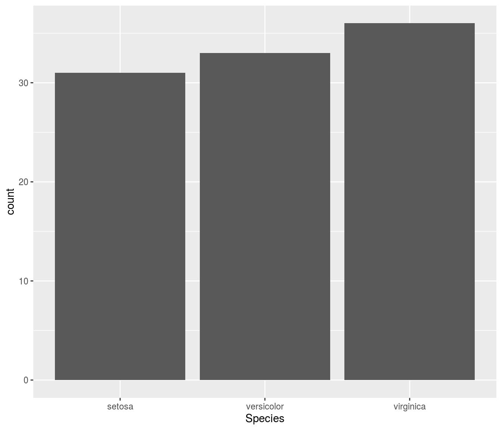

```r

df$Species <- factor(df$Species, levels = c("versicolor", "virginica", "setosa"))
ggplot(df, aes(Species)) + geom_bar()
```

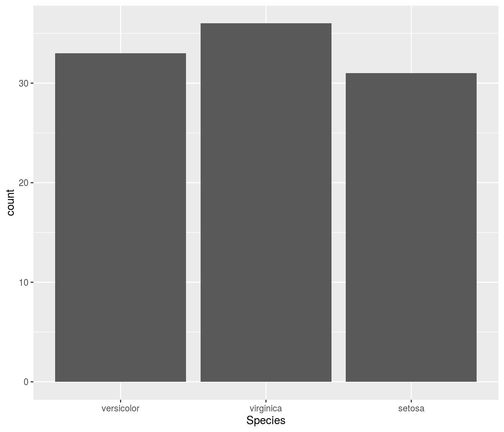

### Statistical models
When building a regression model, R will automatically encode your independent 
character variables using `contr.treatment` contrasts.  This means that each 
level of the vector is contrasted with a baseline level (by default the first
level once the vector has been converted to a factor).  If you want to change 
the baseline level or use a different encoding methodology then you need to 
work with factors.  To illustrate this we use the `Titanic` dataset.


```r
# load data and convert to one observation per row
data("Titanic")
df <- as.data.frame(Titanic)
df <- df[rep(1:nrow(df), df[ ,5]), -5]
rownames(df) <- NULL
head(df)
```

<div class="kable-table">

<table>
 <thead>
  <tr>
   <th style="text-align:left;"> Class </th>
   <th style="text-align:left;"> Sex </th>
   <th style="text-align:left;"> Age </th>
   <th style="text-align:left;"> Survived </th>
  </tr>
 </thead>
<tbody>
  <tr>
   <td style="text-align:left;"> 3rd </td>
   <td style="text-align:left;"> Male </td>
   <td style="text-align:left;"> Child </td>
   <td style="text-align:left;"> No </td>
  </tr>
  <tr>
   <td style="text-align:left;"> 3rd </td>
   <td style="text-align:left;"> Male </td>
   <td style="text-align:left;"> Child </td>
   <td style="text-align:left;"> No </td>
  </tr>
  <tr>
   <td style="text-align:left;"> 3rd </td>
   <td style="text-align:left;"> Male </td>
   <td style="text-align:left;"> Child </td>
   <td style="text-align:left;"> No </td>
  </tr>
  <tr>
   <td style="text-align:left;"> 3rd </td>
   <td style="text-align:left;"> Male </td>
   <td style="text-align:left;"> Child </td>
   <td style="text-align:left;"> No </td>
  </tr>
  <tr>
   <td style="text-align:left;"> 3rd </td>
   <td style="text-align:left;"> Male </td>
   <td style="text-align:left;"> Child </td>
   <td style="text-align:left;"> No </td>
  </tr>
  <tr>
   <td style="text-align:left;"> 3rd </td>
   <td style="text-align:left;"> Male </td>
   <td style="text-align:left;"> Child </td>
   <td style="text-align:left;"> No </td>
  </tr>
</tbody>
</table>

</div>

```r

# For this example we convert all variables to characters
df[] <- lapply(df, as.character)

# save to temporary folder
filename <- tempfile(fileext = ".csv")
write.csv(df, filename, row.names = FALSE)

# reload data with stringsAsFactors = FALSE
new_df <- read.csv(filename, stringsAsFactors = FALSE)
str(new_df)
#> 'data.frame':	2201 obs. of  4 variables:
#>  $ Class   : chr  "3rd" "3rd" "3rd" "3rd" ...
#>  $ Sex     : chr  "Male" "Male" "Male" "Male" ...
#>  $ Age     : chr  "Child" "Child" "Child" "Child" ...
#>  $ Survived: chr  "No" "No" "No" "No" ...
```

First lets see what happens if we try and build a logistic regression model for
survivals but using our newly loaded dataframe


```r
model_1 <- glm(Survived ~ ., family = binomial, data = new_df)
#> Error in eval(family$initialize): y values must be 0 <= y <= 1
```

This errors due to the **Survived** variable being a character vector.  Let's 
convert it to a factor.


```r
new_df$Survived <- factor(new_df$Survived)
model_2 <- glm(Survived ~ ., family = binomial, data = new_df)
summary(model_2)
#> 
#> Call:
#> glm(formula = Survived ~ ., family = binomial, data = new_df)
#> 
#> Deviance Residuals: 
#>     Min       1Q   Median       3Q      Max  
#> -2.0812  -0.7149  -0.6656   0.6858   2.1278  
#> 
#> Coefficients:
#>             Estimate Std. Error z value Pr(>|z|)    
#> (Intercept)   2.0438     0.1679  12.171  < 2e-16 ***
#> Class2nd     -1.0181     0.1960  -5.194 2.05e-07 ***
#> Class3rd     -1.7778     0.1716 -10.362  < 2e-16 ***
#> ClassCrew    -0.8577     0.1573  -5.451 5.00e-08 ***
#> SexMale      -2.4201     0.1404 -17.236  < 2e-16 ***
#> AgeChild      1.0615     0.2440   4.350 1.36e-05 ***
#> ---
#> Signif. codes:  0 '***' 0.001 '**' 0.01 '*' 0.05 '.' 0.1 ' ' 1
#> 
#> (Dispersion parameter for binomial family taken to be 1)
#> 
#>     Null deviance: 2769.5  on 2200  degrees of freedom
#> Residual deviance: 2210.1  on 2195  degrees of freedom
#> AIC: 2222.1
#> 
#> Number of Fisher Scoring iterations: 4
```

This works, but the baseline case for **Class** is `1st`.  What if we wanted it
to be `3rd`.  We would first need to convert the variable to a factor and choose
the appropriate level as a baseline


```r
new_df$Class <- factor(new_df$Class)
levels(new_df$Class)
#> [1] "1st"  "2nd"  "3rd"  "Crew"
contrasts(new_df$Class) <- contr.treatment(levels(new_df$Class), 3)
model_3 <- glm(Survived ~ ., family = binomial, data = new_df)
summary(model_3)
#> 
#> Call:
#> glm(formula = Survived ~ ., family = binomial, data = new_df)
#> 
#> Deviance Residuals: 
#>     Min       1Q   Median       3Q      Max  
#> -2.0812  -0.7149  -0.6656   0.6858   2.1278  
#> 
#> Coefficients:
#>             Estimate Std. Error z value Pr(>|z|)    
#> (Intercept)   0.2661     0.1293   2.058   0.0396 *  
#> Class1st      1.7778     0.1716  10.362  < 2e-16 ***
#> Class2nd      0.7597     0.1764   4.308 1.65e-05 ***
#> ClassCrew     0.9201     0.1486   6.192 5.93e-10 ***
#> SexMale      -2.4201     0.1404 -17.236  < 2e-16 ***
#> AgeChild      1.0615     0.2440   4.350 1.36e-05 ***
#> ---
#> Signif. codes:  0 '***' 0.001 '**' 0.01 '*' 0.05 '.' 0.1 ' ' 1
#> 
#> (Dispersion parameter for binomial family taken to be 1)
#> 
#>     Null deviance: 2769.5  on 2200  degrees of freedom
#> Residual deviance: 2210.1  on 2195  degrees of freedom
#> AIC: 2222.1
#> 
#> Number of Fisher Scoring iterations: 4
```

## Other things to know about factors
Working with factors can be tricky to both the new, and the experienced `R` 
user.  This is as their behaviour is not always intuitive.  Below we illustrate
three common areas of confusion

### Renaming factor levels

```r
my_factor <- factor(c("Dog", "Cat", "Hippo", "Hippo", "Monkey", "Hippo"))
my_factor
#> [1] Dog    Cat    Hippo  Hippo  Monkey Hippo 
#> Levels: Cat Dog Hippo Monkey

# change Hippo to Giraffe
## DO NOT DO THIS
my_factor[my_factor == "Hippo"] <- "Giraffe"
#> Warning in `[<-.factor`(`*tmp*`, my_factor == "Hippo", value = "Giraffe"): invalid factor level, NA generated
my_factor
#> [1] Dog    Cat    <NA>   <NA>   Monkey <NA>  
#> Levels: Cat Dog Hippo Monkey

## reset factor
my_factor <- factor(c("Dog", "Cat", "Hippo", "Hippo", "Monkey", "Hippo"))

# change Hippo to Giraffe
## DO THIS
levels(my_factor)[levels(my_factor) == "Hippo"] <- "Giraffe"
my_factor
#> [1] Dog     Cat     Giraffe Giraffe Monkey  Giraffe
#> Levels: Cat Dog Giraffe Monkey
```

### Combining factors does not result in a factor

```r
names_1 <- factor(c("jon", "george", "bobby"))
names_2 <- factor(c("laura", "claire", "laura"))
c(names_1, names_2)
#> [1] 3 2 1 2 1 2

# if you want concatenation of factors to give a factor than the help page for
# c() suggest the following method is used:
c.factor <- function(..., recursive=TRUE) unlist(list(...), recursive=recursive)
c(names_1, names_2)
#> [1] jon    george bobby  laura  claire laura 
#> Levels: bobby george jon claire laura

# if you only wanted the result to be a character vector then you could also use
c(as.character(names_1), as.character(names_2))
#> [1] "jon"    "george" "bobby"  "laura"  "claire" "laura"
```


### Numeric vectors that have been read as factors
Sometimes we find a numeric vector is being stored as a factor
(a common occurence when reading a csv from Excel with #N/A values)


```r
# example data set
pseudo_excel_csv <- data.frame(names = c("jon", "laura", "ivy", "george"),
                               ages = c(20, 22, "#N/A", "#N/A"))
# save to temporary file
filename <- tempfile(fileext = ".csv")
write.csv(pseudo_excel_csv, filename, row.names = FALSE)

# reload data
df <- read.csv(filename)
str(df)
#> 'data.frame':	4 obs. of  2 variables:
#>  $ names: chr  "jon" "laura" "ivy" "george"
#>  $ ages : chr  "20" "22" "#N/A" "#N/A"
```

to transform this to a numeric variable we can proceed as follows

```r
df$ages <- as.numeric(levels(df$ages)[df$ages])
#> Error in `$<-.data.frame`(`*tmp*`, ages, value = numeric(0)): replacement has 0 rows, data has 4
str(df)
#> 'data.frame':	4 obs. of  2 variables:
#>  $ names: chr  "jon" "laura" "ivy" "george"
#>  $ ages : chr  "20" "22" "#N/A" "#N/A"
```

## Helpful packages
If you find yourself having to manipulate factors often, then it may be worth
spending some time with the tidyverse package 
[forcats](https://forcats.tidyverse.org).  This was designed to make working
with factors simpler.  There are many tutorials available online but a good 
place to start is the official 
[vignette](https://forcats.tidyverse.org/articles/forcats.html).


<!--chapter:end:05-factors.Rmd-->

# Plotting and Data Visualisations {#plots}

This chapter provides some examples of how to visualise data in R.

For charts, we'll look at a few examples of how to create simple charts in base R but this chapter will focus mainly in using {ggplot2} to plot charts. For maps, we'll look at how to produce static choropleth maps using {ggplot2} and how to produce interactive maps using {leaflet}. 


## Plotting in base R

Before we look at using {ggplot2}, we'll look at how to plot simple charts using functions in base R. We'll use road accident data from 2005 to 2017 to demonstrate how to create line and bar charts.


```r
# read in road accident data
road_acc <- readr::read_csv(
  file = "data/road_accidents_by_year_and_severity.csv")
#> 
#> ── Column specification ────────────────────────────────────────────────────────────────────────────────────────────────────────
#> cols(
#>   accident_year = col_double(),
#>   accident_severity_id = col_double(),
#>   name = col_character(),
#>   total = col_double()
#> )
head(road_acc)
```

<div class="kable-table">

<table>
 <thead>
  <tr>
   <th style="text-align:right;"> accident_year </th>
   <th style="text-align:right;"> accident_severity_id </th>
   <th style="text-align:left;"> name </th>
   <th style="text-align:right;"> total </th>
  </tr>
 </thead>
<tbody>
  <tr>
   <td style="text-align:right;"> 2005 </td>
   <td style="text-align:right;"> 1 </td>
   <td style="text-align:left;"> Fatal </td>
   <td style="text-align:right;"> 2913 </td>
  </tr>
  <tr>
   <td style="text-align:right;"> 2005 </td>
   <td style="text-align:right;"> 2 </td>
   <td style="text-align:left;"> Serious </td>
   <td style="text-align:right;"> 25029 </td>
  </tr>
  <tr>
   <td style="text-align:right;"> 2005 </td>
   <td style="text-align:right;"> 3 </td>
   <td style="text-align:left;"> Slight </td>
   <td style="text-align:right;"> 170793 </td>
  </tr>
  <tr>
   <td style="text-align:right;"> 2006 </td>
   <td style="text-align:right;"> 1 </td>
   <td style="text-align:left;"> Fatal </td>
   <td style="text-align:right;"> 2926 </td>
  </tr>
  <tr>
   <td style="text-align:right;"> 2006 </td>
   <td style="text-align:right;"> 2 </td>
   <td style="text-align:left;"> Serious </td>
   <td style="text-align:right;"> 24946 </td>
  </tr>
  <tr>
   <td style="text-align:right;"> 2006 </td>
   <td style="text-align:right;"> 3 </td>
   <td style="text-align:left;"> Slight </td>
   <td style="text-align:right;"> 161289 </td>
  </tr>
</tbody>
</table>

</div>


### Line charts in base R ###

We want to plot a line chart of total road accidents against year. First we need to group our data by accident year and summarise to get a total sum of accidents for each year:

```r
road_acc_total <- road_acc %>%
  dplyr::group_by(accident_year) %>%
  dplyr::summarise(total = sum(total))
```

We'll now use the base R function 'plot', specifying the x and y axis and well as the plot type 'l' for line charts:

```r
plot(
  x = road_acc_total$accident_year,
  y = road_acc_total$total,
  type = "l"
)
```

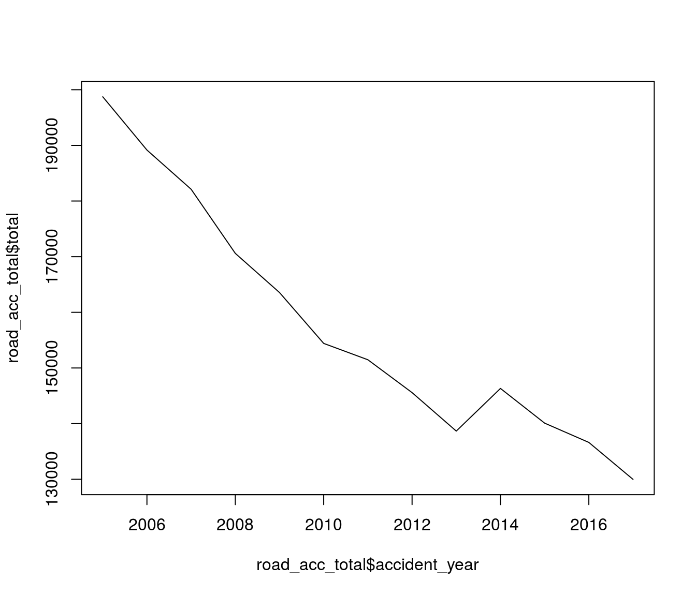

We can make our plot look better by specifying a colour, labelling the axes and giving our plot a title:

```r
plot(
  x = road_acc_total$accident_year,
  y = road_acc_total$total,
  type = "l",
  col = "red",
  xlab = "Year",
  ylab = "Total",
  main = "Total road accidents per year, 2005 - 2017"
)
```

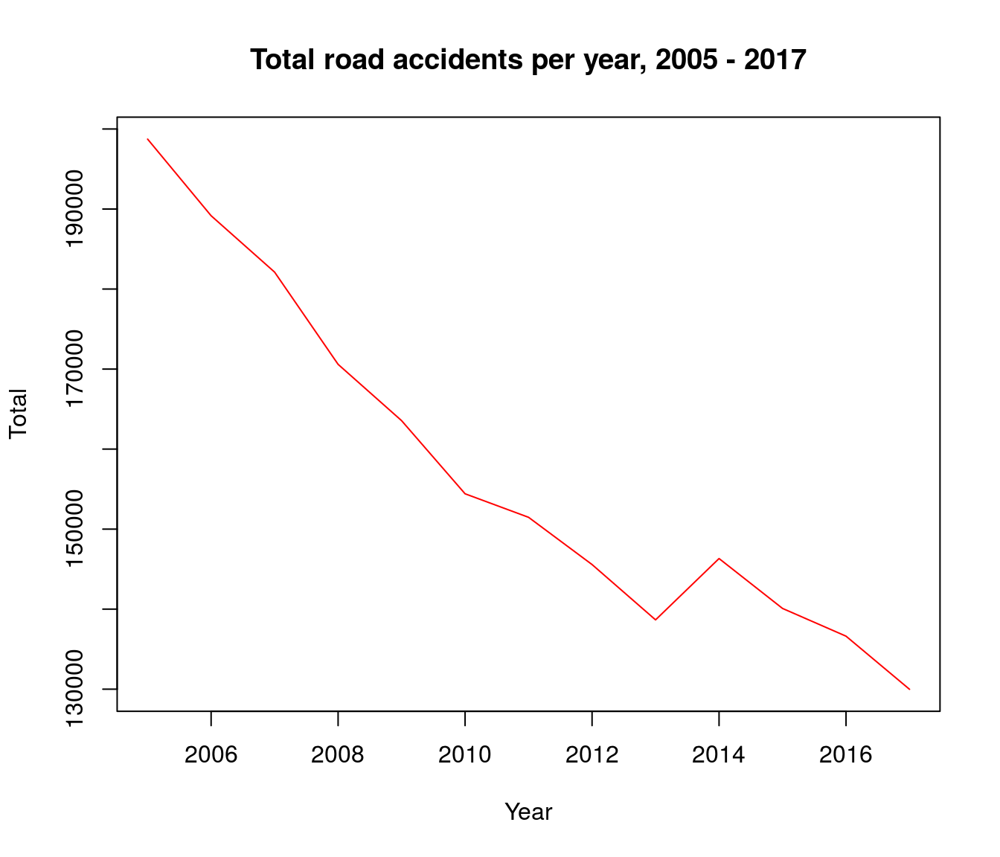

We can also force our plot to start at 0:


```r
plot(
  x = road_acc_total$accident_year,
  y = road_acc_total$total,
  type = "l",
  col = "red",
  xlab = "Year",
  ylab = "Total",
  main = "Total road accidents per year, 2005 - 2017",
  ylim=c(0, max(road_acc_total$total))
)
```

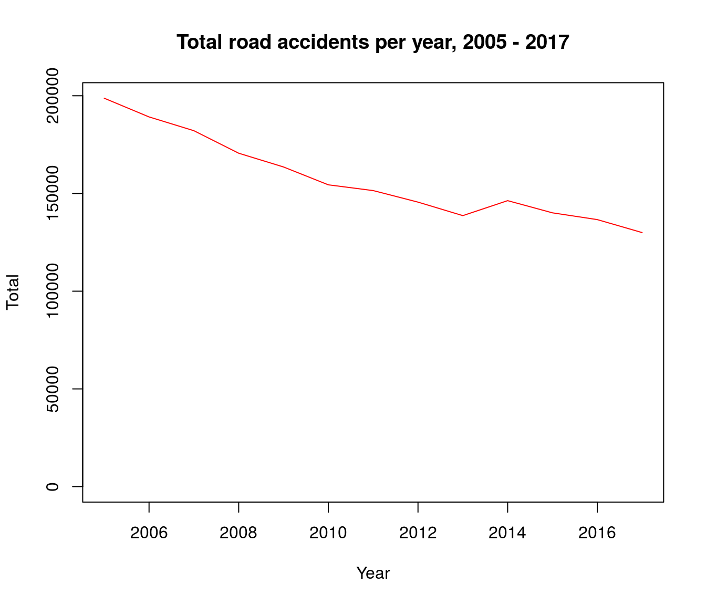


### Bar charts in base R ###

We want to plot a bar chart showing the total number of accidents of each severity in 2017. First let's filter the road accidents data for 2017:


```r
road_acc_2017 <- road_acc %>%
  dplyr::filter(accident_year == 2017)
road_acc_2017
```

<div class="kable-table">

<table>
 <thead>
  <tr>
   <th style="text-align:right;"> accident_year </th>
   <th style="text-align:right;"> accident_severity_id </th>
   <th style="text-align:left;"> name </th>
   <th style="text-align:right;"> total </th>
  </tr>
 </thead>
<tbody>
  <tr>
   <td style="text-align:right;"> 2017 </td>
   <td style="text-align:right;"> 1 </td>
   <td style="text-align:left;"> Fatal </td>
   <td style="text-align:right;"> 1676 </td>
  </tr>
  <tr>
   <td style="text-align:right;"> 2017 </td>
   <td style="text-align:right;"> 2 </td>
   <td style="text-align:left;"> Serious </td>
   <td style="text-align:right;"> 22534 </td>
  </tr>
  <tr>
   <td style="text-align:right;"> 2017 </td>
   <td style="text-align:right;"> 3 </td>
   <td style="text-align:left;"> Slight </td>
   <td style="text-align:right;"> 105772 </td>
  </tr>
</tbody>
</table>

</div>

To create a bar chart, we use the base R function 'barplot' and then specify the variable we want to plot as the height argument:


```r
barplot(height = road_acc_2017$total)
```

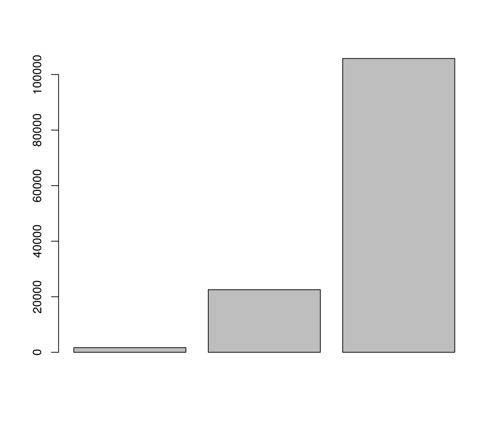

This isn't very useful as we can't see what the different severity types are. So we can specify these in the names.arg argument, as well as add a few extra features to make the plot look better:


```r
barplot(height = road_acc_2017$total,
        names.arg = c("Fatal", "Serious", "Slight"),
        width = 2, #width of the bars
        col = "lightblue",
        xlab = "Severity",
        ylab = "Total accidents",
        main = "Total accidents by severity, 2017")
```

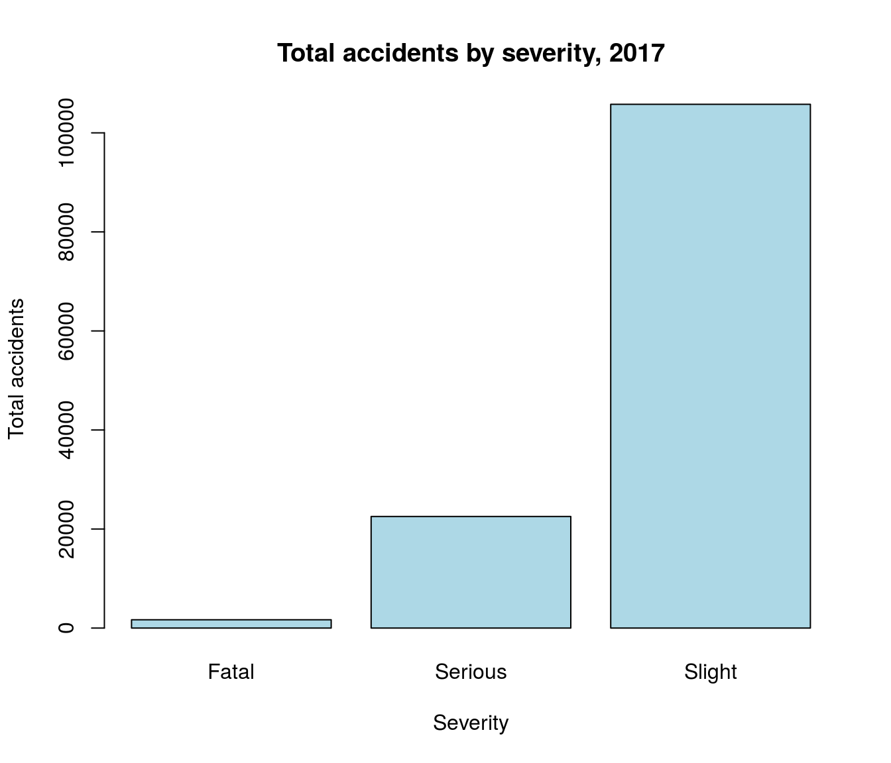


## Plotting withh {ggplot2}

**What is {ggplot2}?**

The 'gg' in {ggplot2} stands for 'grammar of graphics'. This is a way of thinking about plotting as having grammar elements that can be applied in succession to create a plot. This is the idea that you can build every graph from the same few components: a dataset, geoms (marks representing data points), a co-ordinate system and some other things.

The ggplot() function from the {ggplot2} package is how you create these plots. You build up the graphical elements using the + symbol. Think about it as placing down a canvas and then adding layers on top.

**Why should I use {ggplot2} instead of the plot functions in base R?**


As with most things in R, there are multiple ways to do the same thing. This applies to creating visualisations as well. As will be demonstrated below we can replicate the graphs we have created above using {ggplot2} instead, pretty well. 

One method is not necessarily better than the other, but at DfT we advocate using {ggplot2} when plotting charts. There is consistency in the way that {ggplot2} works which makes it easier to get to grips with for beginners. It is also part of the {tidyverse} which we have used earlier on in this cookbook so it shares the underlying design philosophy, grammar, and data structures. 

### Line charts with {ggplot2}

When plotting with {ggplot2}, we start with the ggplot() function which creates a blank canvas, then the next layer we add is the plot type. For line charts, this would be ggplot() + geom_line(). Within these functions, we specify our data and our aesthetic mappings i.e. what variables to map to the x and y axes from the specified data. If we were create a simple line chart for total accidents against year, the code would read as follows:


```r
ggplot(data = road_acc_total) +
  geom_line(mapping = aes(x = accident_year, y = total))
```

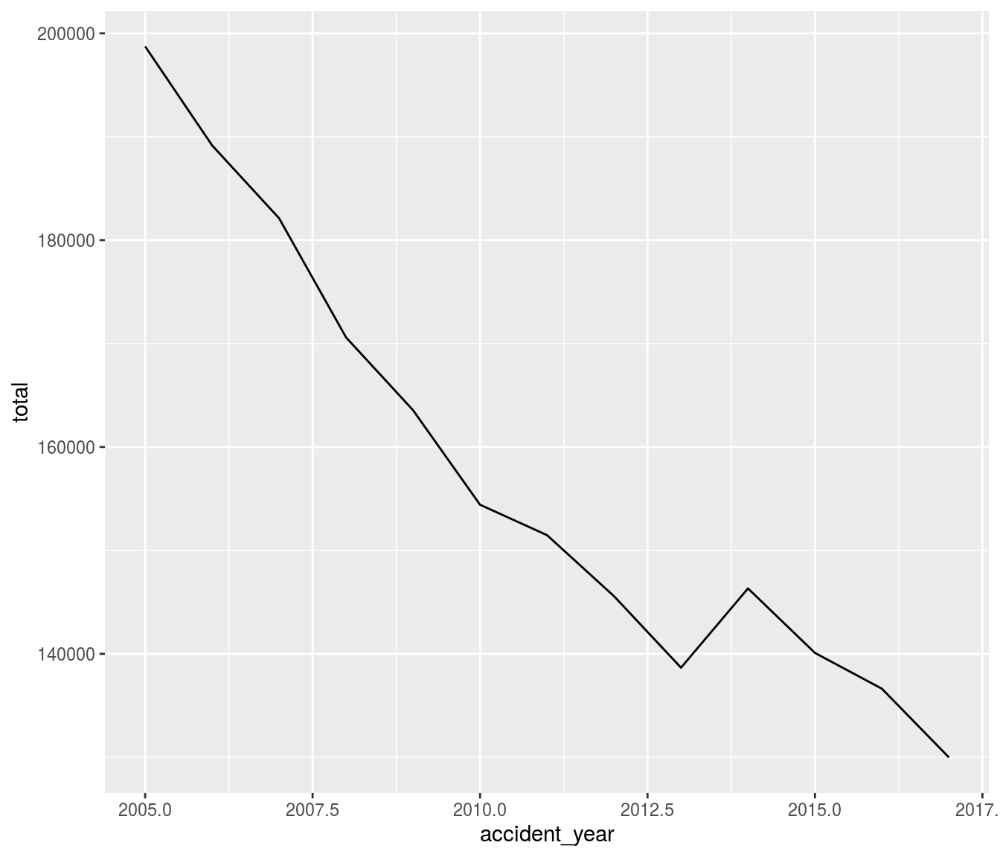

So a reusuable template for making graphs would be as below, with the bracketed sections in the code replaced with a dataset, a geom function and a collection of mappings:

ggplot(data = name_of_dataset) +
  geom_function(mapping = aes())


You can find a range of different plot types available in {ggplot2}, as well as tips on how to use them in the {ggplot2} cheatsheet (https://www.rstudio.com/wp-content/uploads/2016/11/ggplot2-cheatsheet-2.1.pdf).

Let's create the same the line chart we created with base R, showing total road accidents against year:


```r
ggplot(data = road_acc_total) +
  geom_line(aes(x = accident_year, y = total), col = "red") +
  xlab("Year") +
  ylab("Total") +
  ggtitle("Total road accidents per year, 2005 - 2017") +
  scale_x_continuous(breaks = seq(2000, 2017, 2)) +
  expand_limits(y=0) +
  theme_classic()
```

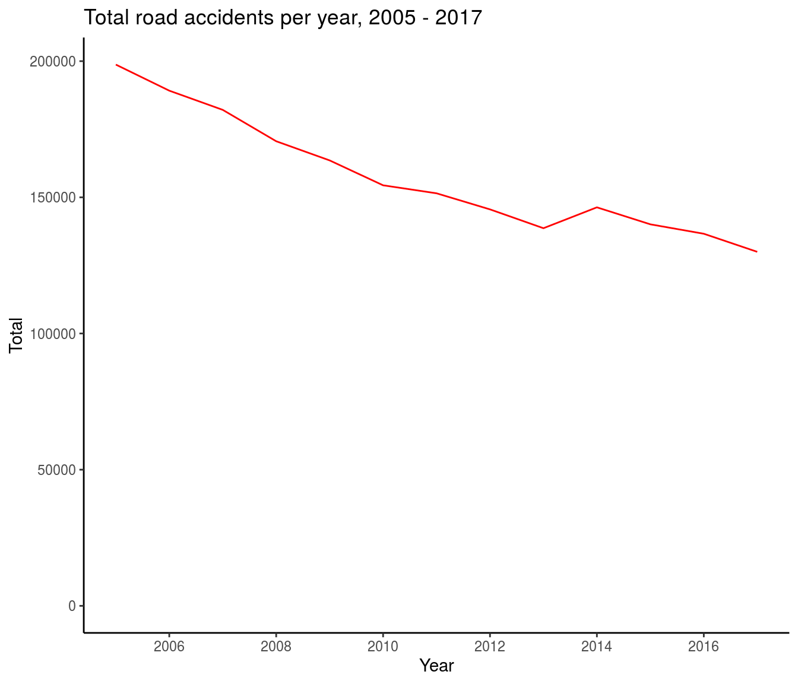

Here we have specified the colour of the line (notice this is outside of the aes() function). We have also labelled the x and y axes and given the plot a title.
We have used scale_x_continuous() function to specify the intervals in the year variable and have used a theme to set the style of our plot (more on this later).

### Aesthetic mappings

To get more insight into our data, we can add a third variable to our plot by mapping it to an aesthetic. This is a visual property of the objects in our plot such as the size, the shape or the colour of our points. For example, if we want to see the total number of road accidents by severity type against year, we can map the 'name' variable to the colour aesthetic:


```r
ggplot(data = road_acc) +
  geom_line(mapping = aes(x = accident_year, y = total, colour = name)) +
  scale_x_continuous(breaks = seq(2000, 2017, 2))
```


So unlike before, we specify the colour within the aes() function, rather than outside of it.

### Bar charts with {ggplot2}

When creating bar charts with {ggplot2}, we can use geom_bar() or geom_col(). geom_bar() makes the height of the bar proportional to the number of cases in each group while geom_col() enables the heights of the bars to represent values in the data. So if your data is not already grouped you can use geom_bar() like so:


```r
messy_pokemon <- readr::read_csv(
  file = "data/messy_pokemon_data.csv")
head(messy_pokemon)
```

<div class="kable-table">

<table>
 <thead>
  <tr>
   <th style="text-align:left;"> species </th>
   <th style="text-align:left;"> combat_power </th>
   <th style="text-align:right;"> hit_points </th>
   <th style="text-align:right;"> weight_kg </th>
   <th style="text-align:left;"> weight_bin </th>
   <th style="text-align:right;"> height_m </th>
   <th style="text-align:left;"> height_bin </th>
   <th style="text-align:left;"> fast_attack </th>
   <th style="text-align:left;"> charge_attack </th>
   <th style="text-align:left;"> date_first_capture </th>
   <th style="text-align:left;"> time_first_capture </th>
  </tr>
 </thead>
<tbody>
  <tr>
   <td style="text-align:left;"> abra </td>
   <td style="text-align:left;"> 101 </td>
   <td style="text-align:right;"> 20 </td>
   <td style="text-align:right;"> 17.18 </td>
   <td style="text-align:left;"> normal </td>
   <td style="text-align:right;"> 0.85 </td>
   <td style="text-align:left;"> normal </td>
   <td style="text-align:left;"> zen_headbutt </td>
   <td style="text-align:left;"> shadow_ball </td>
   <td style="text-align:left;"> 31 May 1977 </td>
   <td style="text-align:left;"> 20:59:33 </td>
  </tr>
  <tr>
   <td style="text-align:left;"> abra </td>
   <td style="text-align:left;"> 81 </td>
   <td style="text-align:right;"> 16 </td>
   <td style="text-align:right;"> 25.94 </td>
   <td style="text-align:left;"> extra_large </td>
   <td style="text-align:right;"> 1.00 </td>
   <td style="text-align:left;"> normal </td>
   <td style="text-align:left;"> zen_headbutt </td>
   <td style="text-align:left;"> shadow_ball </td>
   <td style="text-align:left;"> 24 February 1973 </td>
   <td style="text-align:left;"> 10:18:40 </td>
  </tr>
  <tr>
   <td style="text-align:left;"> bellsprout </td>
   <td style="text-align:left;"> 156 </td>
   <td style="text-align:right;"> 32 </td>
   <td style="text-align:right;"> 5.85 </td>
   <td style="text-align:left;"> extra_large </td>
   <td style="text-align:right;"> 0.80 </td>
   <td style="text-align:left;"> normal </td>
   <td style="text-align:left;"> acid </td>
   <td style="text-align:left;"> sludge_bomb </td>
   <td style="text-align:left;"> 21 June 1924 </td>
   <td style="text-align:left;"> 08:06:55 </td>
  </tr>
  <tr>
   <td style="text-align:left;"> bellsprout </td>
   <td style="text-align:left;"> 262 </td>
   <td style="text-align:right;"> 44 </td>
   <td style="text-align:right;"> 5.42 </td>
   <td style="text-align:left;"> extra_large </td>
   <td style="text-align:right;"> 0.82 </td>
   <td style="text-align:left;"> normal </td>
   <td style="text-align:left;"> acid </td>
   <td style="text-align:left;"> sludge_bomb </td>
   <td style="text-align:left;"> 01 August 1925 </td>
   <td style="text-align:left;"> 11:18:28 </td>
  </tr>
  <tr>
   <td style="text-align:left;"> bellsprout </td>
   <td style="text-align:left;"> 389 </td>
   <td style="text-align:right;"> 50 </td>
   <td style="text-align:right;"> 3.40 </td>
   <td style="text-align:left;"> normal </td>
   <td style="text-align:right;"> 0.66 </td>
   <td style="text-align:left;"> normal </td>
   <td style="text-align:left;"> vine_whip </td>
   <td style="text-align:left;"> wrap </td>
   <td style="text-align:left;"> 06 August 1952 </td>
   <td style="text-align:left;"> 21:11:42 </td>
  </tr>
  <tr>
   <td style="text-align:left;"> bellsprout </td>
   <td style="text-align:left;"> 433 </td>
   <td style="text-align:right;"> 59 </td>
   <td style="text-align:right;"> 6.67 </td>
   <td style="text-align:left;"> extra_large </td>
   <td style="text-align:right;"> 0.84 </td>
   <td style="text-align:left;"> normal </td>
   <td style="text-align:left;"> acid </td>
   <td style="text-align:left;"> power_whip </td>
   <td style="text-align:left;"> 17 January 1915 </td>
   <td style="text-align:left;"> 13:30:41 </td>
  </tr>
</tbody>
</table>

</div>

```r
ggplot(data = messy_pokemon) +
  geom_bar(mapping = aes(x = weight_bin))
```

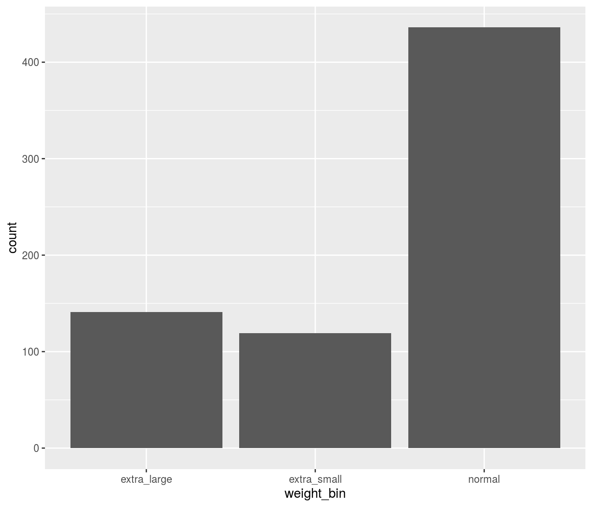

This has grouped our data by weight_bin with the height of the bars representing the number of pokemon in each weight bin.

Let's recreate the total accidents by severity chart, now using {ggplot2} instead:


```r
ggplot(data = road_acc_2017) +
  geom_col(mapping = aes(x = name, y = total), fill = "lightblue", col = "black")+
  xlab("Severity") +
  ylab("Total accidents") +
  ggtitle("Total accidents by severity, 2017")+
  theme_classic()
```


Here we have used geom_col() instead but our data is already grouped so we simply want the height of the bars to represent the values in the data i.e. the number of accidents of each type of severity.

You could also use geom_bar() in this situation but you would need to add an extra argument: stat = "identity".


```r
ggplot(data = road_acc_2017) +
  geom_bar(mapping = aes(x = name, y = total),  fill = "lightblue", col = "black", stat = "identity")+
  xlab("Severity") +
  ylab("Total accidents") +
  ggtitle("Total accidents by severity, 2017") +
  theme_classic()
```

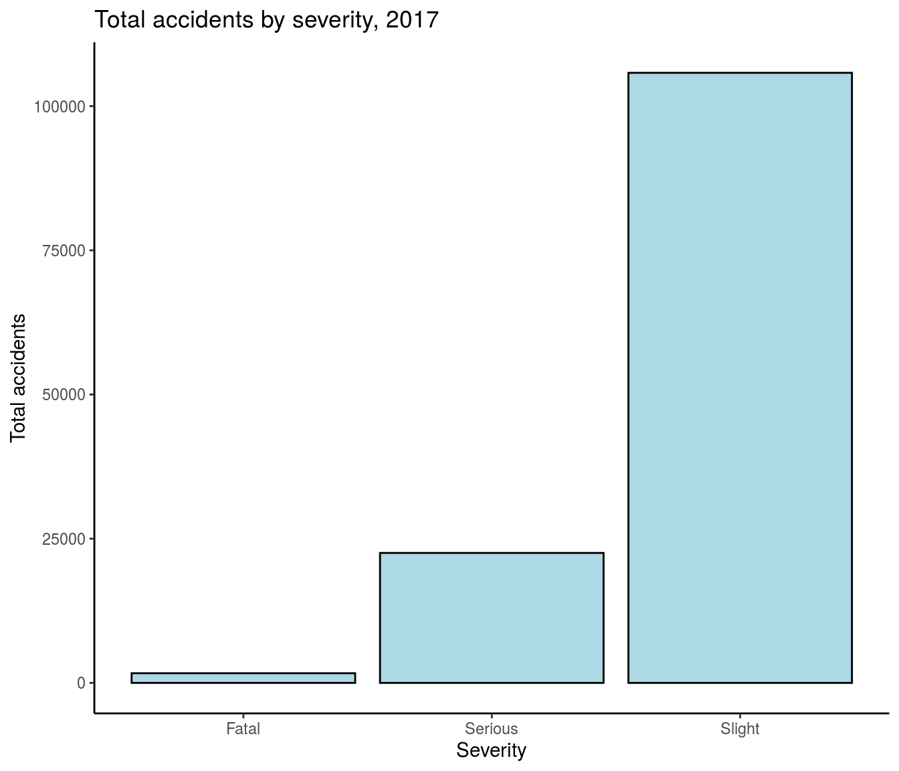

## DfT colours

So far we've used colours built into R and referred to them by name e.g. red, lightlue etc. In order to make charts using DfT colours, we can specify what colours we want using hexcodes. For example, for the previous bar chart we can set the levels of severity to different DfT colours.


```r
ggplot(data = road_acc_2017) +
  geom_col(mapping = aes(x = name, y = total, fill = name))+
  xlab("Severity") +
  ylab("Total accidents") +
  ggtitle("Total accidents by severity, 2017") +
  theme_classic() +
  scale_fill_manual(values = c("#C99212", "#D25F15", "#006853"))
```

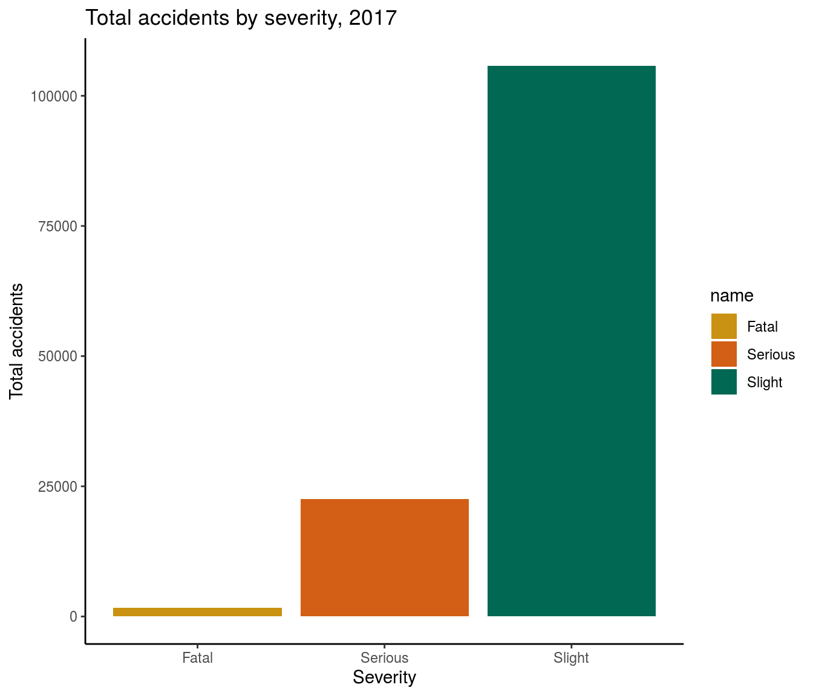

Here we map the name variable to the fill argument within the aesthetic.


## DfT Theme

We mentioned themes earlier. Themes are used to set the style of your plot and can give your plots a consistent customized look. You can customise things such as titles, labels, fonts, background, gridlines, and legends. We have been using theme_classic() so far but {ggplot2} has a number of built-in themes that you can use for your plots available here: [https://ggplot2.tidyverse.org/reference/ggtheme.html](https://ggplot2.tidyverse.org/reference/ggtheme.html)

You can modify aspects of a theme using the theme() function. For example, for our previous accidents plot, we can remove the legend title and move the position of the plot title.


```r
ggplot(data = road_acc_2017) +
  geom_col(mapping = aes(x = name, y = total, fill = name))+
  xlab("Severity") +
  ylab("Total accidents") +
  ggtitle("Total accidents by severity, 2017") +
  theme_classic() +
  scale_fill_manual(values = c("#C99212", "#D25F15", "#006853"))+
  theme(legend.title = element_blank(),
        plot.title = element_text(hjust = 0.5))
```


### Custom DfT Theme

Instead of using the built-in themes, we can create our own theme to apply to our plots. Below I have created a 'DfT theme' for line charts which sets things such as the font types, sizes, axes lines and title positions to make the plot consistent with what we might put in a DfT publication.

You can adjust and tweak this theme and the colours to create plots in the correct style for your own publications. 


```r
# set DfT colours
dft_colour <- c("#006853", # dark green
                    "#66A498", # light green
                    "#D25F15", # orange
                    "#E49F73", # light orange
                    "#C99212", # yellow
                    "#E9D3A0", # pale yellow
                    "#0099A9", # blue
                    "#99D6DD") # light blue
# create theme
# note: 'sans' in R refers to the font 'Arial' in Windows
theme_dft <- ggplot2::theme(axis.text = element_text(family = "sans", size = 10, colour = "black"), # axis text
                            axis.title.x = element_text(family = "sans", size = 13, colour = "black", # x axis title
                                                        margin = margin(t = 10)),
                            axis.title.y = element_blank(),
                            plot.title = element_text(size = 16, family = "sans", hjust = 0.5),
                            plot.subtitle = element_text(size = 13, colour = "black", hjust = -0.05,
                                                         margin = margin(t = 10)),
                            legend.key = element_blank(), # make the legend background blank
                            legend.position = "bottom", # legend at the bottom
                            legend.direction = "horizontal", # legend horizontal
                            legend.title = element_blank(), # remove legend title
                            legend.text = element_text(size = 9, family = "sans"),
                            axis.ticks = element_blank(), # remove tick marks
                            panel.grid = element_blank(), # remove grid lines
                            panel.background = element_blank(), # remove background
                            axis.line.x = element_line(size = 0.5, colour = "black"))  
# use the DfT colours and the DfT theme for the accidents by severity line chart
ggplot(data = road_acc) +
  geom_line(mapping = aes(x = accident_year, y = total, colour = name), size = 1.5) +
  labs(title = "Accidents by severity, 2005 to 2017", 
       x = "Accident Year", 
       y = "")+
  scale_x_continuous(breaks = seq(2005, 2017, 2))+
  scale_colour_manual(values = dft_colour) + #here is where you apply the dft colours
  theme_dft #here we specify our custom theme
```

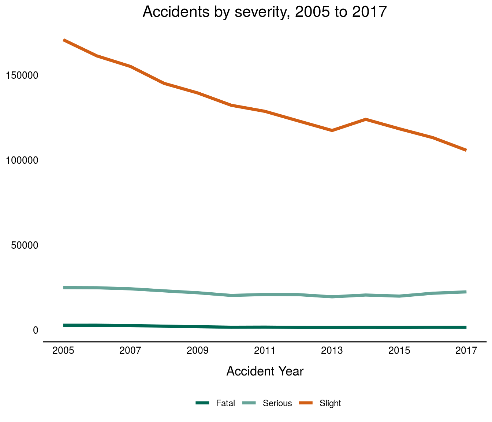


## More {ggplot2} charts 

This section provides more code examples for creating {ggplot2} themes, including the DfT theme code.

First, some more record-level road accident data is read in which can be used with the charts. Note that the data is being read in as a .rds object. A .rds object is an R data object which can be read in as a data frame:


```r
# read in road accident data
road_acc_data <- readr::read_rds("data/road_accidents_2017.RDS")
head(road_acc_data)
```

<div class="kable-table">

<table>
 <thead>
  <tr>
   <th style="text-align:left;"> acc_index </th>
   <th style="text-align:right;"> Location_Easting_OSGR </th>
   <th style="text-align:right;"> Location_Northing_OSGR </th>
   <th style="text-align:right;"> Longitude </th>
   <th style="text-align:right;"> Latitude </th>
   <th style="text-align:right;"> Police_Force </th>
   <th style="text-align:right;"> Accident_Severity </th>
   <th style="text-align:right;"> Number_of_Vehicles </th>
   <th style="text-align:right;"> Number_of_Casualties </th>
   <th style="text-align:left;"> Date </th>
   <th style="text-align:right;"> Day_of_Week </th>
   <th style="text-align:left;"> Time </th>
   <th style="text-align:right;"> Local_Authority_(District) </th>
   <th style="text-align:left;"> Local_Authority_(Highway) </th>
   <th style="text-align:right;"> 1st_Road_Class </th>
   <th style="text-align:right;"> 1st_Road_Number </th>
   <th style="text-align:right;"> Road_Type </th>
   <th style="text-align:right;"> Speed_limit </th>
   <th style="text-align:right;"> Junction_Detail </th>
   <th style="text-align:right;"> Junction_Control </th>
   <th style="text-align:right;"> 2nd_Road_Class </th>
   <th style="text-align:right;"> 2nd_Road_Number </th>
   <th style="text-align:right;"> Pedestrian_Crossing-Human_Control </th>
   <th style="text-align:right;"> Pedestrian_Crossing-Physical_Facilities </th>
   <th style="text-align:right;"> Light_Conditions </th>
   <th style="text-align:right;"> Weather_Conditions </th>
   <th style="text-align:right;"> Road_Surface_Conditions </th>
   <th style="text-align:right;"> Special_Conditions_at_Site </th>
   <th style="text-align:right;"> Carriageway_Hazards </th>
   <th style="text-align:right;"> Urban_or_Rural_Area </th>
   <th style="text-align:right;"> Did_Police_Officer_Attend_Scene_of_Accident </th>
   <th style="text-align:left;"> LSOA_of_Accident_Location </th>
  </tr>
 </thead>
<tbody>
  <tr>
   <td style="text-align:left;"> 2017010001708 </td>
   <td style="text-align:right;"> 532920 </td>
   <td style="text-align:right;"> 196330 </td>
   <td style="text-align:right;"> -0.080107 </td>
   <td style="text-align:right;"> 51.65006 </td>
   <td style="text-align:right;"> 1 </td>
   <td style="text-align:right;"> 1 </td>
   <td style="text-align:right;"> 2 </td>
   <td style="text-align:right;"> 3 </td>
   <td style="text-align:left;"> 2017-08-05 </td>
   <td style="text-align:right;"> 7 </td>
   <td style="text-align:left;"> 1899-12-31 03:12:00 </td>
   <td style="text-align:right;"> 32 </td>
   <td style="text-align:left;"> E09000010 </td>
   <td style="text-align:right;"> 3 </td>
   <td style="text-align:right;"> 105 </td>
   <td style="text-align:right;"> 6 </td>
   <td style="text-align:right;"> 30 </td>
   <td style="text-align:right;"> 0 </td>
   <td style="text-align:right;"> -1 </td>
   <td style="text-align:right;"> -1 </td>
   <td style="text-align:right;"> 0 </td>
   <td style="text-align:right;"> 0 </td>
   <td style="text-align:right;"> 0 </td>
   <td style="text-align:right;"> 4 </td>
   <td style="text-align:right;"> 1 </td>
   <td style="text-align:right;"> 1 </td>
   <td style="text-align:right;"> 0 </td>
   <td style="text-align:right;"> 0 </td>
   <td style="text-align:right;"> 1 </td>
   <td style="text-align:right;"> 1 </td>
   <td style="text-align:left;"> E01001450 </td>
  </tr>
  <tr>
   <td style="text-align:left;"> 2017010009342 </td>
   <td style="text-align:right;"> 526790 </td>
   <td style="text-align:right;"> 181970 </td>
   <td style="text-align:right;"> -0.173845 </td>
   <td style="text-align:right;"> 51.52242 </td>
   <td style="text-align:right;"> 1 </td>
   <td style="text-align:right;"> 3 </td>
   <td style="text-align:right;"> 2 </td>
   <td style="text-align:right;"> 1 </td>
   <td style="text-align:left;"> 2017-01-01 </td>
   <td style="text-align:right;"> 1 </td>
   <td style="text-align:left;"> 1899-12-31 01:30:00 </td>
   <td style="text-align:right;"> 1 </td>
   <td style="text-align:left;"> E09000033 </td>
   <td style="text-align:right;"> 3 </td>
   <td style="text-align:right;"> 5 </td>
   <td style="text-align:right;"> 6 </td>
   <td style="text-align:right;"> 30 </td>
   <td style="text-align:right;"> 3 </td>
   <td style="text-align:right;"> 4 </td>
   <td style="text-align:right;"> 6 </td>
   <td style="text-align:right;"> 0 </td>
   <td style="text-align:right;"> 0 </td>
   <td style="text-align:right;"> 0 </td>
   <td style="text-align:right;"> 4 </td>
   <td style="text-align:right;"> 1 </td>
   <td style="text-align:right;"> 2 </td>
   <td style="text-align:right;"> 0 </td>
   <td style="text-align:right;"> 0 </td>
   <td style="text-align:right;"> 1 </td>
   <td style="text-align:right;"> 1 </td>
   <td style="text-align:left;"> E01004702 </td>
  </tr>
  <tr>
   <td style="text-align:left;"> 2017010009344 </td>
   <td style="text-align:right;"> 535200 </td>
   <td style="text-align:right;"> 181260 </td>
   <td style="text-align:right;"> -0.052969 </td>
   <td style="text-align:right;"> 51.51410 </td>
   <td style="text-align:right;"> 1 </td>
   <td style="text-align:right;"> 3 </td>
   <td style="text-align:right;"> 3 </td>
   <td style="text-align:right;"> 1 </td>
   <td style="text-align:left;"> 2017-01-01 </td>
   <td style="text-align:right;"> 1 </td>
   <td style="text-align:left;"> 1899-12-31 00:30:00 </td>
   <td style="text-align:right;"> 5 </td>
   <td style="text-align:left;"> E09000030 </td>
   <td style="text-align:right;"> 3 </td>
   <td style="text-align:right;"> 13 </td>
   <td style="text-align:right;"> 6 </td>
   <td style="text-align:right;"> 30 </td>
   <td style="text-align:right;"> 3 </td>
   <td style="text-align:right;"> 4 </td>
   <td style="text-align:right;"> 5 </td>
   <td style="text-align:right;"> 0 </td>
   <td style="text-align:right;"> 0 </td>
   <td style="text-align:right;"> 0 </td>
   <td style="text-align:right;"> 4 </td>
   <td style="text-align:right;"> 1 </td>
   <td style="text-align:right;"> 1 </td>
   <td style="text-align:right;"> 0 </td>
   <td style="text-align:right;"> 0 </td>
   <td style="text-align:right;"> 1 </td>
   <td style="text-align:right;"> 1 </td>
   <td style="text-align:left;"> E01004298 </td>
  </tr>
  <tr>
   <td style="text-align:left;"> 2017010009348 </td>
   <td style="text-align:right;"> 534340 </td>
   <td style="text-align:right;"> 193560 </td>
   <td style="text-align:right;"> -0.060658 </td>
   <td style="text-align:right;"> 51.62483 </td>
   <td style="text-align:right;"> 1 </td>
   <td style="text-align:right;"> 3 </td>
   <td style="text-align:right;"> 2 </td>
   <td style="text-align:right;"> 1 </td>
   <td style="text-align:left;"> 2017-01-01 </td>
   <td style="text-align:right;"> 1 </td>
   <td style="text-align:left;"> 1899-12-31 01:11:00 </td>
   <td style="text-align:right;"> 32 </td>
   <td style="text-align:left;"> E09000010 </td>
   <td style="text-align:right;"> 3 </td>
   <td style="text-align:right;"> 1010 </td>
   <td style="text-align:right;"> 1 </td>
   <td style="text-align:right;"> 30 </td>
   <td style="text-align:right;"> 1 </td>
   <td style="text-align:right;"> 4 </td>
   <td style="text-align:right;"> 4 </td>
   <td style="text-align:right;"> 154 </td>
   <td style="text-align:right;"> 0 </td>
   <td style="text-align:right;"> 4 </td>
   <td style="text-align:right;"> 4 </td>
   <td style="text-align:right;"> 2 </td>
   <td style="text-align:right;"> 2 </td>
   <td style="text-align:right;"> 0 </td>
   <td style="text-align:right;"> 0 </td>
   <td style="text-align:right;"> 1 </td>
   <td style="text-align:right;"> 1 </td>
   <td style="text-align:left;"> E01001429 </td>
  </tr>
  <tr>
   <td style="text-align:left;"> 2017010009350 </td>
   <td style="text-align:right;"> 533680 </td>
   <td style="text-align:right;"> 187820 </td>
   <td style="text-align:right;"> -0.072372 </td>
   <td style="text-align:right;"> 51.57341 </td>
   <td style="text-align:right;"> 1 </td>
   <td style="text-align:right;"> 2 </td>
   <td style="text-align:right;"> 1 </td>
   <td style="text-align:right;"> 1 </td>
   <td style="text-align:left;"> 2017-01-01 </td>
   <td style="text-align:right;"> 1 </td>
   <td style="text-align:left;"> 1899-12-31 01:42:00 </td>
   <td style="text-align:right;"> 4 </td>
   <td style="text-align:left;"> E09000012 </td>
   <td style="text-align:right;"> 3 </td>
   <td style="text-align:right;"> 107 </td>
   <td style="text-align:right;"> 3 </td>
   <td style="text-align:right;"> 20 </td>
   <td style="text-align:right;"> 6 </td>
   <td style="text-align:right;"> 2 </td>
   <td style="text-align:right;"> 3 </td>
   <td style="text-align:right;"> 10 </td>
   <td style="text-align:right;"> 0 </td>
   <td style="text-align:right;"> 5 </td>
   <td style="text-align:right;"> 4 </td>
   <td style="text-align:right;"> 1 </td>
   <td style="text-align:right;"> 2 </td>
   <td style="text-align:right;"> 0 </td>
   <td style="text-align:right;"> 0 </td>
   <td style="text-align:right;"> 1 </td>
   <td style="text-align:right;"> 1 </td>
   <td style="text-align:left;"> E01001808 </td>
  </tr>
  <tr>
   <td style="text-align:left;"> 2017010009351 </td>
   <td style="text-align:right;"> 514510 </td>
   <td style="text-align:right;"> 172370 </td>
   <td style="text-align:right;"> -0.353876 </td>
   <td style="text-align:right;"> 51.43876 </td>
   <td style="text-align:right;"> 1 </td>
   <td style="text-align:right;"> 3 </td>
   <td style="text-align:right;"> 2 </td>
   <td style="text-align:right;"> 1 </td>
   <td style="text-align:left;"> 2017-01-01 </td>
   <td style="text-align:right;"> 1 </td>
   <td style="text-align:left;"> 1899-12-31 03:31:00 </td>
   <td style="text-align:right;"> 24 </td>
   <td style="text-align:left;"> E09000027 </td>
   <td style="text-align:right;"> 6 </td>
   <td style="text-align:right;"> 0 </td>
   <td style="text-align:right;"> 6 </td>
   <td style="text-align:right;"> 30 </td>
   <td style="text-align:right;"> 0 </td>
   <td style="text-align:right;"> -1 </td>
   <td style="text-align:right;"> -1 </td>
   <td style="text-align:right;"> 0 </td>
   <td style="text-align:right;"> 0 </td>
   <td style="text-align:right;"> 0 </td>
   <td style="text-align:right;"> 4 </td>
   <td style="text-align:right;"> 1 </td>
   <td style="text-align:right;"> 2 </td>
   <td style="text-align:right;"> 0 </td>
   <td style="text-align:right;"> 0 </td>
   <td style="text-align:right;"> 1 </td>
   <td style="text-align:right;"> 1 </td>
   <td style="text-align:left;"> E01003900 </td>
  </tr>
</tbody>
</table>

</div>

### Scatter plots

The scatter plot example will plot the number of accidents in 2017 for each police force.

To create a scatter plot use **geom_point** in the ggplot2 code.

Note that to draw out a colour for the points, the code specifies which colour in the list of DfT colours (see DfT colours sub-chapter 7.4) the points will be. In this case, the third colour in the list will be the colour of the points.

Labels are added to the scatter plot using **geom_text**. 


```r
# First get total number of accidents for each police force
accident_pf <- road_acc_data %>%
  dplyr::group_by(Police_Force) %>%
  dplyr::tally()
# use the DfT colours and the DfT theme for the accidents by police force scatter chart
ggplot(data = accident_pf, aes(x = Police_Force, y = n)) +
  geom_point(color = dft_colour[3], size = 1.5) +
  labs(title = "Reported Road Accidents by Police Force", 
       x = "Police Force", 
       y = "Number of Accidents")+ 
  scale_y_continuous(breaks = seq(0, 30000, 2000)) +     # set y axis to go from 0 to 30,000
  geom_text(aes(label=Police_Force), size=3, hjust = 0, vjust = 0) +   # amend hjust and vjust to change position
  theme_dft #here we specify our custom theme
```

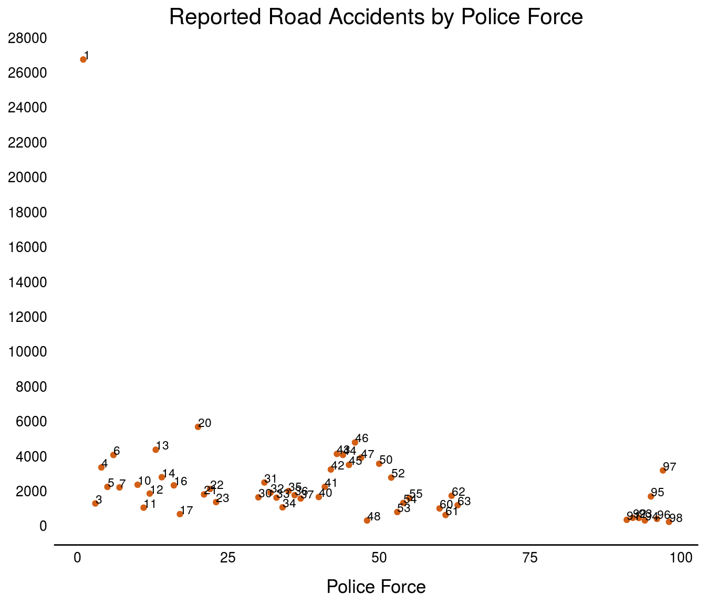

The police forces are labelled with numbers, but the chart shows that police force 1 (Metropolitan Police) has the highest number of road accidents in 2017.

### Horizontal bar chart

The scatter plot showing the number of accidents by police force could also be shown in a horizontal bar chart.

Use **geom_col** plus **coord_flip** to create a horizontal bar chart.

For the horizontal bar chart, bars will be shown in descending order, with the police force with the largest value at the top of the chart. This is done by ensuring the data is arranged by the number of accidents ("n").

As this is categorical data, police force is made a factor, with each police force made a separate level.


```r
# Arrange police force data by size
accident_pf <- arrange(accident_pf, n)
# take a subset for charting purposes
accident_pf_small <- dplyr::filter(accident_pf, n < 600)
# Make police force a factor
accident_pf_small$Police_Force <- 
  factor(accident_pf_small$Police_Force, levels = accident_pf_small$Police_Force)
# use the DfT colours and the DfT theme for the accidents by police force scatter chart
ggplot(data = accident_pf_small) +
  geom_col(mapping = aes(x = Police_Force, y = n, fill = Police_Force)) +
  coord_flip() +         # make bar chart horizontal
  labs(title = "Reported Road Accidents by Police Force, 2017", 
       x = "Police Force", 
       y = "Number of Accidents")+ 
  scale_y_continuous(breaks = seq(0, 500, 50)) + # set y axis running from 0 to 500
   scale_fill_manual(values = dft_colour) +
  theme_dft +  #here we specify our custom theme
  theme(legend.position = "none") # command to remove legends
```


The chart shows that police force 98 (Dumfries and Galloway) recorded the lowest number of accidents in 2017.

### Stacked bar chart

This example will create a stacked bar chart showing the percentage of road accidents in each accident severity category, for each year.

Creating a **percentage stacked bar** requires using the **geom_bar** command in ggplot2 and setting the position to **fill**.


```r
# Make accident year a factor so year on x-axis is labelled individually
#(otherwise axis will be continuous)
road_acc_year <- road_acc
# make year a factor
road_acc_year$accident_year <- as.factor(road_acc_year$accident_year)
# use the DfT colours and the DfT theme for the accidents by police force scatter chart
ggplot(data = road_acc_year, aes(fill = name, y=total, x= accident_year)) +
  geom_bar(position="fill", stat="identity") +  # geom bar with position fill makes stacked bar
  labs(title = "Percentage Accident Severity, by Year", 
       x = "Accident Year", 
       y = "% Accident Severity")+ 
   scale_fill_manual(values = dft_colour) +
  theme_dft 
```

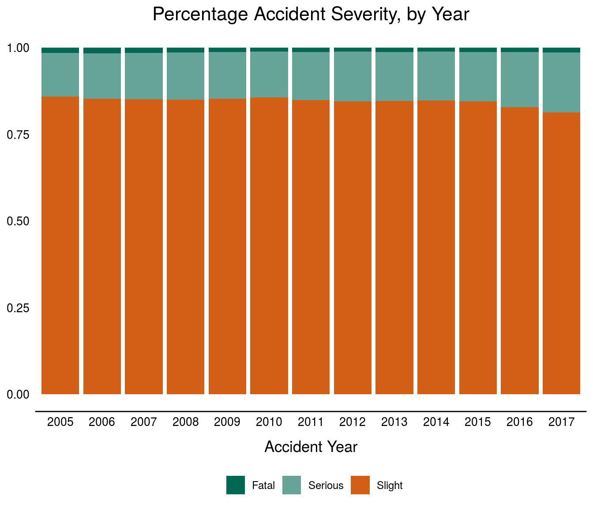

If you want the stacked bar chart to show numbers instead of percentages use **position = "stack"** instead.


```r
# use the DfT colours and the DfT theme for the accidents by police force scatter chart
ggplot(data = road_acc_year, aes(fill = name, y=total, x= accident_year)) +
  geom_bar(position="stack", stat="identity") +
  labs(title = "Number of accidents by severity, by Year", 
       x = "Accident Year", 
       y = "% Accident Severity")+ 
   scale_fill_manual(values = dft_colour) +
  theme_dft 
```

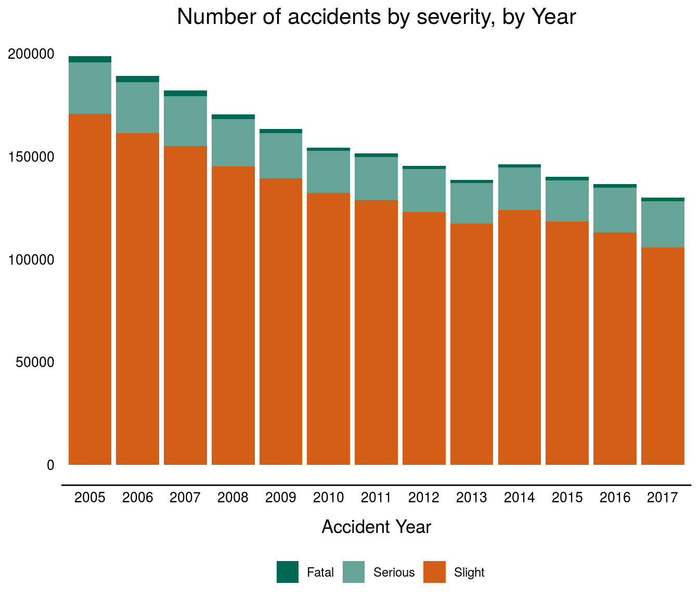

## Interactive charts with {plotly}

{plotly} is a graphing library which makes interactive html graphs. It uses the open source JavaScript graphing library plotly.js. It is great for building dashboards or allowing the user to interact with the data themselves.

{plotly} is not necessarily good for publications as the charts are html but can be useful for exploratory analysis or QA notes. It allows you to zoom into certain parts of the chart and toggle between different categories.

It can be used in two ways - either with {ggplot2} (easier option) or using the plot_ly() wrapper directly which gives you more control.

### {plotly} with {ggplot2}

Taking our previous accidents by severity plot, we can simply assign this to an object and use the ggplotly() function to make it interactive.


```r
library(plotly)
road_acc_chart <- ggplot(data = road_acc) +
  geom_line(mapping = aes(x = accident_year, y = total, colour = name), size = 1.5) +
  labs(title = "Accidents by severity, 2005 to 2017", 
       x = "Accident Year", 
       y = "")+
  scale_x_continuous(breaks = seq(2005, 2017, 2))+
  scale_colour_manual(values = dft_colour) + 
  theme_dft 
plotly::ggplotly(road_acc_chart)
#> Warning: plotly.js does not (yet) support horizontal legend items 
#> You can track progress here: 
#> https://github.com/plotly/plotly.js/issues/53
```

```{=html}
<div id="htmlwidget-6a5ee21dc62f9d8b8368" style="width:672px;height:576px;" class="plotly html-widget"></div>
<script type="application/json" data-for="htmlwidget-6a5ee21dc62f9d8b8368">{"x":{"data":[{"x":[2005,2006,2007,2008,2009,2010,2011,2012,2013,2014,2015,2016,2017],"y":[2913,2926,2714,2341,2057,1731,1797,1637,1608,1658,1618,1695,1676],"text":["accident_year: 2005<br />total:   2913<br />name: Fatal","accident_year: 2006<br />total:   2926<br />name: Fatal","accident_year: 2007<br />total:   2714<br />name: Fatal","accident_year: 2008<br />total:   2341<br />name: Fatal","accident_year: 2009<br />total:   2057<br />name: Fatal","accident_year: 2010<br />total:   1731<br />name: Fatal","accident_year: 2011<br />total:   1797<br />name: Fatal","accident_year: 2012<br />total:   1637<br />name: Fatal","accident_year: 2013<br />total:   1608<br />name: Fatal","accident_year: 2014<br />total:   1658<br />name: Fatal","accident_year: 2015<br />total:   1618<br />name: Fatal","accident_year: 2016<br />total:   1695<br />name: Fatal","accident_year: 2017<br />total:   1676<br />name: Fatal"],"type":"scatter","mode":"lines","line":{"width":5.66929133858268,"color":"rgba(0,104,83,1)","dash":"solid"},"hoveron":"points","name":"Fatal","legendgroup":"Fatal","showlegend":true,"xaxis":"x","yaxis":"y","hoverinfo":"text","frame":null},{"x":[2005,2006,2007,2008,2009,2010,2011,2012,2013,2014,2015,2016,2017],"y":[25029,24946,24322,23121,21997,20440,20986,20901,19624,20676,20033,21725,22534],"text":["accident_year: 2005<br />total:  25029<br />name: Serious","accident_year: 2006<br />total:  24946<br />name: Serious","accident_year: 2007<br />total:  24322<br />name: Serious","accident_year: 2008<br />total:  23121<br />name: Serious","accident_year: 2009<br />total:  21997<br />name: Serious","accident_year: 2010<br />total:  20440<br />name: Serious","accident_year: 2011<br />total:  20986<br />name: Serious","accident_year: 2012<br />total:  20901<br />name: Serious","accident_year: 2013<br />total:  19624<br />name: Serious","accident_year: 2014<br />total:  20676<br />name: Serious","accident_year: 2015<br />total:  20033<br />name: Serious","accident_year: 2016<br />total:  21725<br />name: Serious","accident_year: 2017<br />total:  22534<br />name: Serious"],"type":"scatter","mode":"lines","line":{"width":5.66929133858268,"color":"rgba(102,164,152,1)","dash":"solid"},"hoveron":"points","name":"Serious","legendgroup":"Serious","showlegend":true,"xaxis":"x","yaxis":"y","hoverinfo":"text","frame":null},{"x":[2005,2006,2007,2008,2009,2010,2011,2012,2013,2014,2015,2016,2017],"y":[170793,161289,155079,145129,139500,132243,128691,123033,117428,123988,118435,113201,105772],"text":["accident_year: 2005<br />total: 170793<br />name: Slight","accident_year: 2006<br />total: 161289<br />name: Slight","accident_year: 2007<br />total: 155079<br />name: Slight","accident_year: 2008<br />total: 145129<br />name: Slight","accident_year: 2009<br />total: 139500<br />name: Slight","accident_year: 2010<br />total: 132243<br />name: Slight","accident_year: 2011<br />total: 128691<br />name: Slight","accident_year: 2012<br />total: 123033<br />name: Slight","accident_year: 2013<br />total: 117428<br />name: Slight","accident_year: 2014<br />total: 123988<br />name: Slight","accident_year: 2015<br />total: 118435<br />name: Slight","accident_year: 2016<br />total: 113201<br />name: Slight","accident_year: 2017<br />total: 105772<br />name: Slight"],"type":"scatter","mode":"lines","line":{"width":5.66929133858268,"color":"rgba(210,95,21,1)","dash":"solid"},"hoveron":"points","name":"Slight","legendgroup":"Slight","showlegend":true,"xaxis":"x","yaxis":"y","hoverinfo":"text","frame":null}],"layout":{"margin":{"t":45.7772242977722,"r":7.30593607305936,"b":42.7286564272866,"l":50.8094645080947},"paper_bgcolor":"rgba(255,255,255,1)","font":{"color":"rgba(0,0,0,1)","family":"","size":14.6118721461187},"title":{"text":"Accidents by severity, 2005 to 2017","font":{"color":"rgba(0,0,0,1)","family":"sans","size":21.2536322125363},"x":0.5,"xref":"paper"},"xaxis":{"domain":[0,1],"automargin":true,"type":"linear","autorange":false,"range":[2004.4,2017.6],"tickmode":"array","ticktext":["2005","2007","2009","2011","2013","2015","2017"],"tickvals":[2005,2007,2009,2011,2013,2015,2017],"categoryorder":"array","categoryarray":["2005","2007","2009","2011","2013","2015","2017"],"nticks":null,"ticks":"","tickcolor":null,"ticklen":3.65296803652968,"tickwidth":0,"showticklabels":true,"tickfont":{"color":"rgba(0,0,0,1)","family":"sans","size":13.2835201328352},"tickangle":-0,"showline":true,"linecolor":"rgba(0,0,0,1)","linewidth":0.66417600664176,"showgrid":false,"gridcolor":null,"gridwidth":0,"zeroline":false,"anchor":"y","title":{"text":"Accident Year","font":{"color":"rgba(0,0,0,1)","family":"sans","size":17.2685761726858}},"hoverformat":".2f"},"yaxis":{"domain":[0,1],"automargin":true,"type":"linear","autorange":false,"range":[-6851.25,179252.25],"tickmode":"array","ticktext":["0","50000","100000","150000"],"tickvals":[0,50000,100000,150000],"categoryorder":"array","categoryarray":["0","50000","100000","150000"],"nticks":null,"ticks":"","tickcolor":null,"ticklen":3.65296803652968,"tickwidth":0,"showticklabels":true,"tickfont":{"color":"rgba(0,0,0,1)","family":"sans","size":13.2835201328352},"tickangle":-0,"showline":false,"linecolor":null,"linewidth":0,"showgrid":false,"gridcolor":null,"gridwidth":0,"zeroline":false,"anchor":"x","title":{"text":"","font":{"color":null,"family":null,"size":0}},"hoverformat":".2f"},"shapes":[{"type":"rect","fillcolor":null,"line":{"color":null,"width":0,"linetype":[]},"yref":"paper","xref":"paper","x0":0,"x1":1,"y0":0,"y1":1}],"showlegend":true,"legend":{"bgcolor":"rgba(255,255,255,1)","bordercolor":"transparent","borderwidth":1.88976377952756,"font":{"color":"rgba(0,0,0,1)","family":"sans","size":11.9551681195517},"y":1},"hovermode":"closest","barmode":"relative"},"config":{"doubleClick":"reset","showSendToCloud":false},"source":"A","attrs":{"12969035878":{"x":{},"y":{},"colour":{},"type":"scatter"}},"cur_data":"12969035878","visdat":{"12969035878":["function (y) ","x"]},"highlight":{"on":"plotly_click","persistent":false,"dynamic":false,"selectize":false,"opacityDim":0.2,"selected":{"opacity":1},"debounce":0},"shinyEvents":["plotly_hover","plotly_click","plotly_selected","plotly_relayout","plotly_brushed","plotly_brushing","plotly_clickannotation","plotly_doubleclick","plotly_deselect","plotly_afterplot","plotly_sunburstclick"],"base_url":"https://plot.ly"},"evals":[],"jsHooks":[]}</script>
```
Since we set our legend to be horizontal in our DfT theme, we get a warning message as plotly.js does not support horizontal legend items yet.

### plot_ly()

Using plot_ly() is similar to {ggplot2} in some ways as we build the plot in layers but we use the pipe operator rather than a plus sign, and the ~ sign before the variables in our data:


```r
plotly::plot_ly(road_acc, x = ~accident_year, y = ~total) %>% # specify the data and x and y axes
  plotly::add_lines(color = ~name, colors = dft_colour[1:3]) %>% # colour lines by severity
  plotly::layout(title = "Accidents by severity, 2005 to 2017",
         xaxis = list(title = "Accident Year"),
         yaxis = list(title = ""))
```

```{=html}
<div id="htmlwidget-7ec24289dc6608a1597f" style="width:672px;height:576px;" class="plotly html-widget"></div>
<script type="application/json" data-for="htmlwidget-7ec24289dc6608a1597f">{"x":{"visdat":{"12959075095":["function () ","plotlyVisDat"]},"cur_data":"12959075095","attrs":{"12959075095":{"x":{},"y":{},"alpha_stroke":1,"sizes":[10,100],"spans":[1,20],"type":"scatter","mode":"lines","color":{},"colors":["#006853","#66A498","#D25F15"],"inherit":true}},"layout":{"margin":{"b":40,"l":60,"t":25,"r":10},"title":"Accidents by severity, 2005 to 2017","xaxis":{"domain":[0,1],"automargin":true,"title":"Accident Year"},"yaxis":{"domain":[0,1],"automargin":true,"title":""},"hovermode":"closest","showlegend":true},"source":"A","config":{"showSendToCloud":false},"data":[{"x":[2005,2006,2007,2008,2009,2010,2011,2012,2013,2014,2015,2016,2017],"y":[2913,2926,2714,2341,2057,1731,1797,1637,1608,1658,1618,1695,1676],"type":"scatter","mode":"lines","name":"Fatal","marker":{"color":"rgba(0,104,83,1)","line":{"color":"rgba(0,104,83,1)"}},"textfont":{"color":"rgba(0,104,83,1)"},"error_y":{"color":"rgba(0,104,83,1)"},"error_x":{"color":"rgba(0,104,83,1)"},"line":{"color":"rgba(0,104,83,1)"},"xaxis":"x","yaxis":"y","frame":null},{"x":[2005,2006,2007,2008,2009,2010,2011,2012,2013,2014,2015,2016,2017],"y":[25029,24946,24322,23121,21997,20440,20986,20901,19624,20676,20033,21725,22534],"type":"scatter","mode":"lines","name":"Serious","marker":{"color":"rgba(102,164,152,1)","line":{"color":"rgba(102,164,152,1)"}},"textfont":{"color":"rgba(102,164,152,1)"},"error_y":{"color":"rgba(102,164,152,1)"},"error_x":{"color":"rgba(102,164,152,1)"},"line":{"color":"rgba(102,164,152,1)"},"xaxis":"x","yaxis":"y","frame":null},{"x":[2005,2006,2007,2008,2009,2010,2011,2012,2013,2014,2015,2016,2017],"y":[170793,161289,155079,145129,139500,132243,128691,123033,117428,123988,118435,113201,105772],"type":"scatter","mode":"lines","name":"Slight","marker":{"color":"rgba(210,95,21,1)","line":{"color":"rgba(210,95,21,1)"}},"textfont":{"color":"rgba(210,95,21,1)"},"error_y":{"color":"rgba(210,95,21,1)"},"error_x":{"color":"rgba(210,95,21,1)"},"line":{"color":"rgba(210,95,21,1)"},"xaxis":"x","yaxis":"y","frame":null}],"highlight":{"on":"plotly_click","persistent":false,"dynamic":false,"selectize":false,"opacityDim":0.2,"selected":{"opacity":1},"debounce":0},"shinyEvents":["plotly_hover","plotly_click","plotly_selected","plotly_relayout","plotly_brushed","plotly_brushing","plotly_clickannotation","plotly_doubleclick","plotly_deselect","plotly_afterplot","plotly_sunburstclick"],"base_url":"https://plot.ly"},"evals":[],"jsHooks":[]}</script>
```


You can find more information about using {plotly} in R from the following websites:

* Graphing library with example code: [https://plot.ly/r/](https://plot.ly/r/)

* Cheat sheet: [https://images.plot.ly/plotly-documentation/images/r_cheat_sheet.pdf](https://images.plot.ly/plotly-documentation/images/r_cheat_sheet.pdf)

* E-book: [https://plotly-r.com/index.html](https://plotly-r.com/index.html)

## Mapping in R

There are a wide range of packages you can use to produce maps in R. For static choropleth maps, we're going to focus on using {ggplot2} which we are now familiar with.

### Mapping with {ggplot2}

To complete.

### Mapping with {leaflet}

The {leaflet} package can be used to create interactive maps in R. Similar to {ggplot2}, you start with a base map and then add layers (i.e. features). We're going to map some search and rescue helicopter data, using the longitude and latitude.


```r
library(leaflet)
sarh <- readr::read_csv(file = "data/SARH_spatial.csv")
#> 
#> ── Column specification ────────────────────────────────────────────────────────────────────────────────────────────────────────
#> cols(
#>   Base = col_character(),
#>   Unique_ID = col_character(),
#>   Cat = col_character(),
#>   latitude_new = col_double(),
#>   longitude_new = col_double(),
#>   Place = col_character(),
#>   Domain = col_character()
#> )
head(sarh)
```

<div class="kable-table">

<table>
 <thead>
  <tr>
   <th style="text-align:left;"> Base </th>
   <th style="text-align:left;"> Unique_ID </th>
   <th style="text-align:left;"> Cat </th>
   <th style="text-align:right;"> latitude_new </th>
   <th style="text-align:right;"> longitude_new </th>
   <th style="text-align:left;"> Place </th>
   <th style="text-align:left;"> Domain </th>
  </tr>
 </thead>
<tbody>
  <tr>
   <td style="text-align:left;"> Sumburgh </td>
   <td style="text-align:left;"> Sumb6559171 </td>
   <td style="text-align:left;"> Rescue/Recovery </td>
   <td style="text-align:right;"> 61.10333 </td>
   <td style="text-align:right;"> 1.073333 </td>
   <td style="text-align:left;"> Cormorant Alpha </td>
   <td style="text-align:left;"> Maritime </td>
  </tr>
  <tr>
   <td style="text-align:left;"> Caernarfon </td>
   <td style="text-align:left;"> Caer6580171 </td>
   <td style="text-align:left;"> Support </td>
   <td style="text-align:right;"> 51.88602 </td>
   <td style="text-align:right;"> -5.307241 </td>
   <td style="text-align:left;"> Whitesands Bay </td>
   <td style="text-align:left;"> Coastal </td>
  </tr>
  <tr>
   <td style="text-align:left;"> Humberside </td>
   <td style="text-align:left;"> Humb6587171 </td>
   <td style="text-align:left;"> Rescue/Recovery </td>
   <td style="text-align:right;"> 53.39779 </td>
   <td style="text-align:right;"> -1.903712 </td>
   <td style="text-align:left;"> Kinder Scout </td>
   <td style="text-align:left;"> Land </td>
  </tr>
  <tr>
   <td style="text-align:left;"> Prestwick </td>
   <td style="text-align:left;"> Pres6613171 </td>
   <td style="text-align:left;"> Rescue/Recovery </td>
   <td style="text-align:right;"> 56.33115 </td>
   <td style="text-align:right;"> -4.618574 </td>
   <td style="text-align:left;"> Beinn A Chroin </td>
   <td style="text-align:left;"> Land </td>
  </tr>
  <tr>
   <td style="text-align:left;"> Inverness </td>
   <td style="text-align:left;"> Inve6614171 </td>
   <td style="text-align:left;"> Rescue/Recovery </td>
   <td style="text-align:right;"> 56.80076 </td>
   <td style="text-align:right;"> -5.034575 </td>
   <td style="text-align:left;"> Ben Nevis </td>
   <td style="text-align:left;"> Land </td>
  </tr>
  <tr>
   <td style="text-align:left;"> Newquay </td>
   <td style="text-align:left;"> Newq6617171 </td>
   <td style="text-align:left;"> Search only </td>
   <td style="text-align:right;"> 50.04000 </td>
   <td style="text-align:right;"> -5.636667 </td>
   <td style="text-align:left;"> Porthcurno </td>
   <td style="text-align:left;"> Maritime </td>
  </tr>
</tbody>
</table>

</div>

```r
#plot the interactive map using leaflet
leaflet::leaflet(data = sarh) %>% 
  leaflet::addProviderTiles(provider = providers$Esri.NatGeoWorldMap) %>%  #select the type of map you want to plot
  leaflet::addMarkers(lng = ~longitude_new, 
                      lat = ~ latitude_new, 
                      popup = ~ htmltools::htmlEscape(Base), # what appears when you click on a data point
                      label = ~ htmltools::htmlEscape(Domain) # what appears when you hover over a data point
  )
```

```{=html}
<div id="htmlwidget-9630606b89d4d06e3023" style="width:672px;height:576px;" class="leaflet html-widget"></div>
<script type="application/json" data-for="htmlwidget-9630606b89d4d06e3023">{"x":{"options":{"crs":{"crsClass":"L.CRS.EPSG3857","code":null,"proj4def":null,"projectedBounds":null,"options":{}}},"calls":[{"method":"addProviderTiles","args":["Esri.NatGeoWorldMap",null,null,{"errorTileUrl":"","noWrap":false,"detectRetina":false}]},{"method":"addMarkers","args":[[61.1033333333333,51.886015,53.39779,56.331152,56.800758,50.04,51.45365,50.711125,54.575,57.4231666666667,51.799501,52.586561,51.16483,57.8333333333333,56.462968,56.805099,53.330636,56.515513,52.852372,50.547397,56.849041,60.9083333333333,54.893463,52.403546,53.8333333333333,50.735242,50.402114,49.912498,57.55563,50.410538,52.2073333333333,61.035,50.735242,54.454098,50.5821666666667,57.798884,50.765305,60.327256,54.4873333333333,51.2333333333333,49.9063333333333,61.7333333333333,57.5933333333333,50.216471,53.25234,49.912498,49.9616666666667,51.5858333333333,56.213799,57.027449,53.325235,51.60161,54.65043,51.39431,50.712041,59.254395,54.472066,54.595,51.811757,59.367065,50.4916666666667,56.235687,50.100836,51.075085,53.067777,50.626493,57.480292,50.710226,59.250456,56.235687,49.3525,50.711134,54.235332,57.137513,53.072398,53.020986,55.243419,59.248879,49.913343,51.22967,56.230154,56.517254,49.912446,49.913343,55.938184,50.264682,59.57,53.011309,51.4861666666667,60.353108,52.848703,53.001038,59.349956,60.353984,52.363585,59.7433333333333,50.746626,56.800718,54.539303,52.839442,60.805,50.697603,53.383375,51.397273,56.312653,49.913343,50.8248333333333,50.711125,58.9855,53.8776666666667,50.591828,59.5183333333333,59.25,50.739231,50.290231,49.912498,52.4833333333333,50.73403,59.5885,50.736448,50.736448,53.588081,55.542021,53.076125,50.621169,51.288194,57.993954,59.5885,53.891381,50.223794,50.043899,49.913549,50.3016666666667,50.006533,50.710226,52.979443,53.541895,58.662711,50.616769,55.333695,50.7155,53.0183333333333,59.4028333333333,53.26,51.4731666666667,57.725,51.8741666666667,56.1236666666667,54.4381666666667,52.809,57.8376666666667,50.7371666666667,56.569819,53.1211666666667,51.4418333333333,56.67347,57.639381,52.891176,49.435,50.32,50.67,53.5383333333333,50.0966666666667,50.0966666666667,56.24,57.73537,54.447046,57.895382,56.849041,59.5733333333333,51.378809,58.7666666666667,55.5901666666667,57.703953,50.710226,54.672456,50.481427,49.930384,56.75,50.725,57.417765,60.7333333333333,53.3883333333333,50.711125,59.875,50.657463,54.7563333333333,57.974281,49.91324,50.710226,58.3315,55.354281,58.346371,50.912007,53.067777,53.067777,53.077524,50.623547,50.094145,54.527648,55.915562,54.527648,50.710226,53.067777,51.3826666666667,56.213799,50.075675,57.007361,54.473865],[1.07333333333333,-5.3072415,-1.9037115,-4.6185738,-5.0345747,-5.63666666666667,0.81529027,-1.2988755,-5.93083333333333,-5.25,-2.445147,-4.088587,-4.6659543,-8.05,-2.9541999,-5.003795,-3.8379289,-5.9126421,-4.0033043,-4.9796494,-5.0450465,-2.16333333333333,-1.3622953,-4.0652278,-3.88333333333333,-1.668363,-3.5139878,-6.291765,-6.22611,-5.1216725,-4.32366666666667,1.705,-1.668363,-3.2122852,-1.06183333333333,-3.8439383,0.29439376,-1.6668376,-0.619333333333333,-3.85283333333333,-6.27366666666667,1.155,-1.76166666666667,-3.7926494,-4.6126107,-6.291765,-3.91933333333333,-4.67166666666667,-4.8057287,-2.4068696,-3.7791359,-3.8394612,-3.5684073,-3.4933362,-1.3016946,-2.5470855,-0.61891283,0.431666666666667,-3.8567121,-2.4363027,-0.43,-4.8702732,-5.4175696,1.1963064,-4.0774737,-2.3081466,-4.3616475,-1.298889,-2.6241682,-4.8702732,-2.32533333333333,-1.3002917,-0.44270768,-3.6588847,-4.0702322,-4.0796972,-4.8643807,-2.576802,-6.2932337,-3.9291465,-4.876314,-5.9144484,-6.2931539,-6.2932337,-4.9074732,-5.0587897,1.6785,-4.0151321,-0.8035,-1.2008459,-4.4828425,-4.1398424,-2.9513128,-1.1972,-3.4949692,1.67166666666667,0.18999653,-5.0362097,-3.3152798,-4.4956782,1.45,-1.2934134,-1.8691659,-3.5423076,-6.409623,-6.2932337,-0.258833333333333,-1.2988755,-2.9525,1.89766666666667,-1.9872328,-1.63833333333333,-2.57066666666667,0.24776319,-5.2443737,-6.291765,2.05333333333333,0.23759374,1.05483333333333,0.20511165,0.20511165,0.039535017,-5.1159577,-1.5626071,-2.2798398,-2.7398878,-7.0975821,1.05483333333333,-0.14812658,-5.396911,-5.6901347,-6.2876781,-1.31666666666667,-5.1582143,-1.298889,0.75261592,0.1610761,-4.4583291,-2.2359962,-1.5428338,-0.9985,1.79666666666667,-2.00333333333333,0.916666666666667,0.994333333333333,-5.72416666666667,-3.12833333333333,-4.81966666666667,-3.29033333333333,-3.90233333333333,-5.595,0.2575,-5.175614,-3.9695,-3.604,-5.0569796,-4.0502852,-3.1905112,-2.60283333333333,-4.685,-1.45816666666667,-0.2245,-5.27833333333333,-5.27833333333333,-4.74916666666667,-3.6273829,-3.1041236,-6.3639329,-5.0450465,1.055,-3.5100745,-7.65,-2.738,-7.2146621,-1.298889,-3.3025225,-4.0338273,-6.2947501,-7.05,-0.959333333333333,-5.691916,-2.48333333333333,2.005,-1.2988755,-6.53333333333333,-1.9433601,-3.92583333333333,-4.6460662,-6.2960114,-1.298889,-5.5795,-2.4778499,-5.1575743,-1.5518955,-4.0774737,-4.0774737,-3.9256605,-4.7737752,-5.3695452,-3.6100551,-4.9137816,-3.6100551,-1.298889,-4.0774737,-3.365,-4.8057287,-5.7093525,-7.510735,-3.2128698],null,null,null,{"interactive":true,"draggable":false,"keyboard":true,"title":"","alt":"","zIndexOffset":0,"opacity":1,"riseOnHover":false,"riseOffset":250},["Sumburgh","Caernarfon","Humberside","Prestwick","Inverness","Newquay","Lydd","Lee on Solent","Prestwick","Inverness","St Athan","Caernarfon","Newquay","Stornoway","Inverness","Inverness","Caernarfon","Prestwick","Caernarfon","Newquay","Prestwick","Sumburgh","Humberside","St Athan","Caernarfon","Lee on Solent","Newquay","Newquay","Stornoway","Newquay","St Athan","Sumburgh","Lee on Solent","Prestwick","Lee on Solent","Inverness","Lydd","Sumburgh","Humberside","St Athan","Newquay","Sumburgh","Inverness","Newquay","Caernarfon","Newquay","Newquay","St Athan","Prestwick","Inverness","Caernarfon","St Athan","Prestwick","St Athan","Lee on Solent","Sumburgh","Humberside","Humberside","St Athan","Sumburgh","Lee on Solent","Prestwick","Newquay","Lydd","Caernarfon","Lee on Solent","Inverness","Lee on Solent","Sumburgh","Inverness","Lydd","Lee on Solent","Humberside","Inverness","Caernarfon","Caernarfon","Prestwick","Sumburgh","Newquay","St Athan","Prestwick","Prestwick","Newquay","Newquay","Prestwick","Newquay","Sumburgh","Caernarfon","Lee on Solent","Sumburgh","Caernarfon","Caernarfon","Sumburgh","Sumburgh","Caernarfon","Sumburgh","Lydd","Inverness","Prestwick","Caernarfon","Sumburgh","Lee on Solent","Humberside","St Athan","Prestwick","Lee on Solent","Lee on Solent","Lee on Solent","Sumburgh","Humberside","Lee on Solent","Sumburgh","Inverness","Lydd","Newquay","Newquay","Humberside","Lydd","Sumburgh","Lydd","Lydd","Humberside","Prestwick","Humberside","Lee on Solent","St Athan","Stornoway","Sumburgh","Humberside","Newquay","Newquay","Newquay","Lee on Solent","Newquay","Lee on Solent","Humberside","Humberside","Stornoway","Lee on Solent","Prestwick","Lee on Solent","Humberside","Sumburgh","Humberside","Lydd","Stornoway","St Athan","Prestwick","Humberside","Caernarfon","Stornoway","Lydd","Prestwick","Caernarfon","St Athan","Inverness","Inverness","Caernarfon","Newquay","Newquay","Lee on Solent","Humberside","Newquay","Prestwick","Prestwick","Inverness","Prestwick","Stornoway","Prestwick","Sumburgh","St Athan","Stornoway","Prestwick","Stornoway","Lee on Solent","Prestwick","Newquay","Newquay","Stornoway","Lee on Solent","Inverness","Sumburgh","Humberside","Lee on Solent","Stornoway","Lee on Solent","Prestwick","Inverness","Newquay","Lee on Solent","Stornoway","Prestwick","Inverness","Lee on Solent","Caernarfon","Caernarfon","Caernarfon","Newquay","Newquay","Prestwick","Inverness","Prestwick","Lee on Solent","Caernarfon","St Athan","Prestwick","Newquay","Stornoway","Prestwick"],null,null,null,["Maritime","Coastal","Land","Land","Land","Maritime","Coastal","Land","Land","Land","Land","Land","Land","Maritime","Coastal","Land","Land","Land","Land","Coastal","Land","Maritime","Coastal","Land","Maritime","Coastal","Coastal","Land","Land","Coastal","Coastal","Maritime","Coastal","Land","Maritime","Coastal","Coastal","Land","Coastal","Coastal","Land","Maritime","Maritime","Coastal","Coastal","Land","Maritime","Maritime","Land","Land","Coastal","Coastal","Aero","Coastal","Aero","Land","Land","Maritime","Land","Land","Maritime","Land","Coastal","Maritime","Land","Coastal","Coastal","Land","Land","Land","Land","Land","Land","Land","Land","Land","Coastal","Land","Land","Coastal","Land","Land","Land","Land","Maritime","Land","Maritime","Land","Aero","Land","Coastal","Land","Land","Land","Land","Maritime","Coastal","Land","Land","Coastal","Maritime","Land","Land","Coastal","Coastal","Land","Land","Land","Land","Maritime","Coastal","Land","Land","Coastal","Coastal","Land","Maritime","Coastal","Maritime","Coastal","Coastal","Maritime","Land","Land","Coastal","Land","Coastal","Maritime","Coastal","Coastal","Coastal","Land","Maritime","Coastal","Land","Coastal","Maritime","Maritime","Coastal","Coastal","Maritime","Maritime","Maritime","Maritime","Maritime","Coastal","Land","Maritime","Land","Land","Coastal","Coastal","Land","Land","Coastal","Land","Coastal","Land","Land","Coastal","Land","Land","Land","Aero","Land","Maritime","Land","Land","Land","Maritime","Maritime","Maritime","Land","Land","Land","Land","Land","Land","Coastal","Maritime","Land","Maritime","Maritime","Land","Maritime","Maritime","Maritime","Land","Land","Land","Maritime","Land","Land","Land","Land","Land","Land","Coastal","Coastal","Coastal","Coastal","Coastal","Land","Land","Maritime","Land","Coastal","Coastal","Land"],{"interactive":false,"permanent":false,"direction":"auto","opacity":1,"offset":[0,0],"textsize":"10px","textOnly":false,"className":"","sticky":true},null]}],"limits":{"lat":[49.3525,61.7333333333333],"lng":[-8.05,2.05333333333333]}},"evals":[],"jsHooks":[]}</script>
```

If you want to save this as a static map, you could simply export is an image. More information on using {leaflet} in R can be found here: [https://rstudio.github.io/leaflet/](https://rstudio.github.io/leaflet/)

<!--chapter:end:06-plotting.Rmd-->

# DfT RAP guidance {#RAP}

This section provides a condensed version of the DfT RAP guidance written and amended by the DfT RAP committee.

A more in-depth guide is available internally, please ask the DfT RAP committee for the file path.


## What

This sub-chapter explains what a RAP project is using RAP levels amended from NHS Scotland RAP levels.

Use the DfT RAP levels to ensure your DfT RAP project includes everything it should. A project is considered a RAP project at level 4a and above. 

These RAP levels have been amended from the original [NHS Scotland RAP levels](https://www.isdscotland.org/About-ISD/Methodologies/_docs/Reproducible_Analytical_Pipelines_paper_v1.4.pdf) to reflect DfT processes and software capabilities. There is guidance for the descriptors below the RAP levels.


DfT RAP levels guidance

**Data file produced by code**
Your code will produce the required data. This may involve some or all of cleaning, tidying, wrangling, analysing.

**Outputs produced by code** 
Your code will automate the production of publication ready outputs, for example formatted excel publication tables or reports.

**QA of code**
Your code has been quality assured by someone else, and all comments implemented. Your manager should sign off on the code at this point.

**Documentation so others can independently run the code**
Your code should be documented so that someone else can independently run the code. This could be through comments in the code, or a separate document, such as a README.md, providing guidance.

**Well-structured data storage**
Your project should have an organised hierarchy of files and folders (we recommend using an R project), with data and outputs stored appropriately. 

**Create versions of code when milestones reached**
You should create versions of your code whenever key milestones or sections have been completed. This will allow you to find previous versions of code if something goes wrong, or the code breaks. If version control is available (e.g. Github) then this could be implemented for more advanced version control.

**R packages and versions documented**
R packages and the versions used should be documented so that if other people use your code they can ensure they have the right packages and versions to run your code. Running sessionInfo() and RStudio.Version() after loading all libraries at the start of your code will output information about the packages and RStudio versions used. See the R-Cookbook for how to capture and print this information to a file.

**Peer review of code**
Your code will need to be peer reviewed. This is less in depth than QA’ing the code but will need to be done by an experienced R user or RAP champion. NOTE: it is part of the RAP champion role to peer review RAP projects.

**Automated quality assurance of data**
Your RAP project should include automated quality assurance of data, this could be an automated QA note, or tests and checks within the code.

**Unit testing of functions and/or stress testing across all code**
Where user defined functions are created, these should be unit tested – functions written to pass tests. Where functions are not used the code must stress tested and risks documented. For example, does the code work with previous years? Are the figures at the end as expected? What happens if the data fed into the code is different? What if there are columns missing?

**All processes RAPped**
All processes that make up the pipeline are RAPped. For example, for a publication this could include automation of processes such as data collection, data tidying, data wrangling, quality assurance, producing publication ready table, charts, dashboards etc.

**Reproducible computing environment**
Using a system like docker to create a reproducible computing environment.


## When

Whilst incredibly powerful, RAP should not be seen as a solution for all the difficulties of statistics production. However, implementing even a few of the techniques can drive benefits in auditability, speed, quality, and knowledge transfer. There is a balance to be struck between ease of maintenance and the level of automation, and this is likely to differ for every publication or team.

Sometimes it is difficult to decide if you should a RAP project or not. The following table should help you identify the benefits and risks for your individual problem:


## Additional resources

There is are also quite a few links and resources which can help with a RAP project:

[RAP govdown website](https://ukgovdatascience.github.io/rap-website/resource-nhs-nss-transforming-publications-toolkit.html) is a central repository for all things RAP across government, including lots of links.

[RAP companion](https://ukgovdatascience.github.io/rap_companion/) comprehensive RAP guide.

[RAP collaboration slack channel](https://govdatascience.slack.com/messages/C6H22U3H9/convo/C17V1PCCX-1560436755.005800/)
Contact the wider RAP community for help on more complex issues through the GovDataScience slack domain (you need to be signed in for this link to work).

[GSS RAP champions page](https://gss.civilservice.gov.uk/about-us/champion-networks/reproducible-analytical-pipeline-rap-champions/). Get in contact with RAP champions from DfT and across government.


<!--chapter:end:07-RAP.Rmd-->

# Spatial Analysis in R {#spatial}


## What is Spatial Data?

For most work in R we work with flat data, i.e. data that is only 1 or 2 dimensions. A data frame, for example, has two dimensions (rows representing observations and columns representing variables), and no other information outside of that two dimensional array. Spatial data however needs some extra information for it to accurately represent actual locations on the Earth: the coordinates of the object; and a system of reference for how the coordinates relate to a physical location on Earth.

## Packages

To hold spatial data, we need to leverage packages which exist outside of Base R. We will be using the {sf} package for these example, but note that it is common to see spatial data held in the {sp}, {geojson}, and {raster} packages as well, all of which have their own advantages and disadvantages (it is not uncommon to have to switch from one to another to leverage these advantages - more on that later).

The advantage of using the {sf} package is that data is kept in as similar a format to a flat data frame as possible. This makes it easier to work with our data for two reasons. First, it lets us use {dplyr} data manipulations or join our spatial data with non-spatial data (some spatial data formats don't let you do this). Second, it's just simplier to wrap your head around.

## Reading in Spatial Data

Let's have a look at some data. We can read in our data as a spatial object using the **st_read** funciton from the {sf} package (if it is saved in an .shp format and has necessary metadata). We'll be working with some shapefiles which represent local authorities which are sourced from the ONS.


*Reading in Spatial Data*

```r
LAs <- sf::st_read("data/LAs")
#> Reading layer `LAs' from data source `/cloud/project/data/LAs' using driver `ESRI Shapefile'
#> Simple feature collection with 382 features and 2 fields
#> geometry type:  MULTIPOLYGON
#> dimension:      XY
#> bbox:           xmin: 364.2663 ymin: 9909.1 xmax: 655599.6 ymax: 1218502
#> proj4string:    +proj=tmerc +lat_0=49 +lon_0=-2 +k=0.9996012717 +x_0=400000 +y_0=-100000 +ellps=airy +units=m +no_defs
```

Looking at the message we get when we load in our data, we can find out some basic information about our sf dataframe:

* It tells us that it is a "Simple feature collection with 391 features and 10 fields". In other words, this is telling us that it is an sf dataframe of 391 observations (features) and 10 variables (fields).
* The geometry type is "MULTIPOLYGON". To break this down, the "POLYGON" is telling us we're dealing with distinct shapes for each observation (as opposed to lines or dots), and the "MULTI" is telling us that one observation can be represented by multiple polygons. An example of this would be the Shetland Islands, a single local authority made up of many small polygons.
* The "bbox"" gives us the coordinates of a bounding box which will contain all the features of the sf data frame.
* The "epsg" and "proj4string" gives us the coordinate reference system. The most common code you will see is 4326 which refers to the "World Geodetic System 1984". This is the coordinate reference system you are probably most familiar with (without realising it), as it is used in most GPS and mapping software. Points in the WGS system are referred to by their "latitude" and "longitude". In this case, the epsg code is "NA", in which case we will have to refer to the documentation to discern the correct epsg code to apply to the data.

We can also ask R to give us all of this info with the **st_geometry** function.

*Inspect spatial data*

```r
sf::st_geometry(LAs)
#> Geometry set for 382 features 
#> geometry type:  MULTIPOLYGON
#> dimension:      XY
#> bbox:           xmin: 364.2663 ymin: 9909.1 xmax: 655599.6 ymax: 1218502
#> proj4string:    +proj=tmerc +lat_0=49 +lon_0=-2 +k=0.9996012717 +x_0=400000 +y_0=-100000 +ellps=airy +units=m +no_defs 
#> First 5 geometries:
#> MULTIPOLYGON (((448874 536622.6, 453089.1 53411...
#> MULTIPOLYGON (((451744.3 520566.4, 451788.8 520...
#> MULTIPOLYGON (((478094.9 518835.6, 475360.6 516...
#> MULTIPOLYGON (((448472.8 525830.1, 448796 52591...
#> MULTIPOLYGON (((515719.3 428570.8, 515724.4 428...
```

## CRS Projections

[There's a lot that can be said](https://www.axismaps.com/guide/general/map-projections/) about the utlity of different Coordinate Reference Systems, but long-story-short they all have unique advantages and disadvantages as they distort shape, distance, or size in different ways. In our day-to-day work, you're most likely to encounter two coordinate reference systems: the World Geodatic System (WGS84 - EPSG code: 4326), or the Ordance Survey Great Britain 1936 system (OSGB36 - EPSG code: 27700).

The WGS84 system is best suited to global data - for example plotting international ports or a world map of countries. It is a geodatic system, which means the points it defines refer to a point on a 3d elipsoid which represents the earth.

The OSGB1936 system is best suited to mapping the UK or areas within it. It is a projected system, which means it projects the 3d curve of the earth into a 2d object. An advantage of this is that eastings (the x-axis of this projection) remains consistent at all northings (the y-axis). For example, a 1000 unit change in eastings is a 1km change *anywhere*, whereas a 1 unit change in longitude is a different distance depending on the latitude, as the earth gets narrower the further away you get from the equator. 

Complexities aside, practically what this means is that you will always want *all* of you're spatial data to be in the same CRS, otherwise spatial joins and mapping functions will start throwing up errors. We can change the crs projection very easily with the {sf} function **st_transform**.

*Changing Coordinate Reference System*

```r
LAs <- sf::st_transform(LAs, crs = 27700)

sf::st_crs(LAs)
#> Coordinate Reference System:
#>   User input: EPSG:27700 
#>   wkt:
#> PROJCS["OSGB 1936 / British National Grid",
#>     GEOGCS["OSGB 1936",
#>         DATUM["OSGB_1936",
#>             SPHEROID["Airy 1830",6377563.396,299.3249646,
#>                 AUTHORITY["EPSG","7001"]],
#>             TOWGS84[446.448,-125.157,542.06,0.15,0.247,0.842,-20.489],
#>             AUTHORITY["EPSG","6277"]],
#>         PRIMEM["Greenwich",0,
#>             AUTHORITY["EPSG","8901"]],
#>         UNIT["degree",0.0174532925199433,
#>             AUTHORITY["EPSG","9122"]],
#>         AUTHORITY["EPSG","4277"]],
#>     PROJECTION["Transverse_Mercator"],
#>     PARAMETER["latitude_of_origin",49],
#>     PARAMETER["central_meridian",-2],
#>     PARAMETER["scale_factor",0.9996012717],
#>     PARAMETER["false_easting",400000],
#>     PARAMETER["false_northing",-100000],
#>     UNIT["metre",1,
#>         AUTHORITY["EPSG","9001"]],
#>     AXIS["Easting",EAST],
#>     AXIS["Northing",NORTH],
#>     AUTHORITY["EPSG","27700"]]
```

This changes the CRS projection from the WGS84 system to the OSGB1936 system, converting all of the coordinates to the new system. We can use the crs argument to change to any number of different projections.
Note that this only works if the spatial object has data on the coordinate reference system already. If your data is missing *all* of this information, you will have to set the crs manually (if you know what the CRS projection *should be*):

*Setting Coordinate Reference System*

```r
sf::st_crs(sf_object) <- 27700
```


## Manipulating Spatial Data

As mentiond above, one of the key advantages of working with spatial data in {sf} format is that we can use tidyverse functions to manipulate our data. Let's show this in action by creating a new variable.

The variable "lad19cd" has a unique code for each local authority. All codes begin with a letter, followed by a numeric series. The letter refers to the country ("E" for England, "W" for Wales, "S" for Scotland, and "N" for Northern Ireland). We can use this to create a new variable called "country" for each feature.

*Manipulating {sf} data with dplyr*

```r
LAs <- LAs %>% dplyr::mutate(country = dplyr::case_when(stringr::str_detect(lad19cd, "W") ~ "Wales",
                             stringr::str_detect(lad19cd, "S") ~ "Scotland",
                             stringr::str_detect(lad19cd, "N") ~ "Northern Ireland",
                             stringr::str_detect(lad19cd, "E") ~ "England"))

LAs %>% as.data.frame() %>% dplyr::group_by(country) %>% dplyr::tally()
```

<div class="kable-table">

<table>
 <thead>
  <tr>
   <th style="text-align:left;"> country </th>
   <th style="text-align:right;"> n </th>
  </tr>
 </thead>
<tbody>
  <tr>
   <td style="text-align:left;"> England </td>
   <td style="text-align:right;"> 317 </td>
  </tr>
  <tr>
   <td style="text-align:left;"> Northern Ireland </td>
   <td style="text-align:right;"> 11 </td>
  </tr>
  <tr>
   <td style="text-align:left;"> Scotland </td>
   <td style="text-align:right;"> 32 </td>
  </tr>
  <tr>
   <td style="text-align:left;"> Wales </td>
   <td style="text-align:right;"> 22 </td>
  </tr>
</tbody>
</table>

</div>

As we can see, we've manipulated our data in exactly the same way as we would have with a flat dataframe.We can also join spatial and non-spatial data together in the same way we normally would with dataframes.
Let's take some population data and join it to our Local Authorities. 

*Joining Spatial and non-spatial data*


```r
summary(LAs_pop)
#>    lad19cd            population      
#>  Length:437         Min.   :    2242  
#>  Class :character   1st Qu.:  104503  
#>  Mode  :character   Median :  147997  
#>                     Mean   :  960204  
#>                     3rd Qu.:  276374  
#>                     Max.   :66435550  
#>                     NA's   :7
```

This dataframe of local authority populations has 2 variables, local authority code (lad19cd) and population. We can use a {dplyr} **left_join** to join this to our {sf} dataframe as we would with a flat dataframe.


```r
LAs <- dplyr::left_join(LAs, LAs_pop, by = "lad19cd")

LAs$population <- as.numeric(LAs$population)
```

## Spatial Analysis - Joins

A common task we might want to conduct is to manipulated a spatial object based on a relationship with another spatial object. To do this, we will use the **st_join** function from the {sf} package. The **st_join** allows us to join data on a number of different relationships, the simplest of which examines whether an object intersects another object - i.e. if there is any point where the geometries of both objects are identical. This could be where two lines cross, where two different spatial points objects have the same gemoetry, or it could be a point falling within the bounds of a polygon.

Let's look at some data representing the coordinates of road traffic accidents in Great Britain.

*Read in csv*


```r
class(crash_data)
#> [1] "data.frame"
names(crash_data)
#> [1] "Location_Easting_OSGR"  "Location_Northing_OSGR" "Date"                   "Number_of_Casualties"
```

Our crash data is in a flat csv format, BUT it has variables representing the easting and northing of where each acccident took place. We can use this to turn our crash data into an sf object with the function **st_as_sf**. We take our dataset, define which variables R should use to define coordinates in the "coords" argument, and define the "crs" that those coordinates are plotted in.

*Transforming flat data frames to spatial data*

```r
crashes <- crash_data %>% dplyr::filter(!is.na(Location_Easting_OSGR) & !is.na(Location_Northing_OSGR)) %>%
sf::st_as_sf(coords = c("Location_Easting_OSGR","Location_Northing_OSGR"), crs = 27700)

sf::st_geometry(crashes)
#> Geometry set for 122580 features 
#> geometry type:  POINT
#> dimension:      XY
#> bbox:           xmin: 84654 ymin: 10235 xmax: 655275 ymax: 1209512
#> CRS:            EPSG:27700
#> First 5 geometries:
#> POINT (529150 182270)
#> POINT (542020 184290)
#> POINT (531720 182910)
#> POINT (541450 183220)
#> POINT (543580 176500)
```

The crashes sf dataframe holds information on all reported road traffic accidents in the UK since 2005. It has a number of variables for each accident, such as the accident severity, number of vehicles, number of casualties, time of day, and road and weather conditions.

Let's have a look at the most severe accidents (accidents with 5 or more casualties).

*Quick map of spatial data*

```r
crashes %>% dplyr::filter(Number_of_Casualties >= 5) %>% tmap::qtm()
```


The **qtm** function is a useful function from {tmap} that let's us quickly create maps with a minimum number of arguments. This is often useful for sense-checking data and can help you spot errors in data manipulation when working with spatial data. Here, for example, we can see that our data largely makes sense, so our conversion to {sf} was likely correct. We can (roughly) make out the shape of Great Britain, and we see some clusters around major cities (London, Birmingham, Manchester etc.). We can also see that we don't appear to have data for Northern Ireland in this dataset (either that or Northern Irish drivers are much safer drivers).

Let's see can we work out which Local Authority has had the most road traffic casualties in this period.
We can use a **spatial join** to assign a local authority to each road traffic accident. This works similarly to a {dplyr} left_join, with all of the variables from the **y** table being added to each observation of the **x** table which match eachother by a defined variable. The difference here is that the two tables are joined based on a shared **geometry**, rather than a shared value of a variable. The shared geometry here being whether a point intersects with a polygon (in other words, whether the point falls within a polygon). 

*Joining spatial data*

```r
crashes_join <- sf::st_join(crashes, LAs, join = st_intersects) # essentially a left_join of LAs to crashes
crashes_join$LA_name <- as.character(crashes_join$LA_name)

LAs_casualties <- crashes_join %>% dplyr::group_by(LA_name) %>% dplyr::summarise(casualties = sum(Number_of_Casualties)) # making an sf data frame called LAs_casualties which is the result of a simple group_by and summarise.

LAs_casualties %>% as.data.frame() %>% dplyr::arrange(desc(casualties)) %>% select(LA_name, casualties) %>% head()
```

<div class="kable-table">

<table>
 <thead>
  <tr>
   <th style="text-align:left;"> LA_name </th>
   <th style="text-align:right;"> casualties </th>
  </tr>
 </thead>
<tbody>
  <tr>
   <td style="text-align:left;"> Birmingham </td>
   <td style="text-align:right;"> 3592 </td>
  </tr>
  <tr>
   <td style="text-align:left;"> Leeds </td>
   <td style="text-align:right;"> 1980 </td>
  </tr>
  <tr>
   <td style="text-align:left;"> Westminster </td>
   <td style="text-align:right;"> 1883 </td>
  </tr>
  <tr>
   <td style="text-align:left;"> Cornwall </td>
   <td style="text-align:right;"> 1663 </td>
  </tr>
  <tr>
   <td style="text-align:left;"> Lambeth </td>
   <td style="text-align:right;"> 1402 </td>
  </tr>
  <tr>
   <td style="text-align:left;"> NA </td>
   <td style="text-align:right;"> 1340 </td>
  </tr>
</tbody>
</table>

</div>

We can see that Birmingham has had more casualties in this period than any other local authority.

The *LAs_casualties* dataset that we created above has the same local authorities names as our original *LAs* sf dataframe, meaning we can easily left_join this table to our original LAs_shapefile. But first, we will turn it into a flat dataframe (ie, with no geographic information) with the **st_set_geometry** function. If we did not get rid of the geometry before left_joining, we would create a "geometry_collection" object for each local authority, which would be a mess of polygons and points within those polygons for each feature. This is because our **group_by** function above also grouped together the geometries of the observations it was grouping together. If we look at the outout above, we can see that the geometry type of LAs_casualties is "MULTIPOINT", so the "Birmingham" observation has 3,532 points representing where each road accident happened, rather than outlining the polygon of Birmingham in any meaningful way.


```r
LAs_casualties <- LAs_casualties %>% sf::st_set_geometry(NULL)

LAs <- dplyr::left_join(LAs, LAs_casualties, by = "LA_name")
```

We now have our casualties data joined to our original local authorities shapefile. We can now use this to make graphical representations of our data.

## Plotting and simplifying

Let's have a look at one of our Local Authorities in isolation, Cornwall.


We can see that our polygon is quite detailed. While this detail is desirable for when we conduct our spatial analysis, if we want to plot all of our local authorities at the same time, it can be better to plot simplified polygons. This is for 3 reasons. First, simplification means that R can create and output plots quicker; Second, outputs will have a smaller file size (particularly useful for interactive plots or when we share our outputs); and third, sometimes simplified polygons actually look better in plots as too-detailed borders can come out looking murky due to over-plotting, particularly in static plots.

To alleviate this, we can simplify our geometry features before plotting. For this, we will use the function **ms_simplify** from the package {rmapshaper}. This function simplifies spatial data while maintaining key topology. Simplifying functions in other packages can do funny things such leave gaps between polygons with internal borders when simplifying. **ms_simplify** doesn't do this.

*Simplifying Spatial Data*

```r
LAs_simp <- rmapshaper::ms_simplify(LAs, keep = 0.05, keep_shapes = TRUE)
```

This command creates a new sf data frame called "LAs_simp", which has all the same information as the original LAs sf dataframe, but has a simplified geometry with fewer points. The "keep" argument specifies how much geographic information we want to hold onto. Here we only keep 5% of the original points. The "keep_shapes" argument specifies whether or not we want to allow the function to delete some features entirely for simplification purposes. This can be useful for polygons with lots of small islands as individual entries (where you are indifferent to whether or not you keep all islands in your dataset), BUT use with caution, as if you simplify too much R might delete entire features (observations) to fulfill the simplification. Here we set "keep_shapes = TRUE"" so we don't lose any features.

Let's have a look at the difference between our original and our simplified polygon:


Even with only 5% of the original points, we can see that we've held onto a lot of the information that we'd want if we were plotting these polygons.

However, we should always use simplification with caution, and only simplify our spatial objects *after* we've carried out spatial analysis. Note that we can also simplify spatial data which are lines, reducing the number of vertices in lines, but we cannot simplify spatial points data, as their geometries (a single point for each entry) is already as small as it can be.


## Mapping Spatial Data

There are a number of packages that you can use to make maps with spatial data in R, including {leaflet}, {ggmap}, {mapdeck}, and {ggplot2}. Here, we will be using the package {tmap}. {tmap} is a highly versatile package for mapping spatial data, with a number of advantages over other packages:

* {tmap} uses a similar grammar to {ggplot2}, where aesthetic layers are layered on top of each other;
* the same piece of {tmap} code can be used to make either static or interactive maps, and;
* {tmap} can work with spatial data in a number of different formats, including {sp}, {raster}, {geojson} and {sf}.

Similar to using {ggplot2}, the first layer of a tmap defines the spatial object that we wish to plot in the function **tm_shape**. We then add (+) an aesthetic element based on this spatial object Most often this aesthetic element will be one of type **tm_polygons**, **tm_line**, or **tm_dots**, depending on the spatial data type.

Let's see this in action, and map our local authorities based on how many road traffic casualties there were in each.

*Create static map in tmap*

```r
LAs <- rmapshaper::ms_simplify(LAs, keep = 0.05, keep_shapes = TRUE) # Simplifying polygons. Remember to only do this after you've finished your spatial analysis, or to save the simplified version as a different name.

tmap::tm_shape(LAs) + # defining what shapefile to use
  tmap::tm_polygons(col = "casualties", # setting the variable to map the colour aesthetic to. tmap takes variable names in quotation marks
              style = "quantile", # the style option lets us define how we want the variable split
             n = 5, # number of quantiles
              pal = "YlGnBu" # choose from a number of palettes available from rcolorbrewer, or define your own
              ) +
  tmap::tm_borders(col = "#000000", # defining polygon border as black
           lwd = 0.3 # setting border width
  ) +
  tmap::tm_layout(legend.outside = TRUE # putting the legend outside the plot rather than inside
            )
```


One problem with this plot is that we still have Northern Ireland in the plot, and we only have NAs for northern Ireland (as our casualties dataset didn't have accidents which happened there). To fix this, we can utilise a simple {dplyr} filter to remove features which have an *NA* value for casualties. We can then pipe a filtered sf dataframe into the **tm_shape** function.


```r
LAs %>%
 dplyr::filter(!is.na(casualties)) %>%
tm_shape() + # defining what shapefile to use
  tm_polygons(col = "casualties", # setting the variable to map the colour aesthetic to. tmap takes variable names in quotation marks
              style = "quantile", # the style option lets us define how we want the variable split
              n = 5, # number of quantiles
              pal = "YlGnBu" # choose from a number of palettes available from rcolorbrewer, or define your own
             ) +
  tm_borders(col = "#000000", # defining polygon border as black
           lwd = 0.3 # setting border width
  ) +
  tm_layout(legend.outside = TRUE # putting the legend outside the plot rather than inside
           )
```


Though this plot is useful, and gives us a sense of the distribution of accidents, it's difficult to make out values of smaller local authorities. What would make this easier is if we changed our map to an interactive map. We can do this very easily, using the same chunk of code, by simply setting the **tmap_mode** to "view".

*Create interactive map in tmap*

```r
tmap_mode("view")

LAs %>%
 filter(!is.na(casualties)) %>%
tm_shape() + # defining what shapefile to use
  tm_polygons(col = "casualties", # setting the variable to map the colour aesthetic to. tmap takes variable names in quotation marks.
              style = "quantile", # the style option lets us define how we want the variable split
              n = 5, # number of quantiles
             pal = "YlGnBu" # choose from a number of palettes available from rcolorbrewer, or define your own
              ) +
 LAs %>%
  filter(!is.na(casualties)) %>%
tm_shape() +
  tm_borders(col = "#000000", # defining polygon border as black
            lwd = 0.3 # setting border width
  ) +
  tm_layout(legend.outside = TRUE # putting the legend outside the plot rather than inside
            )
```
<iframe src="image/interactive1.html" width="672" height="400px"></iframe>

It's worth noting that some arguments in {tmap} are only availble in static plots, and some only available in interactive maps. However, R will just skip the arguments that don't apply, so it wont break your code to leave them in. Here, the "legend.outside" argument is meaningless in an interactive plot, so is skipped by R when creating this interactive plot.

A problem with this interact plot is that when you click on a local authority, you can't find out it's name. The default popup variable is the object id, because it's the first variable in the sf dataframe, which isn't very useful. We can manually set the popup variables instead.

We can also make the map look a bit nicer by increasing the transparency of the polygons with the "alpha" argument.

Finally we can pick from any number of basemaps. {tmap} leverages the {leaflet} package for basemaps, and you can find a list of available basemaps [here](https://leaflet-extras.github.io/leaflet-providers/preview/).

*Improving Interactive Map*

```r

tm_basemap(server = "CartoDB.Positron") + # defining basemap
LAs %>%
  filter(!is.na(casualties)) %>%
tm_shape() + # defining what shapefile to use
  tm_polygons(col = "casualties", # setting the variable to map the colour aesthetic to. tmap takes variable names in quotation marks.
              style = "quantile", # the style option lets us define how we want the variable split
              n = 5, # number of quantiles
              pal = "YlGnBu", # choose from a number of palettes available from rcolorbrewer, or define your own
              alpha = 0.4, # setting transparency
             popup.vars = c("Local Authority" = "lad19nm", "casualties"), # setting variables to be seen on click
              id = "lad19nm" # Setting a variable to display when hovered over
              ) 
```
<iframe src="image/interactive2.html" width="672" height="400px"></iframe>

There are myriad aesthetic possibilities in {tmap} and related packages. It's not uncommon for a map to be built first in {tmap}, before exported as {leaflet} map and further edited in the {leaflet} package, though we wont cover that here. It's also possible to plot more than one spatial object at the same time. For example, layering polygons, points and lines from various shapefiles. Simply define the new spatial object with **tm_shape** and add aesthetics as before.

Let's see this in action, adding a layer to our map with the worst car accidents in our dataset (accidents with over 10 casualties).

*Mapping multiple spatial objects*

```r
tm_basemap(server = "CartoDB.Positron") + # defining basemap
LAs %>%
  filter(!is.na(casualties)) %>%
tm_shape() + # defining what shapefile to use
  tm_polygons(col = "casualties", # setting the variable to map the colour aesthetic to. tmap takes variable names in quotation marks.
              style = "quantile", # the style option lets us define how we want the variable split
              n = 5, # number of quantiles
              pal = "YlGnBu", # choose from a number of palettes available from rcolorbrewer, or define your own
              alpha = 0.4, # setting transparency
              popup.vars = c("Local Authority" = "lad19nm", "casualties"),
              id = "lad19nm") +
crashes %>% filter(Number_of_Casualties == 10) %>%
tm_shape() + # defining our second shapefile to use and plot in the same output as above
  tm_dots(col = "red", # calling tm_dots on point objects
          alpha = 0.7, # making the dots partially transparent
          jitter = 0.05,  # adding a small amount of random jittering to points so overlayed points are visible
          id = "Number_of_Casualties"
  ) 
```
<iframe src="image/interactive3.html" width="672" height="400px"></iframe>

## Other Spatial Types
We have worked only with the {sf} package here, but it's important to be aware of different types of spatial data formats that exist in R.

Most similar to the {sf} package is {sp}. sp objects hold the different spatial and non-spatial components of a dataset in different "slots", creating a hierarchical data structure, where an observation in one slot is linked to an observation in another slot. This works similarly to a relational database in SQL. For example, if our local authorities were in sp format, we would access names of local authorities by calling something like "LAs_sp@data$lad19nm". The "@" symbol specifies we want the dataframe "slot", and then we call the variable with the "$" as usual. Other slots in an sp object are the bounding box, the proj4string (a way of defining the projection, essentially a long-form crs), and the spatial data (points, polygons etc.). A drawback of holding data like this is that you have to use base R to manipulate data. {dplyr} will not work with sp objects, making sp objects more cumbersome to work with.

{sf} was  developed to replace {sp}, but as {sf} is a relatively new package, there may be times when you encounter a function you need that only works on an {sp} object. When this happens, we can quickly convert objects back and forth between *sf* and *sp* with the following commands:

*Converting data from sf to sp objects*

```r
object_sp <- as(object_sf, class = "SPATIAL") # sf to sp object
object_sf <- st_as_sf(object_sp) # sp to sf object
```

Another type of spatial data package to be aware of is the {raster} package. Raster objects are in a gridded data format: they define a rectangle, with a point of origin and an end point, and then define the number of rows and columns to split that rectangle into, making a grid of equal cell sizes. This format spares R from having to plot a polygon for every single grid square. It's often used for altitude or temperature data, but can be used for a wide range of data (eg emissions, or calculating distance from features of interest across a defined spatial area). Raster objects are held in the {raster} package, though plotting can be done with {tmap}, {leaflet}, and a range of mapping packages.

## Further Resources

For a range of shapefiles, the [ONS data portal](http://geoportal.statistics.gov.uk/) is a good place to look. It has local authorities with joinable data on average wages, populations, etc. as well as a number of other shapefiles for points/areas of interest such as national parks, hospitals, output areas of different sizes, and rural/urban areas.

For resources on using tmap and other mapping functions, see [this online workshop](http://www.seascapemodels.org/data/data-wrangling-spatial-course.html) which covers a range of topics. It should take about 4 hours to do everything in the workshop (but also good to just find individual bits of code). It mostly uses {ggplot2} but it finishes with some work with {raster} and {tmap}.

There's also [this very good blog post](https://www.jessesadler.com/post/gis-with-r-intro/), which does a good job of peaking under the hood of how sf and sp objects work without getting *too* technical.

For a more detailed overview of mapping in R, see [this amazing online book](https://geocompr.robinlovelace.net/) from Robin Lovelace. Of particular interest are Chapters 5 and 8, but the whole book is useful.

<!--chapter:end:08-Spatial.Rmd-->

# Functions {#functions}

This chapter contains the basics of how to write a function, links to more complete instructions, and examples of functions.


## User defined functions (UDFs)

A non-exhaustive list of possible reasons for writing your own UDF,

* you are repeating some code chunk changing only a few variables each time.
* you want to apply the same set of commands to multiple instances of some object: it might be a dataframe, a text string, a document, an image etc.
* tidier code, you can write the functions in a separate R file and load these functions by running that file when you load other packages.
* easier to update, just update the function rather than edit potentially multiple code chunks.
* prevents copy/paste errors
* you are writing a package/library

## Top tips for writing functions

* name the function something sensible that gives you a clue what it does, usually containing a verb, and making sure that it doesn't conflict with names of other functions in use.
* write some description of what the function is intended for and the expected outcome, including what it needs to work properly, eg it might take an integer value argument only, and therefore fail if given a double.
* make your function as independent as possible, use `name_space::function` syntax if it uses functions from other packages so they don't have to be loaded (they will have to be installed though).
* recommend passing named arguments rather than relying on global variables (again name your arguments clearly).
* recommend giving arguments default values, this shows an example of the type of variable that is expected here.
* note that variables assigned inside a function will not appear in the global environment unless explicitly returned.
* using an explicit return statement is useful if the function is complex, otherwise the output will be the final evaluated expression.

## Function structure

Below is an example of the syntax for defining a function named `state_animal_age`. The list of named arguments are included in brackets `()` with defaults. The function code sits inside braces `{}`, and returns a single string of the concatenated inputs. 


```r
state_animal_age <- function(animal = "animal type", age = 0) {
  #function takes animal name as a string and current age and pastes them together
  #output is single string
  return( paste(animal, age, sep = ': ') )
}

#run function with defaults
state_animal_age()
#> [1] "animal type: 0"

#run function passing inputs to argument names, order doesn't matter
state_animal_age(age = 2, animal = "potoo")
#> [1] "potoo: 2"

#run function passing inputs by position, order matters
state_animal_age("tortoise", 169)
#> [1] "tortoise: 169"
```

## Function with `purrr` structure

The scenario in which I most find myself writing functions is when I want to do the same thing to a set of similar objects. I write a function that does what I want to one object and then use `purrr::map` (or one of its siblings) to iterate through the complete list of objects. This greatly simplifies the entire process. For examples see Chapter 3 **.xlsx and .xls** section and below.

Using the function above that takes two inputs I can use `purrr::map2` to iterate over two lists of these input values. Note that the corresponding values in each list form a pair of inputs for the function, so we get three outputs. Consider how this is different to iterating over nested lists, where, in this case, we would get nine outputs.  


```r
animal_list = c('cat', 'dog', 'elephant')
age_list = c(12, 7, 42)

purrr::map2(.x = animal_list, .y = age_list, .f = state_animal_age)
#> [[1]]
#> [1] "cat: 12"
#> 
#> [[2]]
#> [1] "dog: 7"
#> 
#> [[3]]
#> [1] "elephant: 42"
```

## Add superscript to text function

A function to add superscript to text when creating excel tables in R.

Copy and paste the code below into R and save as it's own file. This script can then be run before your R code to create a function that can be used to add superscripts to text.

An example of how to use the function is below the function code.


An example of using the superscript function in R:


note: to use this function you will need to load an Excel workbook into R using the openxlsx package:


## Function to produce multiple graphs

A generic function to create multiple graphs based on a list e.g. a graph for each local authority.

The function creates a list to iterate over to produce multiple graphs, in this case a list of local authorities.

The function then uses a loop to basically create a graph for each value in the list. 

The graphs are created using ggplot, where the data being used to create the graphs is subset based on the value it is currently using from the list. So, in this case the data is subset based on each local authority in the list and a graph is created using this subset of data. This is then looped for each local authority in the list.

The function saves each graph as a png file in the working directory.


## Further reading

[Functions chapter of R for Data Science by Hadley Wickham](https://r4ds.had.co.nz/functions.html)

## Function to create folder structure for R project


<!--chapter:end:09-functions.Rmd-->

